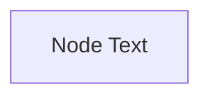
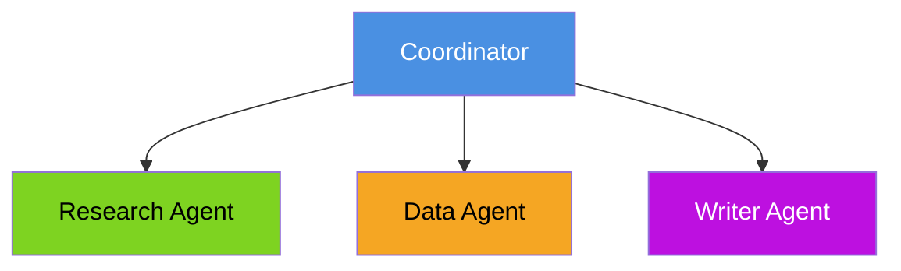
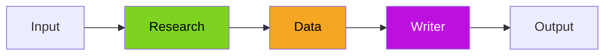
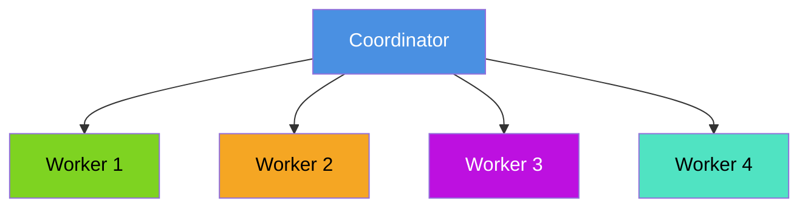
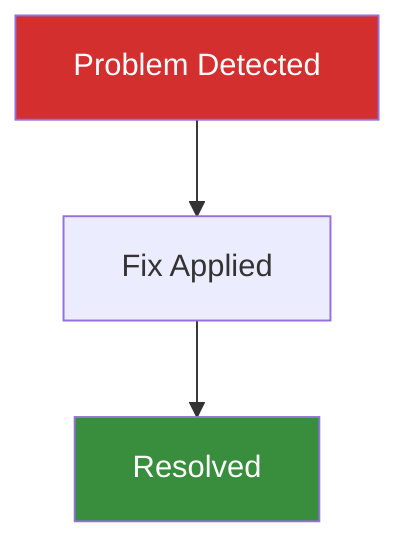

# Color Standards for Documentation

This document defines the color palette and contrast standards for all tutorial documentation to ensure readability and accessibility.

## Color Contrast Requirements

All colored elements must meet **WCAG AA standards** (minimum 4.5:1 contrast ratio for normal text).

### General Rule

- **Light backgrounds** (>50% luminance): Use **dark text** (`#000000` or `#333333`)
- **Dark backgrounds** (<50% luminance): Use **white text** (`#FFFFFF` or `#F0F0F0`)

## Approved Color Palette

### Dark Colors (require white text #FFFFFF)

| Color | Hex Code | Usage | Text Color |
|-------|----------|-------|------------|
| Dark Red | `#D32F2F` | Error states, critical items, problem nodes | `#FFFFFF` |
| Dark Orange | `#F57C00` | Warnings, attention items, processing nodes | `#FFFFFF` |
| Dark Green | `#388E3C` | Success states, completed items, resolution nodes | `#FFFFFF` |
| Medium Blue | `#4A90E2` | Information, coordinators, primary nodes | `#FFFFFF` |
| Dark Purple | `#BD10E0` | Special actions, writer agents, output nodes | `#FFFFFF` |

### Light/Bright Colors (require dark text #000000)

| Color | Hex Code | Usage | Text Color |
|-------|----------|-------|------------|
| Bright Green | `#7ED321` | Research agents, data gathering, input nodes | `#000000` |
| Bright Orange | `#F5A623` | Data agents, analysis, processing nodes | `#000000` |
| Bright Cyan | `#50E3C2` | Support agents, auxiliary functions, helper nodes | `#000000` |
| Bright Red | `#FF6B6B` | High priority, review agents, validation nodes | `#000000` |
| Light Green | `#90EE90` | Positive outcomes, approved states | `#000000` |
| Light Pink | `#FFB6C1` | Alternative paths, single agent options | `#000000` |
| Light Gray | `#CCCCCC` | Shared resources, utility functions | `#000000` |

## Mermaid Diagram Standards

### Basic Syntax

All Mermaid diagram nodes with colored backgrounds must explicitly specify text color:



### Complete Examples

#### Dark Background Node (needs white text)


#### Light Background Node (needs dark text)


#### Multi-Node Diagram



## Color Usage by Agent Type

### Coordinator Agents
- **Color**: `#4A90E2` (medium blue)
- **Text**: `#FFFFFF` (white)
- **Usage**: Central orchestration, master coordinators

### Research Agents
- **Color**: `#7ED321` (bright green)
- **Text**: `#000000` (black)
- **Usage**: Information gathering, web search, data collection

### Data/Analysis Agents
- **Color**: `#F5A623` (bright orange)
- **Text**: `#000000` (black)
- **Usage**: Data processing, calculations, quantitative analysis

### Writer/Output Agents
- **Color**: `#BD10E0` (dark purple)
- **Text**: `#FFFFFF` (white)
- **Usage**: Content generation, formatting, report creation

### Support/Helper Agents
- **Color**: `#50E3C2` (bright cyan)
- **Text**: `#000000` (black)
- **Usage**: Auxiliary functions, SEO, editing, quality checks

### Error/Problem States
- **Color**: `#D32F2F` (dark red)
- **Text**: `#FFFFFF` (white)
- **Usage**: Errors, failures, critical issues, debugging start points

### Success/Resolution States
- **Color**: `#388E3C` (dark green)
- **Text**: `#FFFFFF` (white)
- **Usage**: Successful completion, fixes applied, resolved issues

### Warning/Processing States
- **Color**: `#F57C00` (dark orange)
- **Text**: `#FFFFFF` (white)
- **Usage**: Warnings, in-progress items, quality checks

## Callout Boxes and Blockquotes

### Markdown Callout Syntax

Use standard markdown blockquotes with emoji indicators:

```markdown
> **🎯 Why This Matters**
> 
> Content text in default color (rendered by markdown viewer)
```

### Supported Callout Types

| Emoji | Type | Usage |
|-------|------|-------|
| 🎯 | Why This Matters | Establishes importance and context |
| 📚 | Building on Tutorial 1 | Connects to prior learning |
| ⚠️ | Warning | Cautions and gotchas |
| 💡 | Tip | Helpful suggestions |
| 🔍 | Deep Dive | Detailed exploration |
| ✅ | Best Practice | Recommended approaches |
| ❌ | Anti-Pattern | What to avoid |

## Testing Contrast

### Manual Testing

1. Use [WebAIM Contrast Checker](https://webaim.org/resources/contrastchecker/)
2. Input background color hex code
3. Input text color hex code
4. Verify meets **WCAG AA** (4.5:1 minimum)
5. Target **WCAG AAA** (7:1) for optimal readability

### Automated Validation

Run this regex search to find styles without explicit text colors:

```bash
grep -r "style.*fill:#" --include="*.md" | grep -v "color:"
```

Should return **no results** (all styles have explicit color).

## Quick Reference: Common Patterns

### Three-Agent Pipeline



### Coordinator with Four Workers



### Debugging Flow (Error to Success)



## Maintenance Checklist

When adding new diagrams:

- [ ] All colored nodes have explicit `color:` property
- [ ] Dark backgrounds (`#4A90E2`, `#BD10E0`, `#D32F2F`, `#F57C00`, `#388E3C`) use white text
- [ ] Light backgrounds (`#7ED321`, `#F5A623`, `#50E3C2`, `#FF6B6B`, `#90EE90`, `#FFB6C1`, `#CCCCCC`) use dark text
- [ ] Colors chosen from approved palette
- [ ] Contrast meets WCAG AA minimum (4.5:1)
- [ ] Colors are semantically appropriate (red for errors, green for success, etc.)

## Related Documentation

- [Tech Stack Decisions](./tech-stack.md) - Why we use Mermaid for diagrams
- [.cursorrules](../.cursorrules) - AI assistant documentation standards
- [Tutorial 2 Style Guide](../lesson-2-multi-agent/tutorial-2/guides/) - Writing guidelines

---

**Last Updated**: 2025-11-23  
**Maintained By**: Tutorial authors  
**Questions?**: See [Contributing Guidelines](../README.md)

