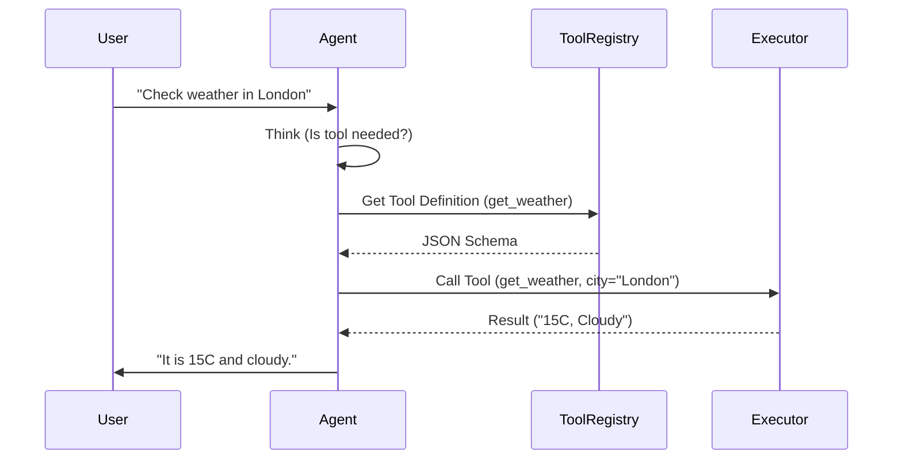
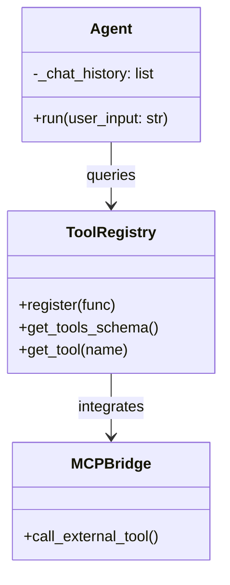

# Architecture Visualization Tools

**Page 15 of 16** | [← Previous: LLM Driven Design](./llm-driven-design.md) | [Next: Progress Tracker →](../../progress.md) | [↑ Reading Guide](../READING_GUIDE.md)

A picture is worth a thousand tokens. In the AI era, we don't just draw diagrams to document; we draw them to *communicate with the AI*.

## 1. Why Visualize?

LLMs have excellent spatial reasoning when given text-based diagrams. Providing a sequence diagram in your prompt significantly reduces hallucinations about control flow.

## 2. Traditional Tools (AI-Assisted)

### Mermaid.js (The King of AI Diagrams)
Mermaid is "Diagrams as Code." Because it is text, LLMs can read it and write it perfectly.

**Example**:
You can paste this into a Markdown file (like this one) and GitHub/Cursor will render it.

### PlantUML
Great for complex, strict UML. LLMs know it well, but it requires a Java dependency to render locally often. Mermaid is usually preferred for quick docs.

## 3. AI-Native Visualization

### Claude Artifacts / ChatGPT Canvas
These tools allow you to say "Draw a system diagram of my code" and they render an interactive React component or image instantly.
*   **Use case**: Brainstorming and high-level whiteboarding.

### Cursor + Mermaid
Inside Cursor, you can highlight code and say: "Generate a Mermaid class diagram for this module."
*   **Use case**: Understanding legacy code or reviewing your own architecture.

## 4. Decision Matrix: Which Tool?

| Need | Recommended Tool | Why? |
| :--- | :--- | :--- |
| **Documentation** | **Mermaid** | Lives in git, version controllable, renders in Markdown. |
| **Brainstorming** | **Excalidraw** | Low fidelity, feels like a whiteboard. |
| **Complex Systems** | **PlantUML** | Handles massive diagrams better than Mermaid. |
| **Quick Explanation** | **Claude Artifacts** | Interactive, fast, good for "selling" an idea. |

## 5. Hands-on: Visualizing This Tutorial

Here is the actual architecture of the Agent you are building in Lab 1, expressed as a Mermaid Class Diagram.

## 6. Living Documentation

The best diagram is one that doesn't lie.
*   **Commit your diagrams**: Keep `architecture.md` in your repo.
*   **Update with PRs**: If you change the code structure, ask the AI: "Update the Mermaid diagram to reflect these changes."

