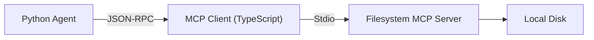

# Model Context Protocol (MCP)

**Page 5 of 15** | [← Previous: Tool Calling Architecture](./tool-calling-architecture.md) | [Next: Testing Agents →](./testing-agents.md) | [↑ Reading Guide](../READING_GUIDE.md) | [📋 Tech Stack Reference](./tech-stack-decisions.md)

The Model Context Protocol (MCP) is an open standard that standardizes how AI agents interact with data and tools.

## The Problem

Before MCP, every AI tool needed a custom integration:
*   Connecting to GitHub required a specific GitHub API wrapper.
*   Connecting to PostgreSQL required a specific SQL wrapper.
*   Connecting to Google Drive required a specific Drive wrapper.

This $N \times M$ problem meant developers spent all their time building connectors.

## The MCP Solution

MCP works like a USB-C port for AI applications.

*   **MCP Servers**: Expose resources (data) and tools (functions) via a standard protocol.
*   **MCP Clients**: AI applications (like Cursor, Claude Desktop, or your custom agent) that can connect to any MCP server.

## How We Use It

In this tutorial, we will use MCP to give our agent superpowers without writing complex integration code.

1.  **Consumption**: Our agent will act as an MCP Client.
2.  **Integration**: We will connect to existing MCP servers (like a Filesystem server) to instantly give our agent ability to read/write files safely.
3.  **Future**: In later tutorials, we will build custom MCP servers to expose your own data to any AI.

## Architecture in Tutorial 1

We use a TypeScript bridge because the MCP ecosystem is currently strongest in TypeScript, allowing us to leverage the official SDKs easily.

