# Exercise 1: Understanding the Agent

| Duration | Difficulty | Prerequisites | Skills Practiced |
|----------|------------|---------------|------------------|
| ~30 min | Beginner | Setup complete, Ollama running | Code tracing, Mental model building, AI-assisted learning |

**Goal**: Mental model mapping. You cannot build what you do not understand.

## Context
The file `src/agent/simple_agent.py` contains a "ReAct" (Reasoning + Acting) loop. It doesn't just answer; it thinks, acts, and observes.

## Learning by Asking AI

> **AI Context for This Exercise**
> Include these files when asking your AI assistant:
> - `@.cursorrules` (always)
> - `@src/agent/simple_agent.py` (the agent implementation)
> - `@lesson-1-fundamentals/tutorial-1/concepts/tool-calling-architecture.md` (reference doc)

Before diving into the code, **use your AI assistant to build understanding**. This is the primary way to learn - not a fallback when stuck!

**Ask these questions to your AI (expect 2-3 back-and-forth messages per topic):**

**Understanding the Architecture:**
```
@.cursorrules @src/agent/simple_agent.py

I'm starting Exercise 1. Looking at simple_agent.py:

1. What is the "ReAct" pattern and how does this agent implement it?
2. Walk me through the chat() method - what are the key steps?
3. Why does the messages list include the system prompt?
```

**Understanding Tool Calling:**
```
@.cursorrules @src/agent/simple_agent.py

Following up on Exercise 1:

1. How does the agent know what tools are available?
2. Why are there potentially multiple iterations in the while loop?
3. What triggers the second LLM call after a tool is executed?
```

**Connecting to Concepts:**
```
@.cursorrules @lesson-1-fundamentals/tutorial-1/concepts/tool-calling-architecture.md

I've read about the 7-step tool calling loop:

1. How does the code in simple_agent.py map to these 7 steps?
2. Where in the code does "schema injection" happen?
3. Where does the agent decide to stop looping?
```

**Iteration is Normal:** Your first question might get a general answer. Follow up with:
- "Can you show me the specific lines where that happens?"
- "I see that code, but I don't understand why it's structured that way"
- "How does this relate to the ReAct pattern mentioned in the docs?"

**Why This Approach Works:**
- ✅ Builds genuine understanding, not just surface knowledge
- ✅ Prepares you to modify the agent later
- ✅ Makes the documentation more meaningful
- ✅ Teaches you to read code with AI assistance

**Then proceed to the hands-on tasks below.**

## Tasks

### 1. Run with Verbose Logging
Run the agent and ask: "What is the weather in Paris?".
Observe the logs. You should see:
1.  **User Input**: "What is the weather in Paris?"
2.  **System Prompt**: The hidden instructions.
3.  **Tool Call**: `{"tool": "get_weather", "args": {"city": "Paris"}}`
4.  **Tool Output**: "15C, Cloudy"
5.  **Final Answer**: "The weather in Paris is 15C..."

### 2. Trace the Code
Open `src/agent/simple_agent.py`. Find the `chat()` method (around lines 51-102).
*   Where does the `messages` list get initialized? (Hint: Look in the `__init__` method around line 46)
*   Where is the `tool_registry` queried? (Hint: Look for `registry.get_schemas()` and `registry.get_tool()`)
*   How does the agent decide to make a second LLM call? (Hint: Look for the tool_calls check)

### 3. The Diagram
Sketch the flow you observed. Compare it with the flow description in [Tool Calling Architecture](../../tutorial-1/concepts/tool-calling-architecture.md).

**Visual Reference - Tool Calling Flow:**

```mermaid
sequenceDiagram
    participant User
    participant Agent
    participant LLM
    participant Tool
    
    User->>Agent: "What is the weather in Paris?"
    Agent->>Agent: Add to messages[]
    Agent->>LLM: messages + tool schemas
    LLM->>Agent: Response with tool_call
    Agent->>Agent: Parse tool_call
    Agent->>Tool: get_weather("Paris")
    Tool->>Agent: "The weather in Paris is Sunny, 25°C"
    Agent->>Agent: Add tool result to messages[]
    Agent->>LLM: messages (now with tool result)
    LLM->>Agent: Final response with answer
    Agent->>User: "The weather in Paris is Sunny, 25°C"
    
    Note over Agent,LLM: First LLM call: Decision
    Note over Agent,LLM: Second LLM call: Synthesis
```



**Key Insight:** The agent makes **two LLM calls**:
1. First call: LLM decides to use a tool and outputs structured JSON
2. Second call: LLM synthesizes the tool output into a natural language response

## Checkpoint
*   [ ] I can explain why the agent loops twice for one question.
*   [ ] I understand the flow: User → Agent → LLM (decide) → Tool → LLM (synthesize) → User

---

## 💡 Stuck on This Exercise?

**Ask Your AI Assistant** (include `.cursorrules` for context):

```
@.cursorrules

I'm working on Exercise 1 (Understanding the Agent).

I'm having trouble [understanding the flow / finding the code / tracing execution].

Specifically: [describe what's confusing]

Can you explain this according to the project's architecture?
```

**Or debug with the tool:**
```bash
python scripts/debug_agent.py --test "What is the weather in Paris?"
```

**See also:**
- [Tool Calling Architecture](../../tutorial-1/concepts/tool-calling-architecture.md) - The 7-step loop explained
- [Getting Unstuck Guide](../getting-unstuck.md) - Systematic debugging
- [FAQ](../FAQ.md#why-does-my-agent-make-two-llm-calls-for-one-question) - Why two LLM calls?

