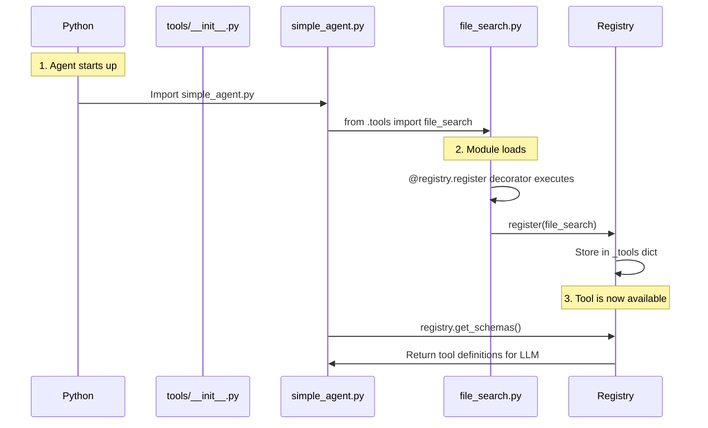

# Exercise 2: Adding a Tool

**Goal**: Extend the Agent's capabilities.

## Context
An agent is only as smart as its tools. We will add a `search_files` tool that allows the agent to grep for code in your project.

## Steps

### 1. Create the Tool
Create `src/agent/tools/file_search.py`.
Implement a function `search_files(directory: str, pattern: str) -> str`.
*   Use `os.walk` or `glob`.
*   Return a **descriptive string** with the results (not a raw list!).
*   **Crucial**: Handle `FileNotFoundError` and return a friendly string like "Error: Directory not found".
*   **Agentic Best Practice**: Tools should return human-readable strings, not data structures. LLMs understand natural language better than raw lists.

### 2. Register the Tool
Import `registry` from `src.agent.tool_registry`.
Decorate your function with `@registry.register`.

```python
from src.agent.tool_registry import registry

@registry.register
def search_files(directory: str, pattern: str) -> str:
    """
    Search for files matching a pattern in a directory.
    
    Args:
        directory: The path to search in (e.g., "src/", "tests/")
        pattern: The file pattern to match (e.g., "*.py", "test_*.py")
    
    Returns:
        A string describing the results: list of files found, or an error message
    
    Examples:
        search_files("src/", "*.py") -> "Found 3 files: src/agent/simple_agent.py, ..."
        search_files("invalid/", "*.py") -> "Error: Directory not found"
    """
    # Your implementation here
    # Hint: Return descriptive strings like "Found 5 files: ..." or "Error: ..."
```

### 3. Make the Tool Importable
First, update `src/agent/tools/__init__.py` to import your tool:

```python
"""
Tools package for the agent.
Import tool modules here to ensure they get registered.
"""
from . import file_search

__all__ = ['file_search']
```

Then, in `src/agent/simple_agent.py`, add this import near the top (around line 8):

```python
from .tools import file_search  # noqa: F401
```

**Why this matters - How Tool Registration Works**: 

Python decorators like `@registry.register` only execute when Python **loads the module**. Here's the flow:



**Step-by-step:**

1. **Decorator Definition** (`@registry.register`): Tells Python "when this function is defined, add it to the registry"
2. **Module Import** (`from .tools import file_search`): Actually loads the file, causing the decorator to execute
3. **Decorator Execution**: Runs `registry.register(file_search)`, adding the tool to the global registry
4. **Agent Usage** (`registry.get_schemas()`): Agent queries the registry to see what tools are available

**Both imports serve different purposes:**
- `tools/__init__.py` import: Clean package-level exports (Python best practice)
- `simple_agent.py` import: Actually loads the module, triggering the decorator (required for registration)

**Technical Notes:**
- We use **relative imports** (`.tools`) since we're inside the `src.agent` package
- The `# noqa: F401` comment tells linters to ignore "unused import" warnings (this is a **side-effect import**)
- Without the `simple_agent.py` import, Python never loads the module, so the decorator never runs!

**Python Philosophy Note**: Every Python package directory should have an `__init__.py` file. This makes packages explicit and enables proper exports. See the [Package Structure Guide](../../tutorial-1/guides/package-structure.md) for details.

### 4. Verify
Run the agent and test with these queries:
1. "Find all python files in the tests directory."
2. "Find all files in the data directory."
3. "Search for text files in data/"

Expected behavior:
- Query 1: Should find test_framework.py, conftest.py, and any test files
- Query 2: Should find todos.txt, notes.txt, sample.py
- Query 3: Should find todos.txt and notes.txt (*.txt pattern)

The agent should call `search_files` and return descriptive results for each query

## Common Pitfalls
*   **Missing Docstring**: If you don't write a docstring, the Agent won't know how to use the tool.
*   **Wrong Type Hints**: The `tool_registry` uses type hints to build the JSON schema. Make sure they are correct.
*   **Returning Complex Types**: Return strings (natural language) instead of lists or dictionaries. Agents understand `"Found 3 files: ..."` better than `['file1', 'file2', 'file3']`.
*   **Raising Exceptions**: Return error strings like `"Error: Directory not found"` instead of raising exceptions. Let the agent handle the error gracefully.

## Common Issues for This Exercise

### Tool Not Found (KeyError)
- **Check:** Is `__init__.py` in `tools/` directory?
- **Check:** Did you import in `simple_agent.py`?
- **Debug:** Run `python scripts/debug_agent.py --tools`

### Import Errors
- **Check:** File structure matches tutorial exactly
- **Check:** Running from project root, not subdirectory
- **Debug:** See [Troubleshooting](../troubleshooting.md#import--module-errors)

### Tool Returns None
- **Check:** Every code path has a `return` statement
- **Check:** Exceptions caught and returned as error strings

---

## 💡 Stuck on This Exercise?

**Most Common Issue - Tool Not Registering:**

```
@.cursorrules

Exercise 2: My tool isn't registered (KeyError: 'search_files').

File structure:
src/agent/tools/
├── __init__.py
└── file_search.py

My file_search.py has:
- @registry.register decorator
- Proper function signature
- Complete docstring

I added: from .tools import file_search  # noqa: F401 to simple_agent.py

What am I missing according to the tool registration pattern?
```

**Debug Tool Registration:**
```bash
# See what tools are actually registered
python scripts/debug_agent.py --tools

# Expected: Should list search_files
# If not: Check import is actually executing
```

**See Also:**
- [Troubleshooting: Tool Registration](../troubleshooting.md#tool-registration-errors)
- [FAQ: Why noqa:F401?](../FAQ.md#q-why-do-i-need--noqua-f401-after-tool-imports)
- [Getting Unstuck Guide](../getting-unstuck.md)

---

## 🎉 Victory Checkpoint

If your agent successfully finds files using the `search_files` tool, congratulations! You've just:
- ✅ Created your first custom tool
- ✅ Understood the decorator pattern for tool registration
- ✅ Learned agentic best practices (human-readable outputs, error strings)
- ✅ Extended the agent's capabilities beyond its training data

**You're no longer just using AI - you're building agentic systems!**

