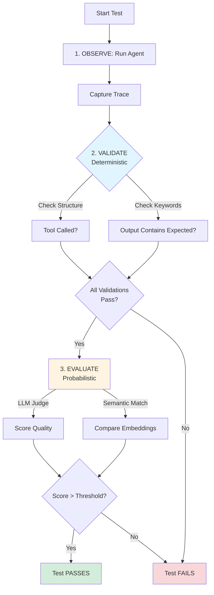

# Exercise 4: Testing Methodology

**Goal**: Trust but Verify.

## Context
We use the O.V.E. (Observe, Validate, Evaluate) methodology.
*   **Observe**: Run the agent.
*   **Validate**: Check the structure (Did it return JSON? Did it call a tool?).
*   **Evaluate**: Check the quality (Did it answer the user's intent?).

## Learning by Asking AI

> **AI Context for This Exercise**
> Include these files when asking your AI assistant:
> - `@.cursorrules` (always)
> - `@tests/test_framework.py` (the O.V.E. test harness)
> - `@lesson-1-fundamentals/tutorial-1/concepts/testing-agents.md` (O.V.E. methodology)
> - Your tool file (e.g., `@src/agent/tools/file_search.py`)

**Before writing tests**, understand the O.V.E. methodology through AI conversation:

**Understanding O.V.E.:**
```
@.cursorrules @lesson-1-fundamentals/tutorial-1/concepts/testing-agents.md

I'm on Exercise 4 (Testing). Reading about O.V.E. methodology:

1. What's the difference between Validate and Evaluate?
2. Why can't we use traditional assert output == "expected" for agents?
3. When should I use deterministic checks vs probabilistic checks?
```

**Understanding the Test Framework:**
```
@.cursorrules @tests/test_framework.py

Looking at test_framework.py:

1. How does AgentTestRunner capture the agent's behavior?
2. What does TestCase expect me to define?
3. What's the difference between expected_tool_calls and expected_content_keywords?
```

**Writing Your First Test:**
```
@.cursorrules @tests/test_framework.py @src/agent/tools/file_search.py

I'm writing a test for my file_search tool:

Tool behavior: [describe what your tool does]
Expected: [what should happen]

How should I structure:
1. The unit test (testing the tool function directly)?
2. The E2E test (testing the agent using the tool)?
```

**When Tests Fail:**
```
@.cursorrules

My test fails with: AssertionError: passed_validation is False

Test code: [paste test]
Test output: [paste pytest output]

According to O.V.E., what validation is likely failing?
```

**Handling Flakiness:**
```
@.cursorrules

My test passes 3 out of 5 times (flaky).

Current temperature: [your setting]
System prompt: [relevant parts]
Test expectations: [what you're checking]

How do I make this deterministic according to the tutorial?
```

**Iterate Your Tests:** First test might:
- Check for exact text (too strict)
- Miss edge cases
- Have wrong expectations

**Share the test code and failures with your AI**, refine together. Expect 2-3 iterations to get robust tests.

**Why This Approach Works:**
- ✅ Understand O.V.E. deeply, not just copy test code
- ✅ Learn to handle probabilistic behavior
- ✅ Build debugging skills for flaky tests
- ✅ Create tests you can explain and modify

**Now implement the tests using the steps below.**



**Note**: This exercise uses the test data files in `data/` (todos.txt, notes.txt, sample.py). These are provided in the repository for consistent testing.

## Steps

### 1. Create a Test File
Create `tests/unit/test_file_search.py`.

### 2. Unit Test (The Tool)
Test the Python function `search_files` in isolation.
*   Mock the filesystem (or use a temporary directory fixture).
*   Assert it finds the files it should.
*   Assert it returns an error string for invalid directories (don't raise Exceptions!).

### 3. E2E Test (The Agent)
Use the `AgentTestRunner` from `tests/test_framework.py`.

```python
from src.agent.simple_agent import Agent
from tests.test_framework import AgentTestRunner, TestCase

def test_agent_finds_files():
    agent = Agent()
    runner = AgentTestRunner(agent)
    
    case = TestCase(
        name="Find Python Files",
        prompt="Find python files in tests/",
        expected_tool_calls=["search_files"],
        expected_content_keywords=["test_framework.py"]
    )
    
    result = runner.run(case)
    
    assert result.passed_validation, f"Validation failed: {result.validation_errors}"
```

### 4. Flakiness Check
Run the test 5 times.
```bash
for i in {1..5}; do pytest tests/unit/test_file_search.py; done
```
If it fails once, your prompt might be ambiguous. Refine the prompt (Exercise 3) until it passes 5/5.

## Common Issues for This Exercise

### Tests Fail Randomly (Flakiness)
- **Check:** Temperature set to 0.1 or lower?
- **Check:** System prompt explicit enough?
- **Try:** Relax assertions (check keywords, not exact text)
- **Goal:** 5/5 passes = robust test

### AssertionError: passed_validation is False
- **Debug:** Print `result.validation_errors` to see what failed
- **Check:** Does tool actually get called? (check `result.tool_calls`)
- **Check:** Does response contain expected keywords?

### Import Errors in Tests
- **Check:** Running from project root
- **Check:** Virtual environment activated
- **Fix:** `pytest tests/unit/test_file_search.py`

---

## 💡 Stuck on This Exercise?

**Test Keeps Failing:**

```
@.cursorrules

Exercise 4: My test fails inconsistently (passes 2/5 times).

Test code:
[paste relevant test]

Agent temperature: [setting]
System prompt: [paste or summarize]

Test output when it fails:
[paste pytest output]

How do I make this deterministic according to O.V.E. methodology?
```

**Understanding Test Failures:**

```
@.cursorrules

My test fails with:
AssertionError: passed_validation is False

Test: test_agent_finds_files

I'm not sure what validation is failing. According to the test 
framework, how do I debug this?

Test code:
[paste test]
```

**Debug Tests:**
```bash
# Run with verbose output
pytest tests/unit/test_file_search.py -v -s

# Run single test
pytest tests/unit/test_file_search.py::test_agent_finds_files -v -s

# Check flakiness
for i in {1..5}; do pytest tests/unit/test_file_search.py; done
```

**See Also:**
- [Testing Agents Concept](../../tutorial-1/concepts/testing-agents.md)
- [Troubleshooting: Testing Issues](../troubleshooting.md#testing-issues)
- [FAQ: O.V.E. Methodology](../FAQ.md#q-whats-the-difference-between-validate-and-evaluate-in-ove)

---

## 🎉 Victory Checkpoint

If your tests pass consistently (5/5 runs), you've achieved something remarkable! You've:
- ✅ Implemented the O.V.E. (Observe, Validate, Evaluate) methodology
- ✅ Written both unit tests (tool isolation) and E2E tests (agent behavior)
- ✅ Understood probabilistic testing (handling LLM non-determinism)
- ✅ Built confidence in your agentic system through validation

**You can now test AI systems like a professional!**

