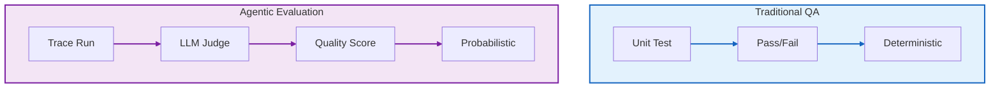

# The Evolution of Architecture Practices

**Page 7 of 16** | [← Previous: Testing Agents](../concepts/testing-agents.md) | [Next: LLM Driven Design →](./llm-driven-design.md) | [↑ Reading Guide](../READING_GUIDE.md)

Architecture is not static. Just as Agile replaced Waterfall, AI is replacing "Big Design Up Front" with "Continuous AI-Assisted Refinement."

## 1. The Traditional Era

### Waterfall (The Blueprint)
In the early days, software was treated like civil engineering. You drafted blueprints (UML), approved them, and then construction (coding) began. Changes were catastrophic.

### Agile & Microservices (The reaction)
We realized we couldn't predict the future. We broke monoliths into microservices to isolate change. Architecture became about defining *boundaries* so teams could move independently.

## 2. The AI Shift: Discovery over Planning

In the AI era, the cost of writing code has dropped near zero. The cost of *reading* and *maintaining* it has stayed the same.

**The Discovery Loop**:
Instead of planning the perfect module structure on a whiteboard, you:
1.  **Prompt** the AI for a solution.
2.  **Critique** the generated structure.
3.  **Refine** until the architecture emerges.

We are moving from "Architect -> Coder" to "Architect -> Reviewer".

## 3. New Patterns: LLM-First Architecture

### Small Contexts
LLMs have context limits. Monoliths are hard for Agents to reason about.
*   **Pattern**: Extreme Modularity.
*   **Why**: So an Agent can read the entire relevant context in one go. "One file, one purpose" is more important than ever.

### Self-Describing Code
Code is now read by humans *and* machines.
*   **Pattern**: Verbose Docstrings as Prompts.
*   **Why**: Your Python docstring is literally the system prompt for the Agent using that function.

## 4. Case Study: Architecting this Tutorial

When we built this tutorial, we didn't write the `simple_agent.py` loop from scratch.
1.  **Prompt**: "I need a Python loop that takes user input, calls tools from a registry, and returns a response. Use a ReAct style."
2.  **Result**: The AI gave a messy 100-line function.
3.  **Architectural Intervention**: "Split this into `select_tool`, `execute_tool`, and `format_response`. Use a decorator for registration."
4.  **Final Code**: The clean, modular structure you see in `src/agent`.

## 5. What Still Matters

Some things haven't changed. The AI is bad at:
*   **Security Boundaries**: It will happily generate SQL injection vulnerabilities if not guided.
*   **System Scale**: It doesn't know if your system needs to handle 10 users or 10 million.
*   **Domain Modeling**: It knows generic "E-commerce", but it doesn't know *your* business rules.

**You are the keeper of the constraints.** The AI provides the implementation.

