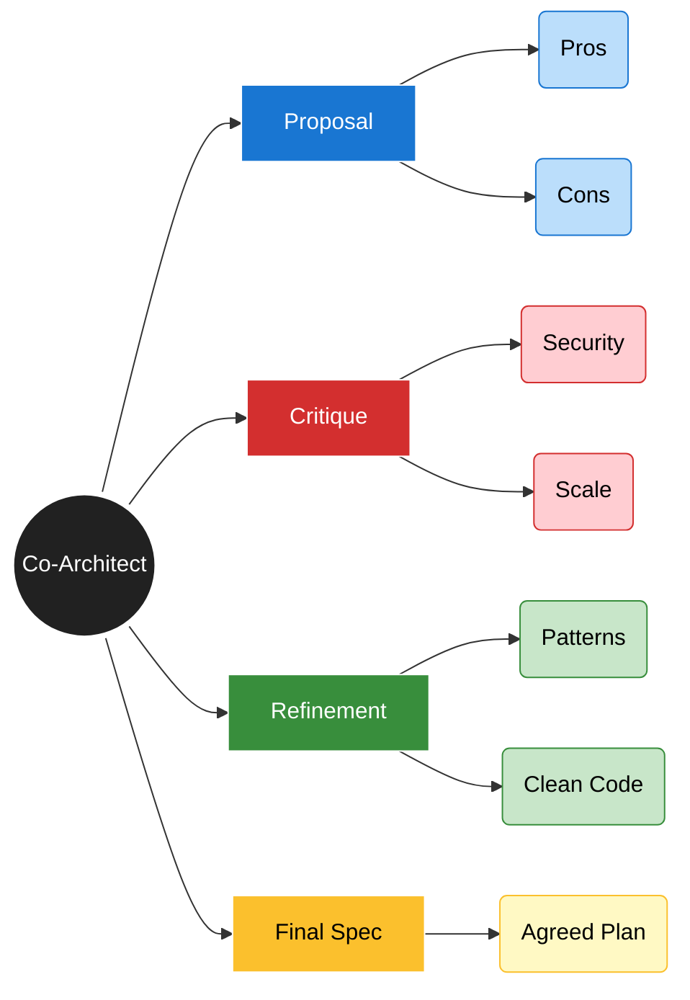

# LLM-Driven Design

**Page 8 of 16** | [← Previous: Architecture Evolution](./evolution.md) | [Next: Visualization Tools →](./visualization-tools.md) | [↑ Reading Guide](../READING_GUIDE.md)

Architecture is no longer a solitary activity. You now have a tireless partner to brainstorm with. This guide covers how to effectively "prompt for architecture."

## 1. Prompting for Architecture

Don't just ask "Write code." Ask for the *plan*.

**Bad Prompt**:
"Write a Python script to scrape websites."

**Architectural Prompt**:
"I need to build a web scraping system. It needs to be modular, respect rate limits, and save data to JSON.
1. Propose a high-level architecture (classes/functions).
2. Explain how you will handle errors and retries.
3. List the libraries you recommend and why."

**Why this works**: You force the LLM to "think" before it "types."

## 2. Iterative Refinement (The Conversation)

Architecture emerges from dialogue.

*   **User**: "Your proposal looks good, but using a global variable for configuration is bad practice."
*   **Agent**: "You are right. I will refactor to use a `Config` class passed via dependency injection."
*   **User**: "Better. Now, what if we want to swap the scraping engine later?"
*   **Agent**: "I will introduce an abstract `Scraper` interface..."

This back-and-forth is where the real engineering happens.

## 3. Using AI for Trade-off Analysis

LLMs are excellent at listing pros and cons. Use them to validate your gut feeling.

**Template**:
"I am debating between [Option A] and [Option B] for [Problem].
My constraints are: [Constraint 1], [Constraint 2].
Act as a Senior Architect. Compare these options and recommend one."

## 4. Template Prompts

### The "Refactor" Prompt
"Review this file: [PASTE CODE].
Identify 3 architectural weaknesses (e.g., tight coupling, lack of separation of concerns).
Propose a refactoring plan without changing the external behavior."

### The "System Design" Prompt
"Design a system to handle [Task].
Output:
1. A list of core components.
2. The data flow between them.
3. Potential failure modes and how to mitigate them."

## 5. Pitfalls: When to Override

The AI aims to please, not to be right.
*   **Over-engineering**: It might suggest a microservices architecture for a todo app. You must say "Keep it simple."
*   **Hallucinated Best Practices**: It might invent patterns that don't exist. Trust your experience.
*   **Security Blindness**: It prioritizes functionality over safety. Always audit for security.

## 6. The Human-AI Loop

1.  **Human**: Define the problem and constraints.
2.  **AI**: Propose multiple solutions.
3.  **Human**: Select the best path and refine constraints.
4.  **AI**: Generate the implementation.
5.  **Human**: Review against the original architectural vision.

