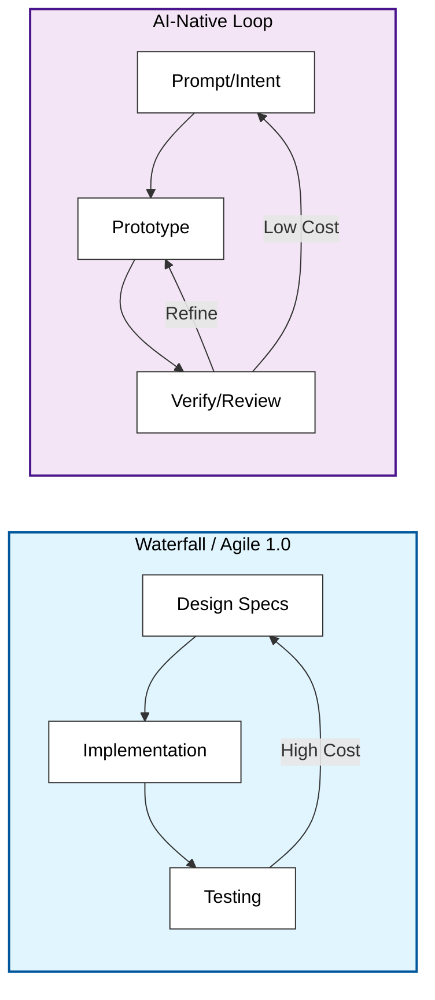

# Architecture in the AI Era

**Page 2 of 16** | [← Previous: Software Engineering Evolution](./software-engineering-evolution.md) | [Next: LLM Fundamentals →](./llm-fundamentals.md) | [↑ Reading Guide](../READING_GUIDE.md)

Software architecture has traditionally been a "measure twice, cut once" discipline. In the AI era, it's becoming "measure once, cut fast, check, and refine."

## The Shift: Iteration over Specification

Traditionally, we spent weeks designing strict class hierarchies and database schemas before writing a line of code. Refactoring was expensive.

With LLMs, **refactoring is cheap**.
*   **Old**: "We must get the data model perfect because changing it impacts 50 files."
*   **New**: "Let's prototype the data model. If it's wrong, the Agent can update those 50 files in minutes."

This doesn't mean architecture is dead. It means architecture has shifted from *preventing change* to *enabling change*.

## LLM-Driven Architectural Decisions

You are no longer the sole architect. You have a co-architect who has read every design pattern book in existence.

*   **Trade-off Analysis**: Instead of guessing, ask the LLM: "Compare a message queue vs. direct HTTP calls for this specific agent use case. List pros and cons."
*   **Pattern Matching**: "This code feels messy. Which design pattern would clean up this tool registration logic?"
*   **Critique**: "Here is my proposed folder structure. What are the scalability bottlenecks?"

## Why Diagrams Still Matter (More Than Ever)

When code generation is easy, code volume explodes. It's easy to lose the mental model of the system in a sea of generated functions.

**Visuals are the anchor.**
*   You need high-level diagrams to communicate *intent* to the LLM.
*   "Generate code based on this sequence diagram" is a powerful workflow.
*   If you can't draw it, the Agent probably can't build it correctly.

## When to Architect vs. Prototype

*   **Architect (Human Lead)**: System boundaries, security constraints, choosing the tech stack (e.g., "Use MCP for tools"), and defining the core data entities.
*   **Prototype (AI Lead)**: Implementation details, helper functions, specific API integrations, and unit test coverage.

Don't let the AI design your security model. Do let the AI design your regex parser.

