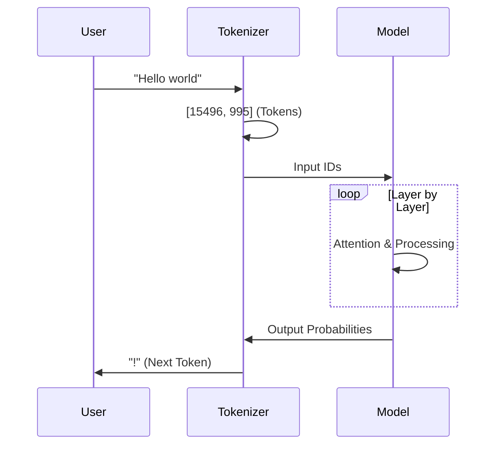

# LLM Fundamentals for Agentic AI

**Page 3 of 16** | [← Previous: Architecture in AI Era](./architecture-in-ai-era.md) | [Next: Tool Calling Architecture →](./tool-calling-architecture.md) | [↑ Reading Guide](../READING_GUIDE.md)

Understanding how Large Language Models (LLMs) work is crucial for building effective agents. This guide covers the basics relevant to agent development.

## What is an LLM?

At its core, an LLM is a probabilistic engine that predicts the next token in a sequence.

### The Inference Pipeline

1.  **Tokenization**: Text is broken down into smaller units called "tokens" (roughly 0.75 words).
2.  **Embedding**: Tokens are converted into high-dimensional vectors (lists of numbers) representing semantic meaning.
3.  **Attention**: The model looks at all tokens in the context window to understand relationships (e.g., "it" refers to "the cat").
4.  **Generation**: The model calculates the probability of every possible next token and selects one based on your settings.

## Key Parameters

### Context Window
The amount of text (tokens) the model can "remember" at once.
*   **Llama 3.1**: Support for large context windows (up to 128k tokens), allowing for passing large documentation or code files.
*   **Implication**: You must manage what goes into the context. Too much noise degrades performance.

### Temperature
Controls the randomness of the output.
*   **Low (0.0 - 0.2)**: Deterministic, focused. Best for code generation and tool calling.
*   **High (0.7 - 1.0)**: Creative, varied. Best for brainstorming or creative writing.

### System Prompts
The initial instruction given to the model that sets its persona and rules.
*   **Agentic AI**: This is where we define the agent's capabilities ("You are a research assistant...") and constraints ("Always use tools for...").

## Why Llama 3.1?

For this tutorial, we use Llama 3.1 because:
*   **Local**: Runs on your machine via Ollama (privacy, no cost).
*   **Proven**: Llama 3.1 (July 2024) is battle-tested and the community standard for local agent development.
*   **Tool Calling**: Fine-tuned specifically for structured tool calling, which is critical for agents.
*   **Optimal Size**: 8B parameter model strikes perfect balance between capability and resource usage.

---

## 🎯 Knowledge Check

Before moving on, test your understanding:

**Question 1:** What's the difference between a low temperature (0.1) and high temperature (0.9) setting?

Show Answer

- **Low temperature (0.1)**: More deterministic and focused. The model picks the most likely next token. Best for tool calling and code generation where consistency matters.
- **High temperature (0.9)**: More creative and varied. The model explores less likely options. Best for brainstorming and creative writing.

For agentic AI, we typically use low temperature to ensure consistent tool calling behavior.

**Question 2:** Why does context window size matter for agents?

Show Answer

The context window limits how much the agent can "remember" at once. If you fill it with:
- Too much irrelevant information → performance degrades (noise)
- Too little information → agent lacks context to make decisions

For agents, this means:
- System prompt + tool definitions + conversation history + tool outputs must fit
- Larger context windows (128k tokens) enable passing entire codebases or documentation
- You must still curate what goes in for best performance

**Question 3:** In your own words, explain what a "system prompt" is and why it matters for agentic AI.

Show Answer

A system prompt is the initial instruction that sets the model's behavior, persona, and constraints. For agentic AI, it's critical because:

- **Defines capabilities**: "You have access to file search and read tools..."
- **Sets constraints**: "Never delete files without confirmation..."
- **Guides tool usage**: "Always use tools for current information..."
- **Establishes persona**: "You are a senior software engineer..."

Think of it as the "operating system" for your agent - it defines how the agent thinks and acts.

**Ready to continue?** If you can answer these questions, you understand the fundamentals. Move on to [Tool Calling Architecture](./tool-calling-architecture.md) to see how LLMs become agents.

