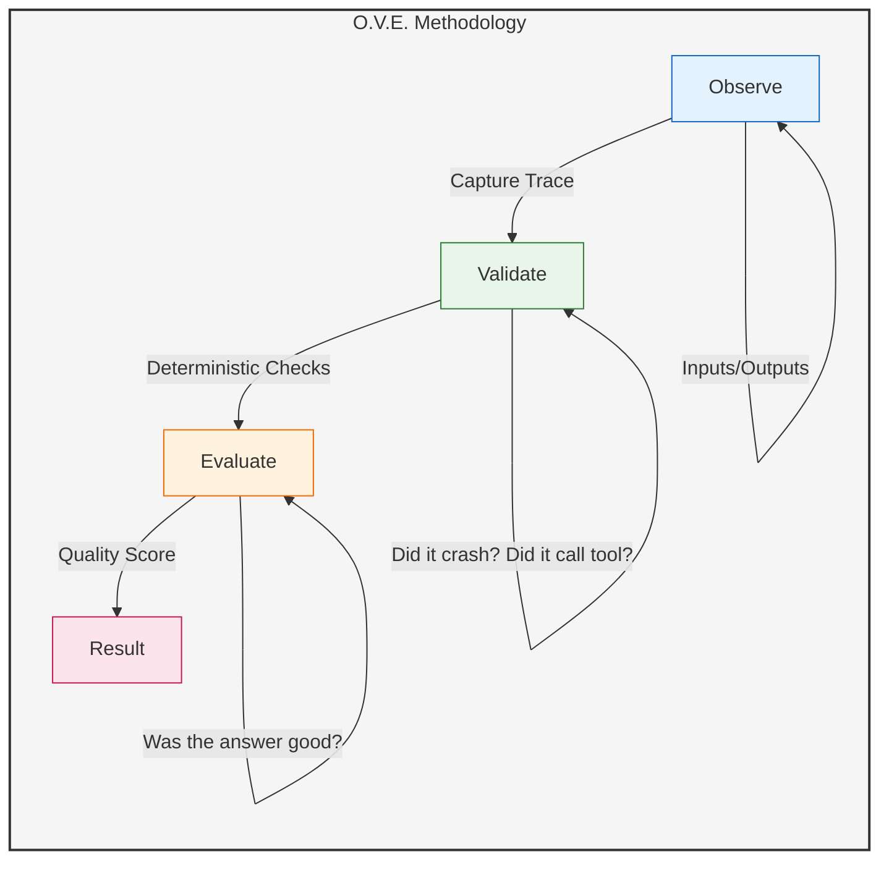

# Testing Agents: Observe, Validate, Evaluate

**Page 6 of 16** | [← Previous: MCP Introduction](./mcp-intro.md) | [Next: Architecture Evolution →](../architecture/evolution.md) | [↑ Reading Guide](../READING_GUIDE.md)

Testing AI agents is fundamentally different from testing traditional software. Agents are non-deterministic (probabilistic), meaning they might solve the same problem in different ways each time.

## The Challenge

*   **Traditional Unit Test**: `assert add(2, 2) == 4` (Binary: Pass/Fail)
*   **Agent Test**: `agent.ask("Summarize this text")` (Output varies every time)

## The Methodology: O.V.E.

To test agents effectively, we use the **Observe, Validate, Evaluate** loop.

### 1. Observe
Capture not just the final answer, but the *process*.
*   What tools were called?
*   What arguments were used?
*   How many steps did it take?
*   What was the "thought process" (if using Chain of Thought)?

### 2. Validate (Deterministic Checks)
Check the things that *must* be true.
*   **Structure**: Did it return valid JSON?
*   **Tool Usage**: If asked to calculate `2+2`, did it call the `calculator` tool?
*   **Safety**: Did it avoid forbidden topics?

### 3. Evaluate (Probabilistic Checks)
Score the quality of the response.
*   **LLM-as-a-Judge**: Use a stronger model (or the same model) to grade the output.
    *   "On a scale of 1-5, how concise is this summary?"
    *   "Does this answer directly address the user's question?"
*   **Semantic Similarity**: Compare the vector embedding of the output against a "gold standard" answer.

## Test Harness

In this tutorial, we will build a simple test harness that:
1.  Runs the agent against a set of scenarios.
2.  Records the trace (inputs, tool calls, outputs).
3.  Runs assertions (validations) on the trace.
4.  Can be extended to run evaluations.

## Production Testing Tools

While O.V.E. teaches fundamentals, production systems typically use specialized tools:

### LangSmith (LangChain)
*   **Purpose**: Trace capture, replay, and evaluation
*   **Features**: Dataset-based testing, A/B testing for prompts, production monitoring
*   **Best for**: LangChain-based systems, teams needing observability

### Braintrust
*   **Purpose**: Prompt versioning and regression testing
*   **Features**: Model comparison, cost tracking, dataset management
*   **Best for**: Multi-model systems, prompt experimentation

### OpenAI Evals
*   **Purpose**: Standard benchmark suites
*   **Features**: Custom eval harnesses, reproducible testing
*   **Best for**: OpenAI model users, research-focused teams

### Promptfoo
*   **Purpose**: CLI-based prompt testing
*   **Features**: Multiple provider support, regression detection, CI/CD integration
*   **Best for**: DevOps teams, automated testing pipelines

### When to Use What

**Tutorial 1-2 (Learning)**:
*   Stick with O.V.E. methodology
*   Understand the principles deeply
*   Build your own test harness

**Production (Real Systems)**:
*   Start with LangSmith or Braintrust
*   Scale testing with datasets
*   Monitor production agent behavior
*   Track regressions across prompt versions

**Why Learn O.V.E. First**: These tools implement O.V.E. principles under the hood. Understanding fundamentals lets you use any tool effectively and debug when tools fail.

---

## 🎯 Knowledge Check

Test your understanding of agent testing:

**Question 1:** Why can't we use traditional `assert output == "expected"` for testing agents?

Show Answer

Agents are **probabilistic** (non-deterministic). Even with the same input, they might:
- Use different wording in responses
- Take different tool calling paths
- Vary output based on temperature settings

Example:
- Run 1: "I found 3 files: a.py, b.py, c.py"
- Run 2: "There are 3 Python files: a.py, b.py, and c.py"

Both are correct but have different exact text. Traditional equality checks would fail.

**Question 2:** What's the difference between Validate and Evaluate in O.V.E.?

Show Answer

**Validate (Deterministic):**
- Binary checks: Did X happen? Yes/No
- Examples: "Did it call the right tool?", "Does output contain keyword?"
- Always gives same result

**Evaluate (Probabilistic):**
- Quality checks: How good was the response? Score 1-5
- Examples: "Is this summary concise?", "Does this answer the question?"
- Uses LLM-as-judge or semantic similarity
- May vary slightly between runs

**Analogy:** Validate = "Did you do your homework?" Evaluate = "How good is your homework?"

**Question 3:** Match each test type to the best testing approach:

A. Checking if agent called `search_files` tool  
B. Checking if summary quality is good  
C. Checking if output contains filename "todos.txt"  
D. Checking if response is helpful to user  

Options: (1) Validate, (2) Evaluate

Show Answer

A. **Validate (1)** - Deterministic: tool was either called or not  
B. **Evaluate (2)** - Probabilistic: quality is subjective  
C. **Validate (1)** - Deterministic: keyword check  
D. **Evaluate (2)** - Probabilistic: "helpful" requires judgment  

**Rule of thumb:** 
- If you can write `assert X`, use Validate
- If you need to judge quality, use Evaluate

**Practical Challenge:** Your agent test passes 4 out of 5 times. What should you do?

Show Answer

This is called "test flakiness" and it's common with agents. Solutions:

1. **Lower temperature** (0.0-0.1) for more deterministic behavior
2. **Make prompt more explicit** - reduce ambiguity
3. **Relax validation** - Check for keywords instead of exact matches
4. **Use evaluation instead** - LLM-as-judge is more flexible

**Never ignore flakiness** - it suggests your agent behavior is unstable. In production, 80% success rate means 1 in 5 users get bad results!

**Goal:** Aim for 95%+ consistency before deploying.

