# Tool Calling Architecture

**Page 4 of 16** | [← Previous: LLM Fundamentals](./llm-fundamentals.md) | [Next: MCP Introduction →](./mcp-intro.md) | [↑ Reading Guide](../READING_GUIDE.md)

"Tool calling" (or function calling) is the capability that turns a chatbot into an agent. It allows the LLM to interact with the outside world.

## The 7 Step Tool Calling Loop

Tool calling is not magic; it's a structured dialogue loop:

```mermaid
sequenceDiagram
    participant U as User
    participant S as System (Agent)
    participant L as LLM
    participant T as Tool (Function)

    U->>S: "What's the weather in London?"
    S->>L: Prompt + Tool Definitions
    L->>S: Call Tool: get_weather("London")
    S->>T: Execute get_weather("London")
    T-->>S: Result: "15°C, Cloudy"
    S->>L: Tool Output: "15°C, Cloudy"
    L->>S: "It's 15°C and cloudy in London."
    S->>U: Final Response
```



1.  **User Request**: "What is the weather in London?"
2.  **Schema Injection**: The system sends the prompt *plus* a list of available tools (function definitions) to the LLM.
    ```json
    [
      {
        "name": "get_weather",
        "description": "Get current weather",
        "parameters": { "type": "object", "properties": { "city": { "type": "string" } } }
      }
    ]
    ```
3.  **LLM Decision**: The LLM recognizes it cannot answer from training data but *can* answer using a tool.
4.  **Structured Output**: Instead of text, the LLM outputs a specific JSON structure requesting a tool execution:
    ```json
    { "tool": "get_weather", "args": { "city": "London" } }
    ```
5.  **System Execution**: Your code intercepts this JSON, pauses the LLM, executes the actual Python/JS function, and gets the result ("15°C, Cloudy").
6.  **Feedback**: The system feeds the result back to the LLM as a new message.
7.  **Final Response**: The LLM uses the tool output to answer the user: "The weather in London is currently 15°C and cloudy."

## Why is this "Agentic"?

*   **Reasoning**: The model *decided* to use a tool.
*   **Multi-step**: The model can call tool A, get a result, realize it needs tool B, and continue until the task is done.
*   **Action**: The model is not just observing; it is acting (reading files, making API calls).

## Challenges

*   **Hallucination**: The model might try to call a tool that doesn't exist or invent parameters.
*   **Loops**: The model might get stuck calling the same tool repeatedly.
*   **Error Handling**: If a tool fails, the agent needs to know how to recover (e.g., try a different search query).

## Modern Tool Calling: Structured Outputs (Not Essential)

**What's Changed**: Modern LLMs (GPT-4o, Claude 3.5, Llama 3.1) now support **enhanced JSON schema compliance**.

**Traditional Approach** (Tutorial 1-2):
*   Send tool schemas, hope LLM returns valid JSON
*   Parse response, catch errors if format is wrong
*   Retry on parsing failures

**Modern Approach** (Production):
*   Use `.with_structured_output(schema)` or similar API methods
*   LLM guarantees JSON compliance with schema
*   Eliminates parsing errors, faster iteration
*   Reduces token usage (no retry loops)

**Why This Tutorial Doesn't Use It Yet**:
*   **Educational value**: Understanding the fundamentals and how tool calling works under the hood
*   **Model agnostic**: Works with ANY model (even older ones without structured output support)
*   **Transferable knowledge**: Later tutorials will cover modern patterns

**Production Recommendation**: Once you understand these fundamentals, switch to structured outputs for reliability and performance.

**Further Reading**: 
*   [OpenAI Structured Outputs](https://platform.openai.com/docs/guides/structured-outputs)
*   [Anthropic Tool Use API](https://docs.anthropic.com/claude/docs/tool-use)
*   [LlamaIndex Structured Prediction](https://docs.llamaindex.ai/en/stable/module_guides/querying/structured_outputs/)

---

## 🎯 Knowledge Check

Test your understanding of tool calling:

**Question 1:** Explain the 7-step tool calling loop in your own words.
<details>
<summary>Show Answer</summary>

1. User asks a question
2. System sends question + tool schemas to LLM
3. LLM decides which tool to use (if any)
4. LLM outputs structured JSON with tool name and arguments
5. System executes the actual tool function
6. System sends tool output back to LLM
7. LLM synthesizes final response using tool data

**Key insight**: There are TWO LLM calls - one to decide, one to synthesize.
</details>

**Question 2:** What makes this "agentic" vs. just a chatbot?
<details>
<summary>Show Answer</summary>

Three key differences:

1. **Reasoning**: The agent *decides* whether to use tools based on the question
2. **Action**: The agent can execute functions (read files, call APIs) not just generate text
3. **Multi-step**: The agent can chain multiple tool calls to solve complex problems

A chatbot only generates text from training data. An agent can interact with the world.
</details>

**Question 3:** Scenario - Your agent calls `search_files` but gets "Error: Directory not found". What should happen next?
<details>
<summary>Show Answer</summary>

**Good agent behavior:**
1. Tool returns error string (not exception): `"Error: Directory not found"`
2. System feeds this to LLM as tool output
3. LLM sees the error and responds naturally: "I couldn't find that directory. Could you check the path?"

**Why this matters:**
- Agents handle errors gracefully, not crash
- Error strings let the LLM communicate errors naturally
- The agent can potentially retry with a corrected path

**Bad behavior:** Raising Python exceptions breaks the agent loop.
</details>

**Hands-on Challenge:** Before moving on, sketch out what happens when a user asks: "Find Python files in src/ and tell me how many there are."

- How many tool calls?
- What's passed to each?
- How many LLM calls total?

<details>
<summary>Show Answer</summary>

**Flow:**
1. First LLM call: Decides to use `search_files("src/", "*.py")`
2. Tool execution: Returns "Found 5 files: file1.py, file2.py..."
3. Second LLM call: Synthesizes response "There are 5 Python files in src/: file1.py, file2.py..."

**Total:** 1 tool call, 2 LLM calls

**Advanced:** If the agent needed to read one of those files, it would make a third LLM call to decide, execute `read_file`, then a fourth LLM call to synthesize the final answer.
</details>

**Ready?** If you understand tool calling, you're ready for [MCP Introduction](./mcp-intro.md) to see how we standardize tool interfaces.
