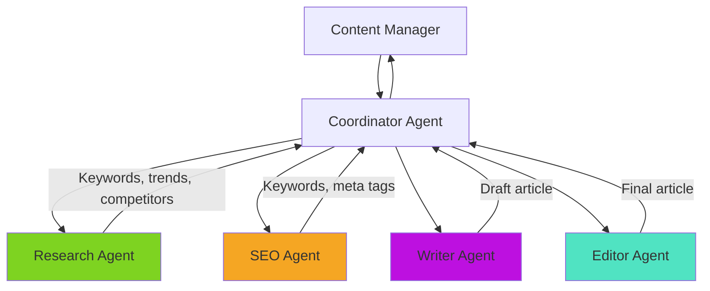
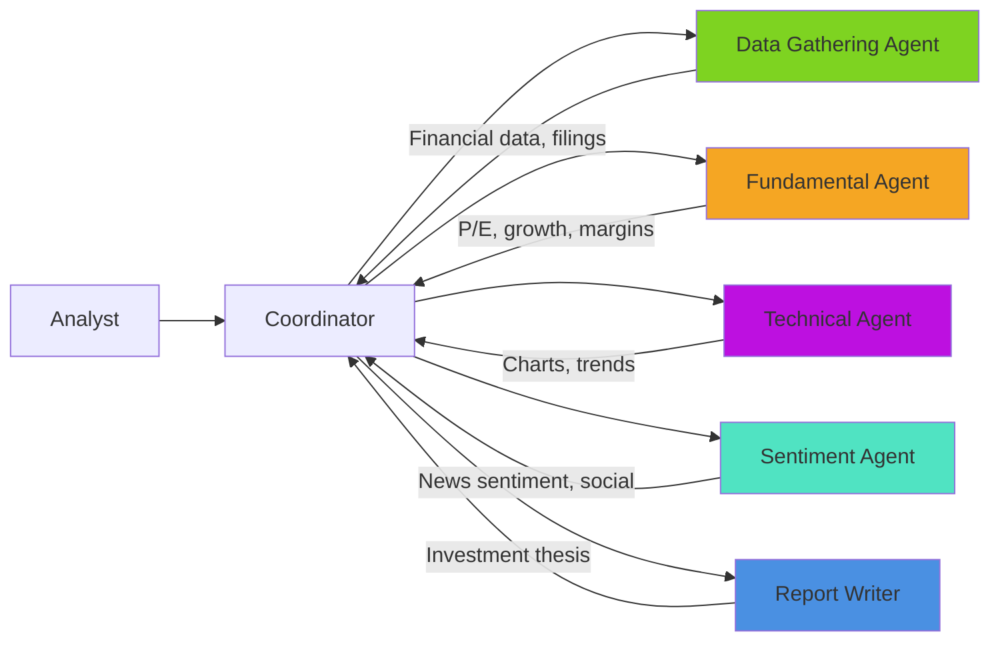
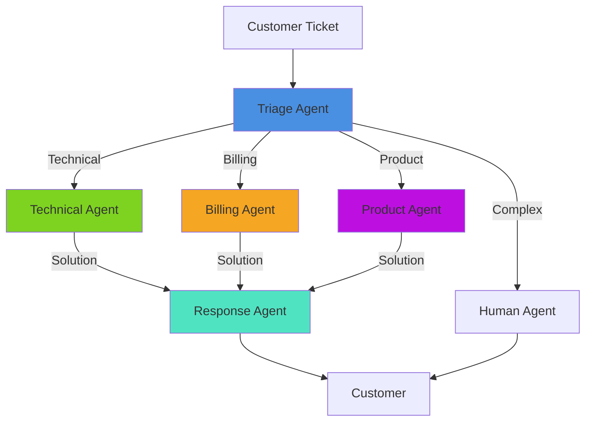
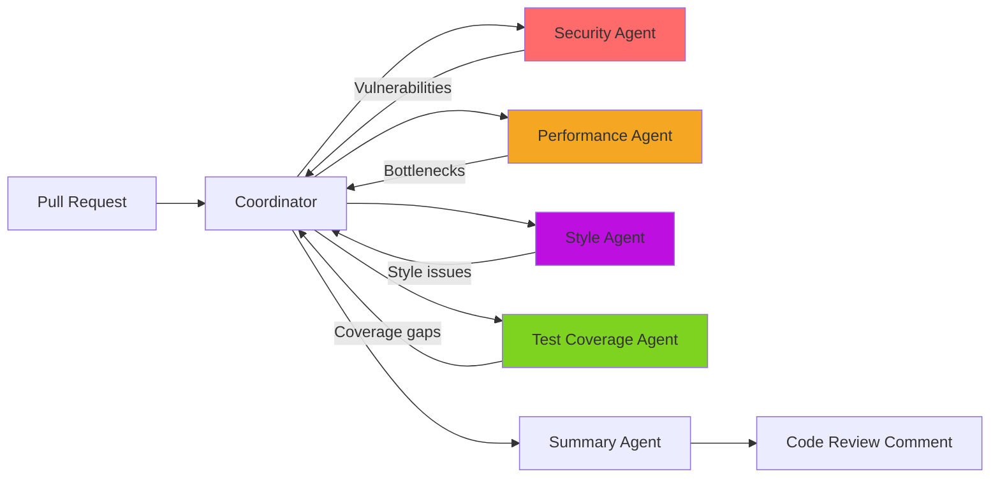
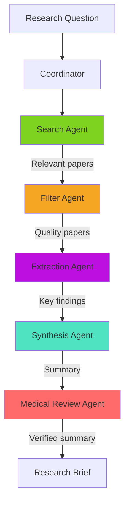

# Real-World Multi-Agent Case Studies

**Supplementary Reading** | [← Back to Index](./INDEX.md) | [↑ Reading Guide](./READING_GUIDE.md)

See how multi-agent systems solve real problems in production. Each case study includes architecture, challenges, and lessons learned.

---

## Table of Contents

1. [Case Study 1: Content Marketing Pipeline](#case-study-1-content-marketing-pipeline)
2. [Case Study 2: Financial Research Platform](#case-study-2-financial-research-platform)
3. [Case Study 3: Customer Support Automation](#case-study-3-customer-support-automation)
4. [Case Study 4: Code Review Assistant](#case-study-4-code-review-assistant)
5. [Case Study 5: Medical Literature Analysis](#case-study-5-medical-literature-analysis)
6. [Lessons Learned Across All Cases](#lessons-learned-across-all-cases)

---

## Case Study 1: Content Marketing Pipeline

**Company:** Mid-size SaaS startup (50-200 employees)  
**Problem:** Manual content creation taking 8-12 hours per article  
**Solution:** Multi-agent content pipeline

### Architecture



### Agent Breakdown

| Agent | Responsibility | Tools | Model |
|-------|---------------|-------|-------|
| **Research Agent** | Find trending topics, competitor analysis | web_search, scrape_website | GPT-3.5 |
| **SEO Agent** | Keyword research, optimization | serp_api, keyword_tool | GPT-3.5 |
| **Writer Agent** | Create article draft | format_markdown | GPT-4 |
| **Editor Agent** | Fact-check, polish, improve | grammar_check, plagiarism_check | GPT-4 |

### Implementation Details

```python
class ContentPipeline:
    """Multi-agent content creation pipeline."""
    
    def generate_article(self, topic: str, target_length: int = 2000):
        """Generate SEO-optimized article."""
        # Phase 1: Research (parallel)
        with ThreadPoolExecutor() as executor:
            research_future = executor.submit(
                self.research.find_trending_topics, topic
            )
            seo_future = executor.submit(
                self.seo.find_keywords, topic
            )
            
            research = research_future.result()
            seo_data = seo_future.result()
        
        # Phase 2: Writing (sequential)
        outline = self.writer.create_outline(topic, research, seo_data)
        draft = self.writer.write_article(outline, target_length)
        
        # Phase 3: Editing (sequential)
        edited = self.editor.fact_check(draft, research)
        polished = self.editor.polish(edited)
        
        return polished
```

### Results

**Before (Manual):**
- Time: 8-12 hours per article
- Cost: $200-300 (writer time)
- Output: 2-3 articles/week

**After (Multi-Agent):**
- Time: 45-60 minutes per article
- Cost: ~$5 (LLM API) + $50 (human review) = $55
- Output: 15-20 articles/week

**ROI:**
- 10x faster
- 5x more output
- Quality maintained (human review catches issues)
- **Payback:** 2 weeks

### Challenges & Solutions

**Challenge 1:** Articles felt "AI-generated"  
**Solution:** Added Editor agent with personality injection and human-review step

**Challenge 2:** Outdated information  
**Solution:** Research agent checks source dates, flags old data

**Challenge 3:** Plagiarism concerns  
**Solution:** Editor agent runs plagiarism check, rewrites similar content

### Lessons Learned

1. ✅ **Parallel research** (research + SEO) saved 40% time
2. ✅ **Human-in-the-loop** maintained quality
3. ✅ **Smaller models for research** (GPT-3.5) cut costs 60%
4. ⚠️ **Still need human review** - AI isn't perfect

---

## Case Study 2: Financial Research Platform

**Company:** Investment firm (10-50 employees)  
**Problem:** Analysts spending 4-6 hours per company research report  
**Solution:** Multi-agent financial analysis system

### Architecture



### Key Features

**1. Data Gathering Agent**
```python
class DataGatheringAgent:
    """Collects financial data from multiple sources."""
    
    tools = [
        "fetch_sec_filings",     # SEC EDGAR API
        "get_financial_data",     # Financial APIs
        "scrape_investor_relations" # Company websites
    ]
    
    def gather_company_data(self, ticker: str):
        return {
            "financials": self.fetch_10k_data(ticker),
            "recent_news": self.search_news(ticker),
            "insider_trades": self.get_insider_data(ticker),
            "earnings_calls": self.get_transcripts(ticker)
        }
```

**2. Fundamental Analysis Agent**
```python
class FundamentalAgent:
    """Analyzes financial metrics."""
    
    def analyze(self, financials: dict):
        return {
            "pe_ratio": self.calculate_pe(financials),
            "growth_rate": self.calculate_cagr(financials),
            "margins": self.analyze_margins(financials),
            "debt_levels": self.analyze_debt(financials),
            "recommendation": self.generate_recommendation()
        }
```

### Results

**Impact:**
- Time: 4-6 hours → 30-45 minutes (90% reduction)
- Coverage: 20 companies/month → 150 companies/month
- Cost: ~$15/report (API costs)
- Quality: Comparable to analyst reports

**Analyst Feedback:**
- "Frees me up for high-value analysis"
- "Catches data points I'd miss"
- "Still need to verify AI conclusions"

### Challenges

**Challenge 1:** Hallucinated financial data  
**Solution:** All numbers verified against source documents, citations required

**Challenge 2:** Outdated market data  
**Solution:** Real-time data feeds, timestamp all information

**Challenge 3:** Regulatory compliance (investment advice)  
**Solution:** Disclaimer added, human analyst approves all reports

### Lessons Learned

1. ✅ **Verification is critical** - financial data can't have errors
2. ✅ **Parallel analysis** - run fundamental, technical, sentiment simultaneously
3. ✅ **Human approval required** - regulatory and liability reasons
4. ⚠️ **API costs add up** - needed cost monitoring

---

## Case Study 3: Customer Support Automation

**Company:** E-commerce platform (200-500 employees)  
**Problem:** 5,000+ support tickets/day, 24-hour response time  
**Solution:** Multi-agent support triage system

### Architecture



### Agent Breakdown

**Triage Agent (Classifier)**
```python
class TriageAgent:
    """Routes tickets to appropriate specialist."""
    
    def classify_ticket(self, ticket: dict):
        # Analyze ticket content
        category = self.determine_category(ticket["message"])
        urgency = self.assess_urgency(ticket["message"])
        complexity = self.assess_complexity(ticket["message"])
        
        if complexity == "high" or urgency == "critical":
            return "human"  # Escalate complex cases
        
        return category  # Route to specialist
```

**Specialist Agents**
```python
class TechnicalAgent:
    """Handles technical issues."""
    
    tools = [
        "search_knowledge_base",
        "check_system_status",
        "view_customer_account",
        "create_ticket_reply"
    ]
    
    def solve_issue(self, ticket):
        # Search knowledge base
        solutions = self.search_knowledge_base(ticket["issue"])
        
        # Check if issue is widespread
        if self.check_system_status(ticket["issue"]):
            return self.generate_system_issue_response()
        
        # Personalized solution
        return self.generate_solution(solutions, ticket)
```

### Results

**Metrics:**

| Metric | Before | After | Improvement |
|--------|--------|-------|-------------|
| Response Time | 24 hours | 5 minutes | 288x faster |
| Resolution Rate | 65% | 78% | +13% |
| Agent Workload | 100 tickets/agent/day | 150 tickets/agent/day | +50% |
| Customer Satisfaction | 3.8/5.0 | 4.2/5.0 | +11% |
| Cost per Ticket | $5.00 | $2.50 | -50% |

**What Gets Automated:**
- 60% of tickets (simple technical, billing, product questions)
- First response always automated (within 5 minutes)
- Complex issues escalated to humans with context

### Implementation Timeline

- **Week 1-2:** Build triage agent, test on historical tickets
- **Week 3-4:** Build technical specialist, deploy to 10% of tickets
- **Week 5-6:** Add billing and product specialists
- **Week 7-8:** Full deployment, monitor quality
- **Total:** 2 months from start to full deployment

### Challenges

**Challenge 1:** Agent gives wrong answer  
**Solution:** Confidence scoring, escalate low-confidence to humans

**Challenge 2:** Customers prefer human interaction  
**Solution:** Option to speak to human always available, agents identify as AI

**Challenge 3:** Knowledge base outdated  
**Solution:** Agents flag when KB doesn't have answer, humans update

### Lessons Learned

1. ✅ **Start with triage** - routing alone added huge value
2. ✅ **Confidence thresholds** - don't auto-respond if uncertain
3. ✅ **Always offer human option** - customers appreciate choice
4. ⚠️ **Monitor for drift** - agent quality degraded over time, needed retraining

---

## Case Study 4: Code Review Assistant

**Company:** Software development team (20-50 engineers)  
**Problem:** Code review bottlenecks, inconsistent quality  
**Solution:** Multi-agent code review system

### Architecture



### Agent Implementations

**Security Agent**
```python
class SecurityAgent:
    """Identifies security vulnerabilities."""
    
    tools = [
        "scan_dependencies",  # Check for known vulnerabilities
        "analyze_sql_injection",
        "check_auth_bypass",
        "detect_secrets"  # API keys, passwords
    ]
    
    def review_security(self, diff: str):
        issues = []
        
        # Scan for common vulnerabilities
        if self.detect_sql_injection(diff):
            issues.append({
                "type": "SQL Injection Risk",
                "severity": "high",
                "line": self.find_vulnerable_line(diff)
            })
        
        # Check dependencies
        if self.has_vulnerable_deps(diff):
            issues.append({
                "type": "Vulnerable Dependency",
                "severity": "medium",
                "recommendation": "Update to latest version"
            })
        
        return issues
```

### Results

**Impact:**
- Review time: 2-4 hours → 30 minutes (human review after AI)
- Issues caught: +40% (AI finds things humans miss)
- Consistency: Much better (same standards every PR)
- Engineer satisfaction: High (faster feedback)

**What AI Catches:**
- Security vulnerabilities (SQL injection, XSS)
- Performance issues (N+1 queries, inefficient loops)
- Style inconsistencies (formatting, naming)
- Test coverage gaps

**What Humans Still Do:**
- Business logic review
- Architecture decisions
- API design feedback
- Mentoring junior engineers

### Integration

```yaml
# .github/workflows/ai-review.yml
name: AI Code Review

on: [pull_request]

jobs:
  ai-review:
    runs-on: ubuntu-latest
    steps:
      - uses: actions/checkout@v2
      - name: Run AI Code Review
        run: |
          python scripts/ai_review.py \
            --pr ${{ github.event.pull_request.number }} \
            --post-comment
```

### Lessons Learned

1. ✅ **Catches different issues than humans** - complementary, not replacement
2. ✅ **Faster feedback loop** - engineers iterate faster
3. ✅ **Consistency** - same standards applied every time
4. ⚠️ **False positives** - needed tuning to reduce noise

---

## Case Study 5: Medical Literature Analysis

**Organization:** Research hospital  
**Problem:** Physicians can't keep up with 5,000+ papers/month  
**Solution:** Multi-agent literature review system

### Architecture



### Agent Roles

**1. Search Agent** - Finds relevant papers (PubMed, Google Scholar)  
**2. Filter Agent** - Evaluates quality (peer-reviewed, citation count, journal impact)  
**3. Extraction Agent** - Pulls key findings, methodology, results  
**4. Synthesis Agent** - Combines findings, identifies patterns  
**5. Medical Review Agent** - Verifies medical accuracy, adds clinical context

### Safety & Compliance

**Critical Requirements:**
- ✅ Citations for every claim
- ✅ Confidence scores
- ✅ Medical professional review required
- ✅ No clinical recommendations (informational only)
- ✅ Disclaimer prominently displayed

### Results

**Before:**
- Literature review: 40-60 hours
- Papers reviewed: 20-30
- Coverage: Limited to researcher's time

**After:**
- Literature review: 2-3 hours (AI) + 2 hours (physician review)
- Papers reviewed: 200-300
- Coverage: Comprehensive

**Quality:**
- Accuracy: 95%+ (verified by physicians)
- Completeness: Significantly better
- Recency: Always includes latest research

### Lessons Learned

1. ✅ **Human expert review is NON-NEGOTIABLE** - medical accuracy critical
2. ✅ **Citations are mandatory** - every claim must be traceable
3. ✅ **Conservative approach** - when uncertain, flag for human review
4. ⚠️ **Liability concerns** - legal review of disclaimers required

---

## Lessons Learned Across All Cases

### What Works

**1. Start Simple**
- Begin with 2-3 agents, not 10
- Add complexity only when needed
- Prove value early

**2. Human-in-the-Loop**
- AI assists, humans decide
- Critical for quality and trust
- Especially important in regulated industries

**3. Parallel When Possible**
- Research + SEO + data gathering can run simultaneously
- Saves 30-50% of execution time
- Coordinator waits for all, then proceeds

**4. Measure Everything**
- Response times
- Quality metrics
- Cost per request
- User satisfaction

**5. Fail Gracefully**
- When uncertain, escalate to human
- Confidence thresholds prevent bad decisions
- Fallback to simpler approach

### What Doesn't Work

**1. Full Automation Too Early**
- Always keep humans in loop initially
- Build trust before removing guardrails

**2. Complex Agent Hierarchies**
- More than 2 levels is hard to debug
- Stick with coordinator-worker pattern

**3. Ignoring Costs**
- LLM API costs add up quickly
- Monitor and optimize aggressively

**4. One-Size-Fits-All**
- Different tasks need different agent designs
- Customize for your use case

### ROI Patterns

Across all cases:
- **Time savings:** 60-90% reduction
- **Cost:** Varies (content = cheaper, finance = neutral, support = much cheaper)
- **Quality:** Equal or better with human review
- **Payback:** 2-12 weeks typically

---

## Your Turn

**Apply These Patterns:**

1. **Identify a multi-step workflow** in your domain
2. **Map it to agents** (research → analyze → report?)
3. **Start with 2-3 agents**, not more
4. **Build MVP in 1-2 weeks**
5. **Measure results** (time, cost, quality)
6. **Iterate** based on feedback

**Questions to Ask:**
- What takes my team the most time?
- Can this be broken into specialists?
- Where does parallelization help?
- What requires human review?
- What's the ROI if we save X hours/week?

---

## Additional Resources

**More Case Studies:**
- [AutoGPT Documentation](https://docs.agpt.co/) - Autonomous agent examples
- [LangChain Use Cases](https://python.langchain.com/docs/use_cases/) - Various applications
- [OpenAI Cookbook](https://github.com/openai/openai-cookbook) - Production patterns

**Communities:**
- r/LangChain - Multi-agent discussions
- AI Engineer Discord - Real-world implementations
- LlamaIndex Community - Agent architectures

---

[← Back to Index](./INDEX.md) | [Start Building →](../lab-2/README.md)

