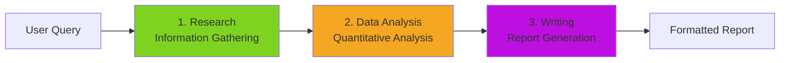
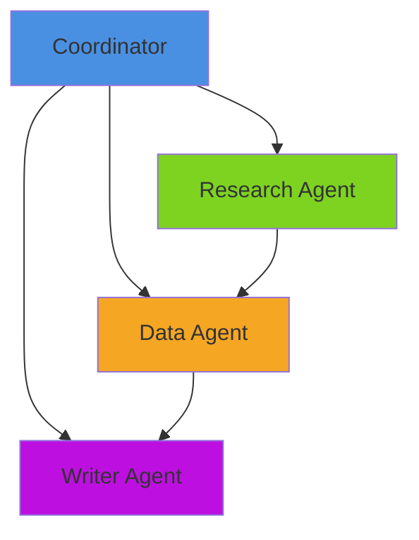
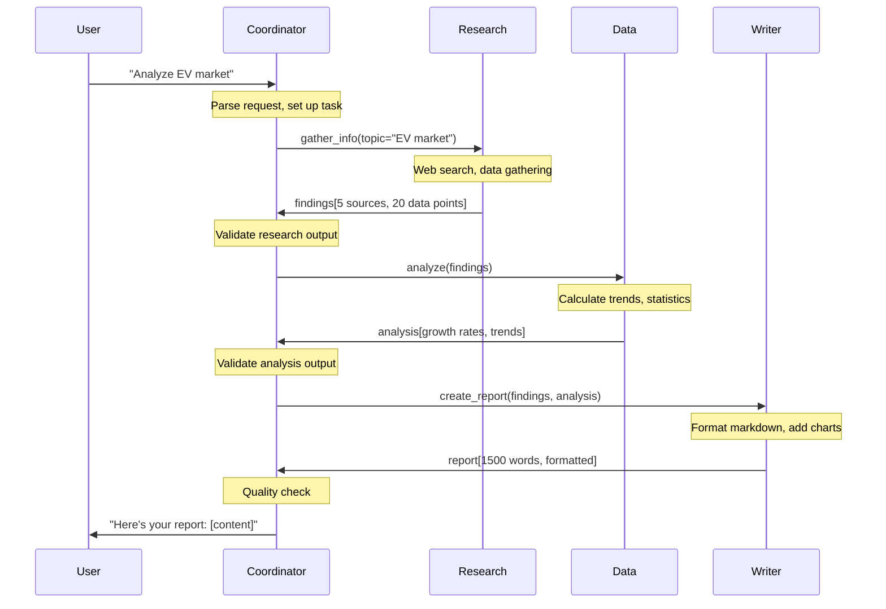
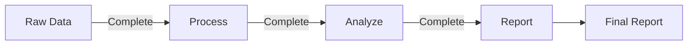
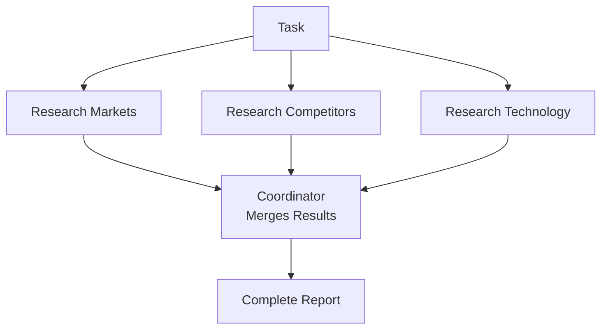
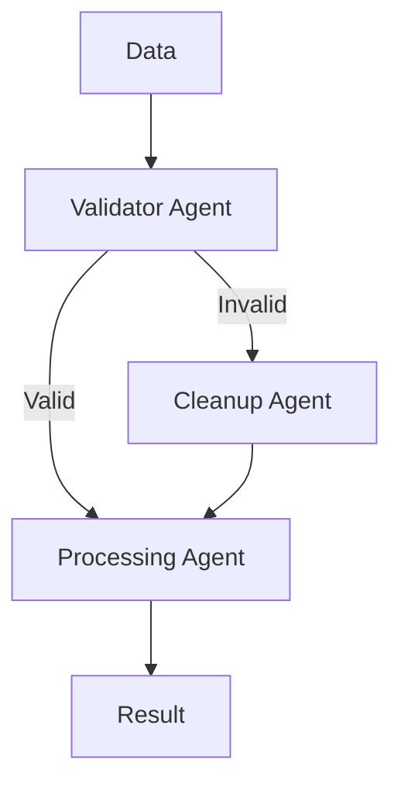

# Designing Agent Teams

**Page 5 of 9** | [← Previous: State Management](../concepts/state-management.md) | [Next: Debugging Multi-Agent Systems →](./debugging-multi-agent.md) | [↑ Reading Guide](../READING_GUIDE.md)

You understand the theory. Now the practical question: "How do I actually design a multi-agent system for MY task?" This guide walks you through a systematic process for decomposing tasks, assigning roles, and designing workflows.

## The Agent Team Design Process

### Step 1: Understand the Task

Before creating agents, deeply understand what you're building.

**Questions to Answer:**
- What is the user's goal? (Final deliverable)
- What are the inputs? (User provides what?)
- What are the outputs? (System produces what?)
- What are the constraints? (Time, resources, quality)
- What tools/data are available? (APIs, databases, files)

**Example: "Build a market research report generator"**

| Aspect | Details |
|--------|---------|
| **Goal** | Generate comprehensive market analysis reports |
| **Inputs** | Topic (e.g., "electric vehicles"), industry, region |
| **Outputs** | 5-10 page formatted report with data, charts, citations |
| **Constraints** | Must complete in <5 minutes, use free data sources |
| **Available Tools** | Web search API, CSV parser, markdown formatter |

### Step 2: Decompose into Subtasks

Break the task into distinct stages. Look for natural boundaries.

**Decomposition Strategies:**

#### Strategy A: By Process Stage (Pipeline)

Follow the natural workflow sequence.

```
Market Research Report:
1. Gather Information (Research)
2. Analyze Data (Analysis)
3. Create Visualizations (Visualization)
4. Write Report (Writing)
5. Review and Edit (Quality Check)
```

#### Strategy B: By Data Type

Group by the kind of data being handled.

```
Investment Analysis:
1. Quantitative Data (Financial Agent)
2. Qualitative Data (Sentiment Agent)
3. Historical Context (Research Agent)
4. Synthesis (Analysis Agent)
```

#### Strategy C: By Skill/Expertise

Organize by domain knowledge required.

```
Legal Document Analysis:
1. Legal Interpretation (Legal Expert Agent)
2. Technical Accuracy (Technical Expert Agent)
3. Business Impact (Business Analyst Agent)
4. Risk Assessment (Risk Manager Agent)
```

**For our example:** We'll use Strategy A (process stages).



### Step 3: Define Agent Roles

For each subtask, create an agent specification.

**Agent Specification Template:**

```markdown
## [Agent Name]

**Purpose:** [One sentence - what is this agent's job?]

**Inputs:** [What does it receive?]
- Input 1
- Input 2

**Outputs:** [What does it produce?]
- Output 1
- Output 2

**Tools Needed:**
- tool_name: description
- tool_name: description

**Success Criteria:** [How do we know it succeeded?]
- Criterion 1
- Criterion 2

**Failure Modes:** [What can go wrong?]
- Failure 1: mitigation
- Failure 2: mitigation
```

**Example: Research Agent Spec**

```markdown
## Research Agent

**Purpose:** Gather relevant information from web sources and documents.

**Inputs:**
- Research topic (string)
- Focus areas (list)
- Max sources (integer)

**Outputs:**
- List of findings (structured data)
- Source citations (URLs/paths)
- Confidence scores per finding

**Tools Needed:**
- web_search(query): Search the web
- read_file(path): Read local documents
- extract_data(html): Parse web pages

**Success Criteria:**
- Found at least 5 relevant sources
- Each finding has a citation
- Sources are from last 2 years (recency)

**Failure Modes:**
- No sources found: Broaden search terms, try alternative queries
- Rate limit hit: Wait and retry, use cached results
- Sources outdated: Flag as warning, use best available
```

### Step 4: Map Dependencies

Identify which agents depend on others.



**Dependency Analysis:**
- **Research** → Independent (can start immediately)
- **Data** → Depends on Research (needs findings to analyze)
- **Writer** → Depends on Research + Data (needs both for report)
- **Coordinator** → Orchestrates all

**Execution Strategy:**
- Parallel: None (each depends on previous)
- Sequential: Research → Data → Writer
- Total time: Sum of all agents

### Step 5: Design the Workflow

Create a detailed sequence of operations.

#### Workflow Example: Market Research Report



### Step 6: Handle Edge Cases

Plan for what happens when things go wrong.

**Common Edge Cases:**

| Scenario | Impact | Mitigation |
|----------|--------|------------|
| Agent timeout | Workflow stalled | Retry with relaxed parameters |
| Partial failure | Incomplete results | Use partial data, flag quality |
| Invalid input | Can't proceed | Validate early, ask user to clarify |
| Tool failure | Agent can't execute | Fallback to alternative tool |
| Conflicting data | Inconsistent output | Flag conflicts, ask user to resolve |

**Example: Research Agent Finds No Sources**

```python
# Coordinator workflow with error handling
try:
    findings = research_agent.gather_info(topic="EV market")
    
    if len(findings) == 0:
        # Mitigation: Broaden search
        findings = research_agent.gather_info(
            topic="electric vehicles OR battery vehicles",
            max_sources=10  # Increase limit
        )
    
    if len(findings) < 3:
        # Still not enough - report to user
        return "I couldn't find enough recent information on this topic. Try a different search term?"
    
    # Proceed to analysis
    analysis = data_agent.analyze(findings)
    
except TimeoutError:
    return "Research is taking longer than expected. Try again in a moment."
```

---

## 🎯 Practical Exercise: Design Your Own Agent Team

**Scenario:** Build a "Meeting Summarizer" that processes Zoom transcripts.

**Requirements:**
- Input: Zoom transcript (text file, 30-60 minutes of conversation)
- Output: Executive summary, action items, decisions made, next steps
- Constraint: Must highlight who said what

**Your Task:** Design the agent team.

**Worksheet:**

```markdown
## Step 1: Task Understanding
- Goal: 
- Inputs:
- Outputs:
- Constraints:

## Step 2: Subtasks
1.
2.
3.

## Step 3: Agent Specs
### Agent 1: [Name]
- Purpose:
- Inputs:
- Outputs:
- Tools:

### Agent 2: [Name]
...

## Step 4: Dependencies
[Draw or describe agent dependencies]

## Step 5: Workflow
[Sequence of operations]

## Step 6: Edge Cases
- Scenario 1:
- Mitigation 1:
```

<details>
<summary>Show Example Solution</summary>

## Step 1: Task Understanding
- **Goal:** Generate structured meeting summary from transcript
- **Inputs:** Transcript file (text), meeting metadata (date, participants)
- **Outputs:** Executive summary, action items list, decisions list, next steps
- **Constraints:** Must attribute statements to speakers, handle 30-60 min transcripts

## Step 2: Subtasks
1. **Parse Transcript** - Extract speakers and statements
2. **Categorize Content** - Identify action items, decisions, discussions
3. **Summarize** - Create concise executive summary
4. **Format** - Structure output for readability

## Step 3: Agent Specs

### Agent 1: Parser Agent
- **Purpose:** Extract structured data from raw transcript
- **Inputs:** Transcript file path, speaker list
- **Outputs:** Structured conversation (list of {speaker, timestamp, text})
- **Tools:** read_file, parse_transcript, identify_speakers

### Agent 2: Analyzer Agent
- **Purpose:** Categorize statements into action items, decisions, discussions
- **Inputs:** Structured conversation
- **Outputs:** Categorized statements
- **Tools:** classify_text, extract_action_items, identify_decisions

### Agent 3: Summary Agent
- **Purpose:** Create concise executive summary
- **Inputs:** Categorized statements
- **Outputs:** 2-3 paragraph summary
- **Tools:** summarize_text, calculate_key_topics

### Agent 4: Formatter Agent
- **Purpose:** Create final formatted document
- **Inputs:** All analysis outputs
- **Outputs:** Markdown document with sections
- **Tools:** format_markdown, create_list, add_attributions

## Step 4: Dependencies
```
Parser → Analyzer → Summary
                 ↘ Formatter
```

## Step 5: Workflow
1. Coordinator → Parser: parse transcript
2. Coordinator → Analyzer: categorize statements
3. Coordinator → Summary: create executive summary
4. Coordinator → Formatter: create final doc (needs Analyzer + Summary)
5. Return to user

## Step 6: Edge Cases
- **Transcript unclear:** Parser flags low confidence sections
- **No action items found:** Formatter notes this explicitly
- **Very long meeting (2+ hours):** Chunk into segments, process separately
</details>

---

## Example Workflows

### Workflow 1: Sequential Pipeline (Research → Analyze → Report)

**Characteristics:**
- Each agent processes entire dataset before passing to next
- Simple coordination logic
- Slower but reliable

**Use when:** Tasks have clear stages, quality > speed



### Workflow 2: Parallel Independent Tasks

**Characteristics:**
- Multiple agents work simultaneously on independent tasks
- Coordinator merges results at end
- Fast but requires careful result aggregation

**Use when:** Subtasks don't depend on each other



### Workflow 3: Conditional Branching

**Characteristics:**
- Next agent depends on results of previous agent
- Coordinator makes routing decisions
- Flexible but complex coordination

**Use when:** Workflow varies based on data



---

## 🎯 Design Checklist

Before implementing your multi-agent system, verify:

**Task Decomposition:**
- [ ] Each subtask has a clear, single purpose
- [ ] Subtasks have natural boundaries (distinct inputs/outputs)
- [ ] No subtask is trying to do multiple jobs
- [ ] Decomposition follows a logical pattern (process, data type, or expertise)

**Agent Specifications:**
- [ ] Each agent has a clear mission statement
- [ ] Inputs and outputs are explicitly defined
- [ ] Tool sets match agent responsibilities
- [ ] Success criteria are measurable
- [ ] Failure modes are identified with mitigations

**Dependencies:**
- [ ] Dependencies are explicitly mapped
- [ ] No circular dependencies
- [ ] Parallel opportunities are identified
- [ ] Critical path is understood (longest sequence)

**Workflow:**
- [ ] Sequence of operations is clearly defined
- [ ] Message types are specified (what data flows where)
- [ ] Error handling is planned for each step
- [ ] Quality gates are defined (validation points)

**Edge Cases:**
- [ ] Timeout scenarios are handled
- [ ] Partial failure recovery is planned
- [ ] Invalid input handling is defined
- [ ] Conflicting data resolution is specified

---

**Ready?** If you can design agent teams, you're ready for [Debugging Multi-Agent Systems](./debugging-multi-agent.md) to learn how to troubleshoot when things go wrong.

**Page 5 of 9** | [← Previous: State Management](../concepts/state-management.md) | [Next: Debugging Multi-Agent Systems →](./debugging-multi-agent.md) | [↑ Reading Guide](../READING_GUIDE.md)

