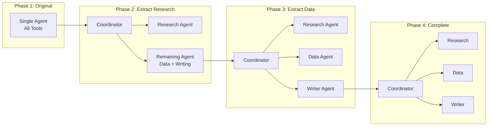

# Refactoring: Single Agent → Multi-Agent

**Page 11 (Supplementary)** | [← Back to Guides](./designing-agent-teams.md) | [↑ Reading Guide](../READING_GUIDE.md)

You've built a single agent system (Tutorial 1) and it's getting complex. This guide shows you **when and how** to refactor from single agent to multi-agent architecture.

---

## Table of Contents

1. [When to Refactor](#when-to-refactor)
2. [Refactoring Strategy](#refactoring-strategy)
3. [Step-by-Step Migration](#step-by-step-migration)
4. [Example: Research Agent Refactoring](#example-research-agent-refactoring)
5. [Testing During Migration](#testing-during-migration)
6. [Common Pitfalls](#common-pitfalls)

---

## When to Refactor

### Signs You Need Multi-Agent

✅ **Refactor when you see:**

1. **Tool Overload** - Single agent has 10+ tools
   ```python
   # Single agent doing too much
   agent.tools = [
       web_search, read_file, list_files,  # Research
       calculate, analyze_trend, compare,   # Data
       format_markdown, create_table,       # Writing
       send_email, schedule_task            # Automation
   ]
   ```

2. **Complex System Prompts** - Trying to be too many things
   ```python
   system_prompt = """
   You are a research assistant, data analyst, writer, and project manager.
   You can search the web, analyze data, write reports, and manage tasks.
   # This is too much for one agent!
   """
   ```

3. **Long Execution Times** - Single agent doing everything sequentially
   ```
   Research (2s) → Analyze (2s) → Write (1s) → Format (1s) = 6 seconds
   # Could be 3 seconds with parallelization
   ```

4. **Quality Issues** - Generalist underperforming on specialized tasks
   ```
   # Single agent's analysis is shallow
   # Dedicated data agent would be better
   ```

5. **Maintenance Nightmare** - Hard to modify without breaking
   ```python
   # Adding one feature breaks three others
   # Tight coupling everywhere
   ```

❌ **Don't refactor if:**
- System is working well and simple
- Task is naturally sequential
- Team doesn't have time for migration
- Performance is acceptable

---

## Refactoring Strategy

### The Strangler Fig Pattern

Gradually replace parts of the single agent with specialized agents:



**Benefits:**
- ✅ Incremental migration
- ✅ Test at each phase
- ✅ Rollback if needed
- ✅ Learn as you go

---

## Step-by-Step Migration

### Step 1: Analyze Current Agent

Document what your single agent does:

```python
# Current single agent analysis
"""
Current Agent: ResearchAssistant

Tools (12):
- web_search, read_file, list_files          [RESEARCH - 40% of usage]
- calculate, analyze_trend, compare          [DATA - 35% of usage]
- format_markdown, create_table, cite        [WRITING - 20% of usage]
- log_message, get_time, send_notification   [UTILITY - 5% of usage]

System Prompt: 450 words (too long!)

Common Workflows:
1. Research → Analyze → Report (70% of requests)
2. Quick fact lookup (20% of requests)
3. Data analysis only (10% of requests)

Pain Points:
- Slow for research tasks (3-4 seconds)
- Analysis quality could be better
- Hard to add new research sources
"""
```

### Step 2: Identify Natural Boundaries

Group tools by domain:

```python
# Tool grouping
RESEARCH_TOOLS = [
    "web_search",
    "read_file",
    "list_files",
    "extract_citations"
]

DATA_TOOLS = [
    "calculate",
    "analyze_trend",
    "compare_values",
    "create_chart_data"
]

WRITING_TOOLS = [
    "format_markdown",
    "create_table",
    "cite_sources",
    "check_grammar"
]

SHARED_TOOLS = [
    "log_message",  # All agents need logging
    "get_time"      # All agents need timestamps
]
```

### Step 3: Create Coordinator (Keep Old Agent)

Don't delete your working agent yet!

```python
# New coordinator that wraps existing agent
class Coordinator:
    def __init__(self):
        # Keep old agent working
        self.legacy_agent = ResearchAssistant()  # Your existing agent
        self.shared_state = SharedState()
    
    def generate_report(self, query):
        """Route to old agent for now."""
        # This keeps everything working
        return self.legacy_agent.process(query)
```

### Step 4: Extract First Specialist (Research)

Create research agent and route research tasks to it:

```python
# New specialized research agent
class ResearchAgent(WorkerAgent):
    def __init__(self, shared_state):
        super().__init__(name="research", shared_state=shared_state)
        self.system_prompt = """
        You are a Research Specialist.
        Your job: Gather information from sources.
        You DO NOT analyze or write - just gather facts.
        """
        self.tools = {
            "web_search": web_search,
            "read_file": read_file,
            "list_files": list_files
        }
    
    def gather_info(self, query):
        # Focused implementation
        pass

# Update coordinator
class Coordinator:
    def __init__(self):
        self.research = ResearchAgent(shared_state)  # NEW
        self.legacy_agent = ResearchAssistant()       # OLD (still there)
        self.use_new_research = True  # Feature flag
    
    def generate_report(self, query):
        # Route research to new agent
        if self.use_new_research:
            findings = self.research.gather_info(query)
            # Fall back to legacy for analysis and writing
            return self.legacy_agent.process_with_findings(query, findings)
        else:
            # Old path still works
            return self.legacy_agent.process(query)
```

**Test:** Verify research agent produces same quality output.

### Step 5: Extract Second Specialist (Data)

```python
class DataAgent(WorkerAgent):
    def __init__(self, shared_state):
        super().__init__(name="data", shared_state=shared_state)
        self.system_prompt = "You are a Data Analyst..."
        self.tools = {
            "calculate": calculate,
            "analyze_trend": analyze_trend
        }

# Update coordinator
class Coordinator:
    def __init__(self):
        self.research = ResearchAgent(shared_state)
        self.data = DataAgent(shared_state)           # NEW
        self.legacy_agent = ResearchAssistant()       # OLD
        self.use_new_data = True
    
    def generate_report(self, query):
        findings = self.research.gather_info(query)
        
        if self.use_new_data:
            analysis = self.data.analyze(findings)
            # Fall back to legacy for writing only
            return self.legacy_agent.write_report(findings, analysis)
        else:
            return self.legacy_agent.process_with_findings(query, findings)
```

### Step 6: Extract Final Specialist (Writer)

```python
class WriterAgent(WorkerAgent):
    def __init__(self, shared_state):
        super().__init__(name="writer", shared_state=shared_state)
        self.system_prompt = "You are a Technical Writer..."
        self.tools = {
            "format_markdown": format_markdown,
            "create_table": create_table
        }

# Update coordinator - PURE MULTI-AGENT NOW
class Coordinator:
    def __init__(self):
        self.research = ResearchAgent(shared_state)
        self.data = DataAgent(shared_state)
        self.writer = WriterAgent(shared_state)
        # No more legacy_agent!
    
    def generate_report(self, query):
        # Pure multi-agent workflow
        findings = self.research.gather_info(query)
        analysis = self.data.analyze(findings)
        report = self.writer.create_report(findings, analysis)
        return report
```

### Step 7: Remove Legacy Agent

Once all tests pass:

```python
# Delete old single agent
# rm src/agent/research_assistant.py

# Update coordinator
class Coordinator:
    def __init__(self):
        self.research = ResearchAgent(shared_state)
        self.data = DataAgent(shared_state)
        self.writer = WriterAgent(shared_state)
        # Legacy agent gone!
```

---

## Example: Research Agent Refactoring

### Before (Single Agent)

```python
# src/agent/simple_agent.py
class SimpleAgent:
    """Single agent doing everything."""
    
    def __init__(self):
        self.system_prompt = """
        You are a helpful assistant that can:
        - Search the web for information
        - Analyze data and calculate trends
        - Write formatted reports
        - Manage your workflow
        
        Use tools appropriately for each task.
        """
        
        self.tools = {
            # Research
            "web_search": web_search,
            "read_file": read_file,
            
            # Data
            "calculate": calculate,
            "analyze": analyze_trend,
            
            # Writing
            "format_markdown": format_markdown,
            "create_table": create_table
        }
    
    def process(self, query):
        """Do everything in one agent."""
        # Research
        findings = self.use_tool("web_search", {"query": query})
        
        # Analyze
        analysis = self.use_tool("analyze", {"data": findings})
        
        # Write
        report = self.use_tool("format_markdown", {
            "content": f"{findings}\n\n{analysis}"
        })
        
        return report
```

**Problems:**
- 8 tools (too many)
- System prompt is vague
- All synchronous (slow)
- Hard to improve one capability

### After (Multi-Agent)

```python
# src/multi_agent/specialized/research_agent.py
class ResearchAgent(WorkerAgent):
    """Focused on research only."""
    
    def __init__(self, shared_state):
        super().__init__(name="research", shared_state=shared_state)
        
        self.system_prompt = """
        You are a Research Specialist.
        Gather information from sources.
        Cite all sources. DO NOT analyze.
        """
        
        self.tools = {
            "web_search": web_search,
            "read_file": read_file
        }
    
    def gather_info(self, query):
        findings = []
        # Focused research logic
        return findings


# src/multi_agent/specialized/data_agent.py
class DataAgent(WorkerAgent):
    """Focused on analysis only."""
    
    def __init__(self, shared_state):
        super().__init__(name="data", shared_state=shared_state)
        
        self.system_prompt = """
        You are a Data Analyst.
        Analyze trends and calculate metrics.
        Show your work. DO NOT write prose.
        """
        
        self.tools = {
            "calculate": calculate,
            "analyze": analyze_trend
        }
    
    def analyze(self, findings):
        analysis = {}
        # Focused analysis logic
        return analysis


# src/multi_agent/specialized/writer_agent.py
class WriterAgent(WorkerAgent):
    """Focused on writing only."""
    
    def __init__(self, shared_state):
        super().__init__(name="writer", shared_state=shared_state)
        
        self.system_prompt = """
        You are a Technical Writer.
        Create clear, formatted reports.
        Use research and analysis provided.
        """
        
        self.tools = {
            "format_markdown": format_markdown,
            "create_table": create_table
        }
    
    def create_report(self, findings, analysis):
        report = ""
        # Focused writing logic
        return report


# src/multi_agent/coordinator.py
class Coordinator:
    """Orchestrates specialized agents."""
    
    def __init__(self):
        self.shared_state = SharedState()
        self.research = ResearchAgent(self.shared_state)
        self.data = DataAgent(self.shared_state)
        self.writer = WriterAgent(self.shared_state)
    
    def generate_report(self, query):
        # Sequential workflow
        findings = self.research.gather_info(query)
        analysis = self.data.analyze(findings)
        report = self.writer.create_report(findings, analysis)
        return report
```

**Benefits:**
- 2-3 tools per agent (manageable)
- Clear system prompts (focused)
- Can parallelize later
- Easy to improve each agent independently

---

## Testing During Migration

### Test Strategy

```python
# tests/test_migration.py
class TestMigration:
    """Verify new multi-agent matches old single agent behavior."""
    
    def test_same_output_quality(self):
        """Multi-agent should produce similar quality."""
        query = "Analyze EV market trends"
        
        # Old agent
        old_agent = SimpleAgent()
        old_result = old_agent.process(query)
        
        # New multi-agent
        coordinator = Coordinator()
        new_result = coordinator.generate_report(query)
        
        # Compare
        assert len(new_result) >= len(old_result) * 0.8  # At least 80% as long
        assert "electric vehicle" in new_result.lower()
        assert "market" in new_result.lower()
    
    def test_preserves_functionality(self):
        """All old features still work."""
        test_cases = [
            "Research EVs",
            "Calculate growth rate",
            "Write report about Tesla"
        ]
        
        old_agent = SimpleAgent()
        coordinator = Coordinator()
        
        for query in test_cases:
            old_result = old_agent.process(query)
            new_result = coordinator.generate_report(query)
            
            # Both should succeed
            assert old_result is not None
            assert new_result is not None
    
    def test_performance_acceptable(self):
        """Multi-agent shouldn't be much slower."""
        import time
        
        query = "Test query"
        
        # Measure old
        start = time.time()
        old_agent.process(query)
        old_time = time.time() - start
        
        # Measure new
        start = time.time()
        coordinator.generate_report(query)
        new_time = time.time() - start
        
        # New should be within 2x of old
        assert new_time < old_time * 2.0
```

---

## Common Pitfalls

### Pitfall 1: Big Bang Rewrite

❌ **Bad:** Rewrite everything at once
```python
# Delete old agent, write 3 new agents from scratch
# High risk, no rollback
```

✅ **Good:** Incremental migration
```python
# Keep old agent, gradually extract specialists
# Test at each step, can rollback
```

### Pitfall 2: Forgetting Shared State

❌ **Bad:** Agents can't see each other's work
```python
# Research agent: findings = {...}
# Data agent: can't access findings!
```

✅ **Good:** Use shared state or messages
```python
# Research agent: shared_state.set("findings", findings)
# Data agent: findings = shared_state.get("findings")
```

### Pitfall 3: Over-Specialization

❌ **Bad:** Too many tiny agents
```python
# Tesla Research Agent
# BMW Research Agent  
# Ford Research Agent
# (Should be one Research Agent with parameters)
```

✅ **Good:** Right level of specialization
```python
# Research Agent (handles all companies)
# Data Agent
# Writer Agent
```

### Pitfall 4: No Feature Flags

❌ **Bad:** Hard cutover
```python
# Use new agents or bust
if not new_agents_work:
    system_is_down()
```

✅ **Good:** Gradual rollout with flags
```python
if feature_flag("use_new_research"):
    findings = research_agent.gather_info(query)
else:
    findings = old_agent.research(query)
```

### Pitfall 5: Not Testing Old Functionality

❌ **Bad:** Only test new features
```python
def test_new_parallel_execution():
    # Test new feature
    pass
# Forget to test that old workflows still work
```

✅ **Good:** Regression tests
```python
def test_all_old_workflows_still_work():
    for workflow in old_workflows:
        assert coordinator.execute(workflow) works
```

---

## Migration Checklist

Before starting:
- [ ] Document current agent capabilities
- [ ] Identify natural tool boundaries
- [ ] Have comprehensive tests for current behavior
- [ ] Set aside 2-4 weeks for migration

During migration:
- [ ] Keep old agent working (don't delete yet)
- [ ] Extract one specialist at a time
- [ ] Test after each extraction
- [ ] Use feature flags for gradual rollout
- [ ] Monitor performance at each step

After migration:
- [ ] All tests pass (old + new)
- [ ] Performance is acceptable
- [ ] Team trained on new architecture
- [ ] Documentation updated
- [ ] Can safely delete old agent

---

## Summary

**Refactoring Pattern:**
1. ✅ Analyze current agent
2. ✅ Identify boundaries
3. ✅ Create coordinator (keep old agent)
4. ✅ Extract first specialist
5. ✅ Test thoroughly
6. ✅ Extract second specialist
7. ✅ Test thoroughly
8. ✅ Extract final specialist
9. ✅ Remove legacy agent
10. ✅ Celebrate! 🎉

**Key Principle:** **Incremental, tested migration** beats big-bang rewrite.

---

**See Also:**
- [Designing Agent Teams](./designing-agent-teams.md) - How to design the target architecture
- [Testing Multi-Agent Systems](./testing-multi-agent.md) - Test your migration
- [Multi-Agent Architecture](../concepts/multi-agent-architecture.md) - When to use multi-agent

---

[← Back to Guides](./designing-agent-teams.md) | [↑ Reading Guide](../READING_GUIDE.md)

