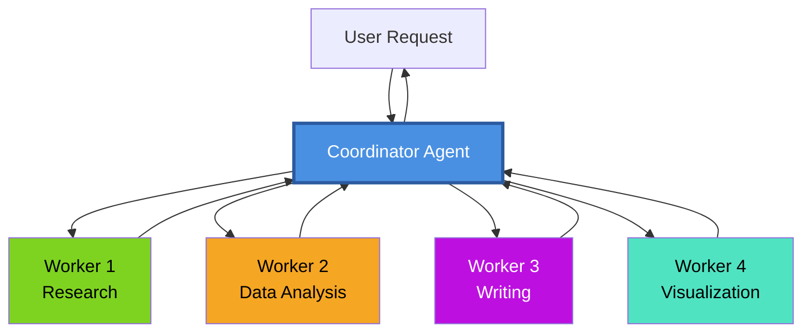
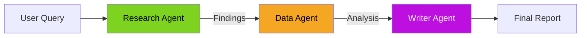
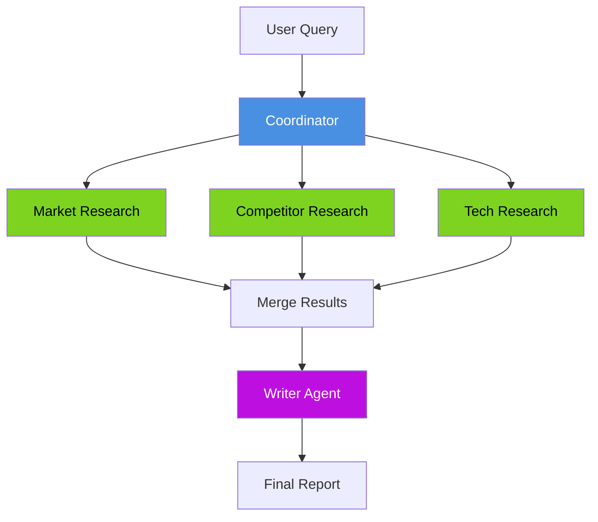
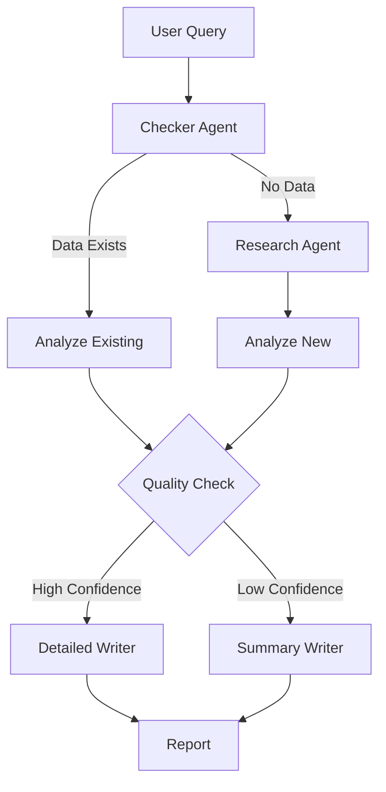
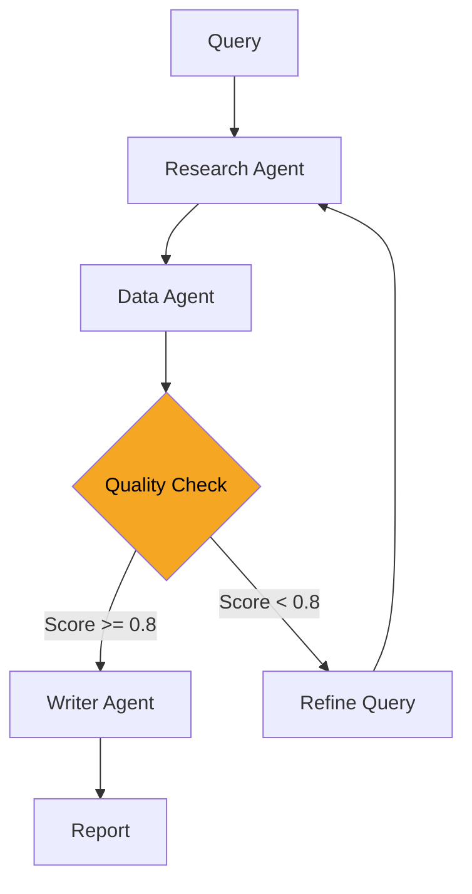

# Coordinator Patterns

**Page 8 of 9** | [← Previous: Testing Multi-Agent Systems](../guides/testing-multi-agent.md) | [Next: Hierarchical vs. Peer-to-Peer →](./hierarchical-vs-peer.md) | [↑ Reading Guide](../READING_GUIDE.md)

The coordinator is the "brain" of a multi-agent system. It decides which agents to activate, in what order, and how to combine their results. This page explores proven coordination patterns and when to use each.

## Single Coordinator Architecture

The simplest and most common pattern: one coordinator orchestrates all workers.



**Coordinator Responsibilities:**
1. **Task Decomposition:** Break user request into subtasks
2. **Delegation:** Assign subtasks to appropriate workers
3. **Sequencing:** Determine execution order
4. **Aggregation:** Combine worker outputs
5. **Error Handling:** Retry or recover from failures
6. **Response Synthesis:** Create final response for user

## Core Coordinator Patterns

### Pattern 1: Sequential Pipeline

Workers execute in a fixed order, each building on the previous.

```python
class SequentialCoordinator:
    """
    Executes agents one at a time in defined order.
    Each agent's output becomes next agent's input.
    """
    
    def __init__(self, shared_state: SharedState):
        self.shared_state = shared_state
        self.research = ResearchAgent(shared_state)
        self.data = DataAgent(shared_state)
        self.writer = WriterAgent(shared_state)
    
    def generate_report(self, query: str) -> str:
        """Execute research → data → writer pipeline."""
        # Step 1: Research
        research_result = self.research.gather_info(query)
        if research_result.status != "success":
            return f"Research failed: {research_result.error}"
        
        # Step 2: Data Analysis
        data_result = self.data.analyze_trends()
        if data_result.status != "success":
            return f"Analysis failed: {data_result.error}"
        
        # Step 3: Writing
        writer_result = self.writer.create_report()
        if writer_result.status != "success":
            return f"Writing failed: {writer_result.error}"
        
        return writer_result.report
```

**Flow Diagram:**


**When to Use:**
- Tasks have clear sequential dependencies
- Each stage needs complete output from previous stage
- Simplicity and predictability are priorities

**Pros:**
- ✅ Easy to understand and debug
- ✅ Clear execution order
- ✅ Predictable timing

**Cons:**
- ❌ Can't parallelize independent work
- ❌ One slow agent blocks everything
- ❌ Total time = sum of all agents

### Pattern 2: Parallel Execution with Merge

Independent workers execute simultaneously, coordinator merges results.

```python
class ParallelCoordinator:
    """
    Executes independent agents in parallel.
    Merges results once all complete.
    """
    
    def __init__(self, shared_state: SharedState):
        self.shared_state = shared_state
        self.market_research = MarketResearchAgent(shared_state)
        self.competitor_research = CompetitorResearchAgent(shared_state)
        self.tech_research = TechResearchAgent(shared_state)
        self.writer = WriterAgent(shared_state)
    
    def generate_report(self, query: str) -> str:
        """Execute research agents in parallel, then write."""
        # Phase 1: Parallel research
        results = self._execute_parallel([
            (self.market_research, "gather_market_data", query),
            (self.competitor_research, "gather_competitor_data", query),
            (self.tech_research, "gather_tech_data", query)
        ])
        
        # Check all succeeded
        if not all(r.status == "success" for r in results):
            return "Some research tasks failed"
        
        # Phase 2: Merge and write
        merged_data = self._merge_results(results)
        self.shared_state.set("research_findings", merged_data)
        
        writer_result = self.writer.create_report()
        return writer_result.report
    
    def _execute_parallel(self, tasks):
        """Execute tasks in parallel (simplified)."""
        import concurrent.futures
        
        results = []
        with concurrent.futures.ThreadPoolExecutor(max_workers=3) as executor:
            futures = [
                executor.submit(agent.execute, action, query)
                for agent, action, query in tasks
            ]
            for future in concurrent.futures.as_completed(futures):
                results.append(future.result())
        
        return results
```

**Flow Diagram:**


**When to Use:**
- Subtasks are independent (don't need each other's outputs)
- Speed is important
- Workers access different data sources

**Pros:**
- ✅ Faster: Total time ≈ slowest agent (not sum)
- ✅ Efficient use of resources
- ✅ Natural for independent research tasks

**Cons:**
- ❌ More complex coordination logic
- ❌ Need to handle partial failures
- ❌ Merge logic can be tricky

### Pattern 3: Conditional Branching

Next agent depends on results of previous agent.

```python
class ConditionalCoordinator:
    """
    Chooses next agent based on previous results.
    Implements decision logic.
    """
    
    def generate_report(self, query: str) -> str:
        """Execute workflow with conditional logic."""
        # Step 1: Check data availability
        checker_result = self.checker.check_data_availability(query)
        
        if checker_result.data_available:
            # Path A: Use existing data
            analysis = self.data_agent.analyze_existing_data()
        else:
            # Path B: Gather new data first
            research = self.research_agent.gather_new_data(query)
            if research.status != "success":
                return "Could not gather data"
            analysis = self.data_agent.analyze_new_data()
        
        # Step 2: Choose report format based on data quality
        if analysis.confidence > 0.8:
            # High confidence: Detailed report
            report = self.detailed_writer.create_full_report()
        else:
            # Low confidence: Summary with caveats
            report = self.summary_writer.create_summary_with_warnings()
        
        return report
```

**Flow Diagram:**


**When to Use:**
- Workflow varies based on data or results
- Different quality levels need different processing
- Want to optimize for common cases (skip unnecessary work)

**Pros:**
- ✅ Flexible and adaptive
- ✅ Can optimize for common paths
- ✅ Handles varying data quality

**Cons:**
- ❌ Complex branching logic
- ❌ More code paths to test
- ❌ Harder to predict execution time

### Pattern 4: Iterative Refinement

Agent outputs feed back to earlier stages for improvement.

```python
class IterativeCoordinator:
    """
    Allows feedback loops for quality improvement.
    Agents can refine their outputs based on downstream feedback.
    """
    
    def generate_report(self, query: str, max_iterations: int = 3) -> str:
        """Execute with iterative refinement."""
        for iteration in range(max_iterations):
            # Research
            research = self.research_agent.gather_info(query)
            
            # Analysis
            analysis = self.data_agent.analyze(research.findings)
            
            # Quality check
            quality = self.quality_agent.evaluate_analysis(analysis)
            
            if quality.score >= 0.8:
                # Good enough, proceed to writing
                break
            
            if iteration < max_iterations - 1:
                # Provide feedback for next iteration
                feedback = quality.improvement_suggestions
                query = self._refine_query(query, feedback)
        
        # Final writing
        report = self.writer_agent.create_report()
        return report
```

**Flow Diagram:**


**When to Use:**
- Quality is more important than speed
- Initial attempts often need refinement
- Have a way to evaluate quality objectively

**Pros:**
- ✅ Higher quality outputs
- ✅ Can handle ambiguous initial queries
- ✅ Self-improving system

**Cons:**
- ❌ Slower (multiple iterations)
- ❌ Need reliable quality evaluation
- ❌ Risk of infinite loops (always use max_iterations)

## Delegation Strategies

### Strategy 1: Broadcast (All Agents)

Send same task to all agents, use best result.

```python
def broadcast_delegation(self, query: str):
    """Ask all agents, use best answer."""
    results = []
    for agent in self.all_agents:
        result = agent.process(query)
        results.append((agent.name, result))
    
    # Choose best result (by confidence, length, etc.)
    best = max(results, key=lambda x: x[1].confidence)
    return best[1]
```

**Use Case:** Multiple agents have different strengths, want most confident answer

### Strategy 2: Round Robin

Distribute tasks evenly across agents.

```python
def round_robin_delegation(self, tasks: list):
    """Distribute tasks evenly."""
    results = []
    for i, task in enumerate(tasks):
        agent = self.agents[i % len(self.agents)]
        result = agent.process(task)
        results.append(result)
    return results
```

**Use Case:** Load balancing across identical agents

### Strategy 3: Capability-Based

Choose agent based on task requirements.

```python
def capability_delegation(self, task: Task):
    """Route to agent with right capabilities."""
    required_tools = task.required_tools
    
    for agent in self.agents:
        if required_tools.issubset(agent.available_tools):
            return agent.process(task)
    
    raise ValueError(f"No agent can handle task requiring {required_tools}")
```

**Use Case:** Heterogeneous agents with different capabilities

## Result Aggregation Techniques

### Technique 1: Last Result Wins

Use output of final agent only.

```python
def last_result_wins(self, agents: list):
    """Only care about final output."""
    result = None
    for agent in agents:
        result = agent.execute()
    return result  # Last agent's output
```

### Technique 2: Merge All Results

Combine outputs from all agents.

```python
def merge_all_results(self, agents: list):
    """Combine all agent outputs."""
    combined = {
        "findings": [],
        "analysis": [],
        "sources": []
    }
    
    for agent in agents:
        result = agent.execute()
        combined["findings"].extend(result.findings)
        combined["sources"].extend(result.sources)
    
    return combined
```

### Technique 3: Weighted Combination

Weight results by agent confidence.

```python
def weighted_combination(self, agents: list):
    """Weight by confidence scores."""
    results = []
    total_confidence = 0
    
    for agent in agents:
        result = agent.execute()
        results.append(result)
        total_confidence += result.confidence
    
    # Weighted average
    if total_confidence > 0:
        for result in results:
            result.weight = result.confidence / total_confidence
    
    return self._combine_weighted(results)
```

## Error Handling and Retries

### Retry Pattern with Exponential Backoff

```python
def execute_with_retry(
    self, 
    agent, 
    action: str, 
    payload: dict,
    max_retries: int = 3
):
    """Retry failed tasks with increasing delays."""
    for attempt in range(max_retries):
        try:
            result = agent.execute(action, payload)
            
            if result.status == "success":
                return result
            
            # Partial success: decide whether to retry
            if result.status == "partial" and result.confidence > 0.5:
                return result  # Good enough
            
        except TimeoutError as e:
            if attempt == max_retries - 1:
                raise  # Final attempt, give up
            
            # Exponential backoff
            wait_time = 2 ** attempt
            time.sleep(wait_time)
            
        except Exception as e:
            # Unexpected error: log and fail
            self.logger.error(f"Agent {agent.name} failed: {e}")
            raise
    
    return Response(status="error", error="Max retries exceeded")
```

### Fallback Pattern

```python
def execute_with_fallback(self, primary_agent, fallback_agent, task):
    """Use fallback if primary fails."""
    try:
        result = primary_agent.execute(task)
        if result.status == "success":
            return result
    except Exception as e:
        self.logger.warning(f"Primary agent failed: {e}, using fallback")
    
    # Primary failed, use fallback
    return fallback_agent.execute(task)
```

---

## 📦 Real-World Pattern Applications

See how each pattern solves actual business problems. These examples show which pattern to use when.

### Example 1: Blog Post Generator (Sequential Pipeline)

**Use Case:** Content marketing automation

**Business Need:** Generate SEO-optimized blog posts from topics

**Agents:**
1. **Research Agent** (2s) → Gather 10 source articles on topic
2. **Outline Agent** (3s) → Create structured outline with SEO keywords
3. **Writer Agent** (5s) → Write full sections following outline
4. **SEO Agent** (2s) → Optimize keywords, meta description, headings
5. **Editor Agent** (3s) → Final polish, fact-check, readability

**Why Sequential:** Each agent needs complete output from previous agent

**Timing:**
- Sequential execution: 2s + 3s + 5s + 2s + 3s = **15 seconds total**
- Coordinator overhead: ~1s
- **Total: 16 seconds**

**Code Pattern:**
```python
def generate_blog_post(topic):
    research = research_agent.gather_sources(topic)
    outline = outline_agent.create_structure(research)
    draft = writer_agent.write_content(outline)
    optimized = seo_agent.optimize(draft)
    final = editor_agent.polish(optimized)
    return final
```

**Business Impact:**
- Manual process: 8-12 hours per post
- Automated: 16 seconds + 30 min human review
- **Result:** 20x faster content production

---

### Example 2: Competitive Intelligence Dashboard (Parallel Execution)

**Use Case:** Market research automation

**Business Need:** Analyze 5 competitors simultaneously for strategic planning

**Agents (running in parallel):**
1. **Company A Analyst** (10s) → Financial metrics, products, market position
2. **Company B Analyst** (10s) → Same analysis for Company B
3. **Company C Analyst** (10s) → Same for Company C
4. **Market Trends Agent** (8s) → Industry-wide trends and forecasts
5. **Tech Landscape Agent** (7s) → Technology adoption and innovation

**Merge Agent:** Coordinator waits for all, creates comparison matrix

**Why Parallel:** All tasks are completely independent

**Timing:**
- Sequential would be: 10+10+10+8+7 = **45 seconds**
- Parallel execution: MAX(10,10,10,8,7) = **10 seconds** (slowest agent)
- Merge logic: +2s
- **Total: 12 seconds vs 45 seconds**
- **Speedup: 3.75x faster**

**Code Pattern:**
```python
def generate_competitive_intel(companies):
    with ThreadPoolExecutor(max_workers=5) as executor:
        futures = {
            executor.submit(analyze_company, c): c 
            for c in companies
        }
        futures['trends'] = executor.submit(analyze_trends)
        futures['tech'] = executor.submit(analyze_tech)
        
        results = {k: f.result() for k, f in futures.items()}
    
    return coordinator.merge_and_compare(results)
```

**Business Impact:**
- Manual research: 2-3 days
- Automated: 12 seconds + 1 hour human analysis
- **Result:** 16x faster strategic insights

---

### Example 3: Customer Support Triage (Conditional Branching)

**Use Case:** Automated ticket routing and resolution

**Business Need:** Handle 1000+ daily support tickets efficiently

**Flow:**
```
Ticket arrives
    ↓
Triage Agent: Classify urgency & category
    ├─> Technical (40%) → Technical Support Agent
    │                      ├─> Resolved → Auto-close
    │                      └─> Complex → Escalate to L2
    │
    ├─> Billing (30%) → Billing Agent
    │                   ├─> Simple → Auto-resolve
    │                   └─> Refund needed → Human approval
    │
    ├─> Product (20%) → Product Team Agent
    │                   └─> Feature request → Add to roadmap
    │
    └─> Unclear (10%) → Human Review
```

**Why Conditional:** Different tickets need different expertise

**Timing by Path:**
- Technical auto-resolve: 5s
- Billing with approval: 8s + human
- Product routing: 3s
- Human review: immediate handoff

**Code Pattern:**
```python
def handle_support_ticket(ticket):
    classification = triage_agent.classify(ticket)
    
    if classification.category == "technical":
        solution = tech_agent.diagnose(ticket)
        if solution.confidence > 0.9:
            return auto_resolve(solution)
        else:
            return escalate_to_human(solution)
    
    elif classification.category == "billing":
        resolution = billing_agent.process(ticket)
        if resolution.needs_approval:
            return await_human_approval(resolution)
        return auto_resolve(resolution)
    
    elif classification.category == "product":
        return product_agent.route_to_team(ticket)
    
    else:
        return immediate_human_review(ticket)
```

**Business Impact:**
- 60% auto-resolved (no human needed)
- 30% agent-assisted (human approval only)
- 10% human-only
- **Result:** 60% cost reduction, 5x faster response time

---

### Example 4: Code Review Automation (Parallel + Sequential Mixed)

**Use Case:** Automated pull request reviews

**Business Need:** Ensure code quality without slowing down development

**Phase 1 - Parallel Analysis (independent checks):**
```
├─> Quality Agent (3s) → Complexity, readability, coverage
├─> Security Agent (5s) → Vulnerability scanning, dep check
└─> Test Agent (8s) → Run test suite, check edge cases
```

**Phase 2 - Sequential Synthesis:**
```
Writer Agent (2s) → Aggregate findings → Generate formatted review
```

**Why Mixed:** Analysis can be parallel (independent), reporting must be sequential (needs all data)

**Timing:**
- Phase 1 parallel: MAX(3s, 5s, 8s) = **8 seconds**
- Phase 2 sequential: 2s
- **Total: 10 seconds**
- vs Sequential: 3+5+8+2 = **18 seconds**
- **Speedup: 1.8x**

**Code Pattern:**
```python
def review_pull_request(pr):
    # Phase 1: Parallel analysis
    with ThreadPoolExecutor() as executor:
        quality_future = executor.submit(quality_agent.analyze, pr)
        security_future = executor.submit(security_agent.scan, pr)
        test_future = executor.submit(test_agent.run, pr)
        
        results = {
            'quality': quality_future.result(),
            'security': security_future.result(),
            'tests': test_future.result()
        }
    
    # Phase 2: Sequential synthesis
    review = writer_agent.create_review(results)
    return review
```

**Business Impact:**
- Manual review: 30-60 minutes per PR
- Automated first pass: 10 seconds
- Human focus on: Architecture and logic (10-15 min)
- **Result:** 3x more PRs reviewed, higher quality

---

### Example 5: Financial Report Generation (Iterative Refinement)

**Use Case:** Quarterly earnings analysis

**Business Need:** Generate investor-ready financial reports with high accuracy

**Iterative Flow:**
```
Round 1: Draft Analysis
    ├─> Data Agent: Calculate metrics
    ├─> Writer Agent: Draft report
    └─> Reviewer Agent: Score quality (7/10 - needs work)
         ↓
Round 2: Refinement
    ├─> Data Agent: Add deeper analysis
    ├─> Writer Agent: Improve narrative
    └─> Reviewer Agent: Score (9/10 - good)
         ↓
Round 3: Final Polish
    ├─> Writer Agent: Final edits
    └─> Reviewer Agent: Score (10/10 - ready)
              ↓
         Publish
```

**Why Iterative:** Quality threshold must be met before publishing

**Timing:**
- Round 1: 10s
- Round 2: 8s (targeted fixes)
- Round 3: 3s (polish)
- **Total: 21 seconds** (3 rounds)

**Code Pattern:**
```python
def generate_financial_report(data, quality_threshold=9.0):
    max_rounds = 5
    
    for round_num in range(1, max_rounds + 1):
        # Generate or refine
        if round_num == 1:
            report = initial_draft(data)
        else:
            report = refine_report(report, feedback)
        
        # Review
        review = reviewer_agent.evaluate(report)
        
        if review.score >= quality_threshold:
            return report  # Done!
        
        feedback = review.improvement_suggestions
    
    return report  # Max rounds reached
```

**Business Impact:**
- Manual: 2-3 days with multiple review cycles
- Automated: 21 seconds + 1 hour human review
- **Result:** Same-day reporting, 95% accuracy

---

### Example 6: Content Moderation Pipeline (Event-Driven)

**Use Case:** Social media content screening

**Business Need:** Screen 10,000+ posts/day for policy violations

**Event-Driven Flow:**
```
Post Published (Event)
    ↓
Moderation Agent: Initial screening (100ms)
    ├─> Safe (85%) → Publish immediately
    ├─> Flagged (10%) → 
    │   └─> Deep Analysis Agent (2s)
    │       ├─> Confidence > 90% → Auto-remove
    │       └─> Confidence < 90% → Human review queue
    └─> Suspicious User (5%) →
        └─> Account History Agent (1s)
            └─> Pattern detection → Flag account
```

**Why Event-Driven:** Real-time response, most content is safe

**Timing by Path:**
- Safe content: **100ms** → instant publish
- Flagged content: 2s analysis
- Suspicious user: 1s history check
- **Average: 200ms** (weighted by frequency)

**Business Impact:**
- 85% auto-approved: no delay
- 10% analyzed: 2s delay
- 5% escalated: human review
- **Result:** Real-time moderation, 95% automated

---

## Pattern Selection Summary

| Pattern | Best For | Execution Time | Complexity | Example |
|---------|----------|----------------|------------|---------|
| **Sequential Pipeline** | Dependent stages | Sum of agents | Low | Blog post generation |
| **Parallel Execution** | Independent tasks | Slowest agent | Medium | Competitive analysis |
| **Conditional Branching** | Decision points | Variable | Medium | Support triage |
| **Mixed (Parallel + Sequential)** | Hybrid workflows | Optimized | Medium-High | Code review |
| **Iterative Refinement** | Quality gates | Multiple rounds | High | Financial reports |
| **Event-Driven** | Real-time systems | Varies by event | High | Content moderation |

**Choosing the Right Pattern:**
1. **Independent subtasks?** → Parallel
2. **Sequential dependencies?** → Sequential Pipeline
3. **Different paths based on data?** → Conditional
4. **Some parallel, some sequential?** → Mixed
5. **Quality threshold required?** → Iterative
6. **Real-time triggers?** → Event-Driven

---

## 🎯 Pattern Selection Challenge

For each scenario below, select the best coordinator pattern and explain why.

**Scenario 1:** News aggregation system
- Gather articles from 10 different news sources
- Each source is independent
- Want results as fast as possible

<details>
<summary>Show Answer</summary>

**Pattern:** Parallel Execution with Merge

**Why:**
- Sources are independent (no dependencies)
- Parallel execution: 1s (slowest source) vs 10s sequential
- Merge all results at end

**Implementation:**
```python
with ThreadPoolExecutor(max_workers=10) as executor:
    futures = [executor.submit(agent.fetch, source) 
               for source in news_sources]
    results = [f.result() for f in as_completed(futures)]
```

**Trade-offs:**
- ✅ Fast (10x speedup)
- ✅ Simple merge logic
- ❌ Need to handle partial failures
</details>

**Scenario 2:** Document generation pipeline
- Research agent gathers data
- Data agent calculates metrics from research
- Writer agent creates report using metrics

<details>
<summary>Show Answer</summary>

**Pattern:** Sequential Pipeline

**Why:**
- Clear dependencies: Research → Data → Writer
- Each step needs complete output from previous
- No opportunity for parallelization

**Implementation:**
```python
findings = research_agent.gather(query)
if findings.status != "success":
    return error_response()

analysis = data_agent.analyze(findings)
if analysis.status != "success":
    return error_response()

report = writer_agent.write(findings, analysis)
return report
```

**Trade-offs:**
- ✅ Simple to reason about
- ✅ Clear error handling
- ❌ Slower (sum of all durations)
</details>

**Scenario 3:** Content moderation system
- Check content against multiple policies
- If flagged, get human review
- If approved, publish immediately
- If rejected, notify user with specific reason

<details>
<summary>Show Answer</summary>

**Pattern:** Conditional Branching

**Why:**
- Decision points determine next steps
- Different paths for different outcomes
- Human-in-the-loop for edge cases

**Implementation:**
```python
moderation_result = moderation_agent.check(content)

if moderation_result.flagged:
    if moderation_result.confidence < 0.8:
        # Uncertain - get human review
        human_review = await request_human_review(content)
        return human_review.decision
    else:
        # Confident rejection
        notify_user(moderation_result.reasons)
        return "rejected"
else:
    # Approved - publish
    publish_agent.publish(content)
    return "published"
```

**Trade-offs:**
- ✅ Handles complexity and uncertainty
- ✅ Human oversight when needed
- ❌ More complex coordination logic
</details>

---

## 🎯 Pattern Selection Guide

**Choose Sequential Pipeline when:**
- Subtasks have strong dependencies
- Execution order is critical
- Simplicity is more important than speed

**Choose Parallel Execution when:**
- Subtasks are independent
- Speed is important
- Have multiple data sources to query

**Choose Conditional Branching when:**
- Workflow varies by data characteristics
- Want to optimize common cases
- Need adaptive behavior

**Choose Iterative Refinement when:**
- Quality is more important than speed
- Can objectively evaluate quality
- Initial attempts often incomplete

---

**Ready?** If you understand coordinator patterns, you're ready for [Hierarchical vs. Peer-to-Peer](./hierarchical-vs-peer.md) to learn alternative architectures.

**Page 8 of 9** | [← Previous: Testing Multi-Agent Systems](../guides/testing-multi-agent.md) | [Next: Hierarchical vs. Peer-to-Peer →](./hierarchical-vs-peer.md) | [↑ Reading Guide](../READING_GUIDE.md)

