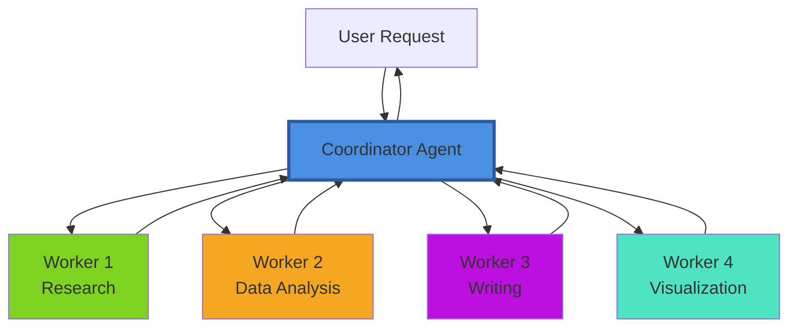
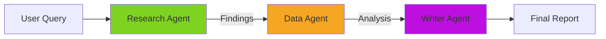
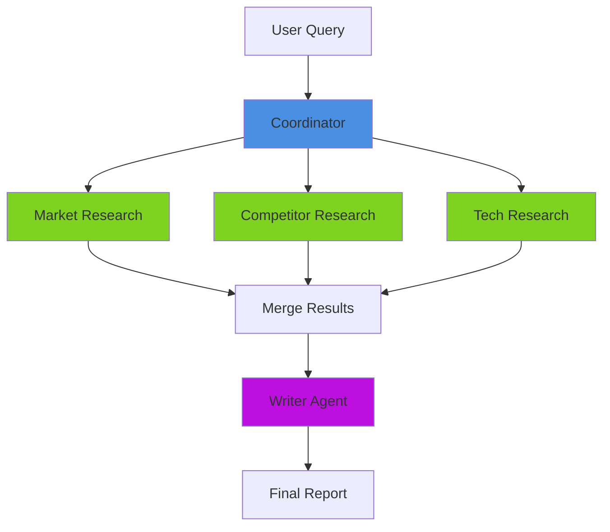

# Coordinator Patterns

**Page 8 of 9** | [← Previous: Testing Multi-Agent Systems](../guides/testing-multi-agent.md) | [Next: Hierarchical vs. Peer-to-Peer →](./hierarchical-vs-peer.md) | [↑ Reading Guide](../READING_GUIDE.md)

The coordinator is the "brain" of a multi-agent system. It decides which agents to activate, in what order, and how to combine their results. This page explores proven coordination patterns and when to use each.

## Single Coordinator Architecture

The simplest and most common pattern: one coordinator orchestrates all workers.



**Coordinator Responsibilities:**
1. **Task Decomposition:** Break user request into subtasks
2. **Delegation:** Assign subtasks to appropriate workers
3. **Sequencing:** Determine execution order
4. **Aggregation:** Combine worker outputs
5. **Error Handling:** Retry or recover from failures
6. **Response Synthesis:** Create final response for user

## Core Coordinator Patterns

### Pattern 1: Sequential Pipeline

Workers execute in a fixed order, each building on the previous.

```python
class SequentialCoordinator:
    """
    Executes agents one at a time in defined order.
    Each agent's output becomes next agent's input.
    """
    
    def __init__(self, shared_state: SharedState):
        self.shared_state = shared_state
        self.research = ResearchAgent(shared_state)
        self.data = DataAgent(shared_state)
        self.writer = WriterAgent(shared_state)
    
    def generate_report(self, query: str) -> str:
        """Execute research → data → writer pipeline."""
        # Step 1: Research
        research_result = self.research.gather_info(query)
        if research_result.status != "success":
            return f"Research failed: {research_result.error}"
        
        # Step 2: Data Analysis
        data_result = self.data.analyze_trends()
        if data_result.status != "success":
            return f"Analysis failed: {data_result.error}"
        
        # Step 3: Writing
        writer_result = self.writer.create_report()
        if writer_result.status != "success":
            return f"Writing failed: {writer_result.error}"
        
        return writer_result.report
```

**Flow Diagram:**


**When to Use:**
- Tasks have clear sequential dependencies
- Each stage needs complete output from previous stage
- Simplicity and predictability are priorities

**Pros:**
- ✅ Easy to understand and debug
- ✅ Clear execution order
- ✅ Predictable timing

**Cons:**
- ❌ Can't parallelize independent work
- ❌ One slow agent blocks everything
- ❌ Total time = sum of all agents

### Pattern 2: Parallel Execution with Merge

Independent workers execute simultaneously, coordinator merges results.

```python
class ParallelCoordinator:
    """
    Executes independent agents in parallel.
    Merges results once all complete.
    """
    
    def __init__(self, shared_state: SharedState):
        self.shared_state = shared_state
        self.market_research = MarketResearchAgent(shared_state)
        self.competitor_research = CompetitorResearchAgent(shared_state)
        self.tech_research = TechResearchAgent(shared_state)
        self.writer = WriterAgent(shared_state)
    
    def generate_report(self, query: str) -> str:
        """Execute research agents in parallel, then write."""
        # Phase 1: Parallel research
        results = self._execute_parallel([
            (self.market_research, "gather_market_data", query),
            (self.competitor_research, "gather_competitor_data", query),
            (self.tech_research, "gather_tech_data", query)
        ])
        
        # Check all succeeded
        if not all(r.status == "success" for r in results):
            return "Some research tasks failed"
        
        # Phase 2: Merge and write
        merged_data = self._merge_results(results)
        self.shared_state.set("research_findings", merged_data)
        
        writer_result = self.writer.create_report()
        return writer_result.report
    
    def _execute_parallel(self, tasks):
        """Execute tasks in parallel (simplified)."""
        import concurrent.futures
        
        results = []
        with concurrent.futures.ThreadPoolExecutor(max_workers=3) as executor:
            futures = [
                executor.submit(agent.execute, action, query)
                for agent, action, query in tasks
            ]
            for future in concurrent.futures.as_completed(futures):
                results.append(future.result())
        
        return results
```

**Flow Diagram:**


**When to Use:**
- Subtasks are independent (don't need each other's outputs)
- Speed is important
- Workers access different data sources

**Pros:**
- ✅ Faster: Total time ≈ slowest agent (not sum)
- ✅ Efficient use of resources
- ✅ Natural for independent research tasks

**Cons:**
- ❌ More complex coordination logic
- ❌ Need to handle partial failures
- ❌ Merge logic can be tricky

### Pattern 3: Conditional Branching

Next agent depends on results of previous agent.

```python
class ConditionalCoordinator:
    """
    Chooses next agent based on previous results.
    Implements decision logic.
    """
    
    def generate_report(self, query: str) -> str:
        """Execute workflow with conditional logic."""
        # Step 1: Check data availability
        checker_result = self.checker.check_data_availability(query)
        
        if checker_result.data_available:
            # Path A: Use existing data
            analysis = self.data_agent.analyze_existing_data()
        else:
            # Path B: Gather new data first
            research = self.research_agent.gather_new_data(query)
            if research.status != "success":
                return "Could not gather data"
            analysis = self.data_agent.analyze_new_data()
        
        # Step 2: Choose report format based on data quality
        if analysis.confidence > 0.8:
            # High confidence: Detailed report
            report = self.detailed_writer.create_full_report()
        else:
            # Low confidence: Summary with caveats
            report = self.summary_writer.create_summary_with_warnings()
        
        return report
```

**Flow Diagram:**


**When to Use:**
- Workflow varies based on data or results
- Different quality levels need different processing
- Want to optimize for common cases (skip unnecessary work)

**Pros:**
- ✅ Flexible and adaptive
- ✅ Can optimize for common paths
- ✅ Handles varying data quality

**Cons:**
- ❌ Complex branching logic
- ❌ More code paths to test
- ❌ Harder to predict execution time

### Pattern 4: Iterative Refinement

Agent outputs feed back to earlier stages for improvement.

```python
class IterativeCoordinator:
    """
    Allows feedback loops for quality improvement.
    Agents can refine their outputs based on downstream feedback.
    """
    
    def generate_report(self, query: str, max_iterations: int = 3) -> str:
        """Execute with iterative refinement."""
        for iteration in range(max_iterations):
            # Research
            research = self.research_agent.gather_info(query)
            
            # Analysis
            analysis = self.data_agent.analyze(research.findings)
            
            # Quality check
            quality = self.quality_agent.evaluate_analysis(analysis)
            
            if quality.score >= 0.8:
                # Good enough, proceed to writing
                break
            
            if iteration < max_iterations - 1:
                # Provide feedback for next iteration
                feedback = quality.improvement_suggestions
                query = self._refine_query(query, feedback)
        
        # Final writing
        report = self.writer_agent.create_report()
        return report
```

**Flow Diagram:**


**When to Use:**
- Quality is more important than speed
- Initial attempts often need refinement
- Have a way to evaluate quality objectively

**Pros:**
- ✅ Higher quality outputs
- ✅ Can handle ambiguous initial queries
- ✅ Self-improving system

**Cons:**
- ❌ Slower (multiple iterations)
- ❌ Need reliable quality evaluation
- ❌ Risk of infinite loops (always use max_iterations)

## Delegation Strategies

### Strategy 1: Broadcast (All Agents)

Send same task to all agents, use best result.

```python
def broadcast_delegation(self, query: str):
    """Ask all agents, use best answer."""
    results = []
    for agent in self.all_agents:
        result = agent.process(query)
        results.append((agent.name, result))
    
    # Choose best result (by confidence, length, etc.)
    best = max(results, key=lambda x: x[1].confidence)
    return best[1]
```

**Use Case:** Multiple agents have different strengths, want most confident answer

### Strategy 2: Round Robin

Distribute tasks evenly across agents.

```python
def round_robin_delegation(self, tasks: list):
    """Distribute tasks evenly."""
    results = []
    for i, task in enumerate(tasks):
        agent = self.agents[i % len(self.agents)]
        result = agent.process(task)
        results.append(result)
    return results
```

**Use Case:** Load balancing across identical agents

### Strategy 3: Capability-Based

Choose agent based on task requirements.

```python
def capability_delegation(self, task: Task):
    """Route to agent with right capabilities."""
    required_tools = task.required_tools
    
    for agent in self.agents:
        if required_tools.issubset(agent.available_tools):
            return agent.process(task)
    
    raise ValueError(f"No agent can handle task requiring {required_tools}")
```

**Use Case:** Heterogeneous agents with different capabilities

## Result Aggregation Techniques

### Technique 1: Last Result Wins

Use output of final agent only.

```python
def last_result_wins(self, agents: list):
    """Only care about final output."""
    result = None
    for agent in agents:
        result = agent.execute()
    return result  # Last agent's output
```

### Technique 2: Merge All Results

Combine outputs from all agents.

```python
def merge_all_results(self, agents: list):
    """Combine all agent outputs."""
    combined = {
        "findings": [],
        "analysis": [],
        "sources": []
    }
    
    for agent in agents:
        result = agent.execute()
        combined["findings"].extend(result.findings)
        combined["sources"].extend(result.sources)
    
    return combined
```

### Technique 3: Weighted Combination

Weight results by agent confidence.

```python
def weighted_combination(self, agents: list):
    """Weight by confidence scores."""
    results = []
    total_confidence = 0
    
    for agent in agents:
        result = agent.execute()
        results.append(result)
        total_confidence += result.confidence
    
    # Weighted average
    if total_confidence > 0:
        for result in results:
            result.weight = result.confidence / total_confidence
    
    return self._combine_weighted(results)
```

## Error Handling and Retries

### Retry Pattern with Exponential Backoff

```python
def execute_with_retry(
    self, 
    agent, 
    action: str, 
    payload: dict,
    max_retries: int = 3
):
    """Retry failed tasks with increasing delays."""
    for attempt in range(max_retries):
        try:
            result = agent.execute(action, payload)
            
            if result.status == "success":
                return result
            
            # Partial success: decide whether to retry
            if result.status == "partial" and result.confidence > 0.5:
                return result  # Good enough
            
        except TimeoutError as e:
            if attempt == max_retries - 1:
                raise  # Final attempt, give up
            
            # Exponential backoff
            wait_time = 2 ** attempt
            time.sleep(wait_time)
            
        except Exception as e:
            # Unexpected error: log and fail
            self.logger.error(f"Agent {agent.name} failed: {e}")
            raise
    
    return Response(status="error", error="Max retries exceeded")
```

### Fallback Pattern

```python
def execute_with_fallback(self, primary_agent, fallback_agent, task):
    """Use fallback if primary fails."""
    try:
        result = primary_agent.execute(task)
        if result.status == "success":
            return result
    except Exception as e:
        self.logger.warning(f"Primary agent failed: {e}, using fallback")
    
    # Primary failed, use fallback
    return fallback_agent.execute(task)
```

---

## 🎯 Pattern Selection Guide

**Choose Sequential Pipeline when:**
- Subtasks have strong dependencies
- Execution order is critical
- Simplicity is more important than speed

**Choose Parallel Execution when:**
- Subtasks are independent
- Speed is important
- Have multiple data sources to query

**Choose Conditional Branching when:**
- Workflow varies by data characteristics
- Want to optimize common cases
- Need adaptive behavior

**Choose Iterative Refinement when:**
- Quality is more important than speed
- Can objectively evaluate quality
- Initial attempts often incomplete

---

**Ready?** If you understand coordinator patterns, you're ready for [Hierarchical vs. Peer-to-Peer](./hierarchical-vs-peer.md) to learn alternative architectures.

**Page 8 of 9** | [← Previous: Testing Multi-Agent Systems](../guides/testing-multi-agent.md) | [Next: Hierarchical vs. Peer-to-Peer →](./hierarchical-vs-peer.md) | [↑ Reading Guide](../READING_GUIDE.md)

