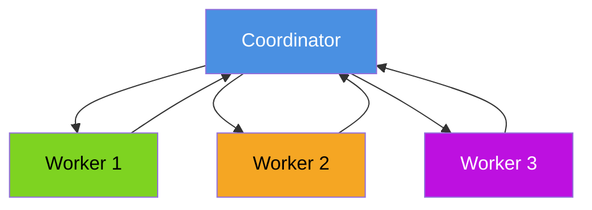
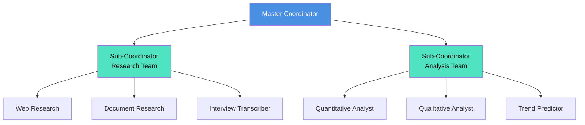
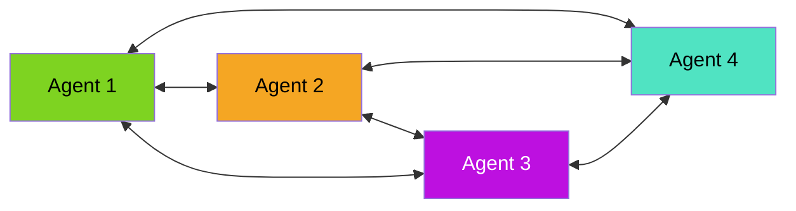
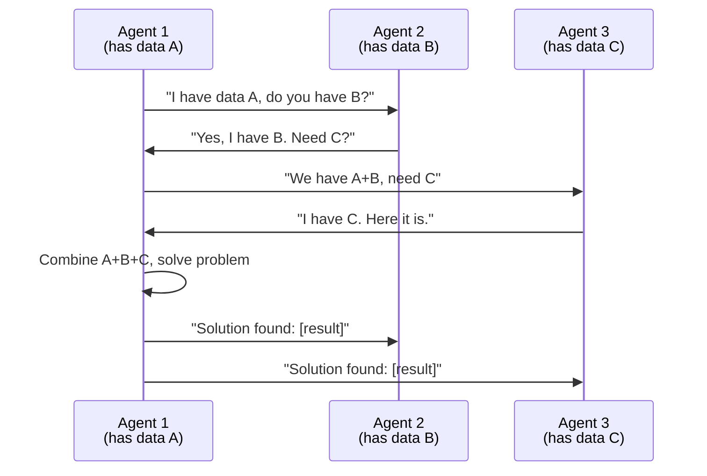
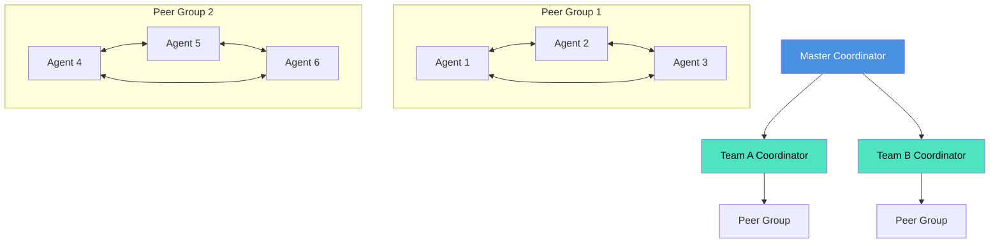

# Hierarchical vs. Peer-to-Peer

**Page 9 of 9** | [← Previous: Coordinator Patterns](./coordinator-patterns.md) | [↑ Reading Guide](../READING_GUIDE.md)

> **⚠️ ADVANCED PREVIEW - OPTIONAL FOR TUTORIAL 2**
> 
> This page covers advanced architectures beyond Tutorial 2's scope. You can **skip this for now** and return after completing Lab 2.
> 
> **Why this is here:** These patterns become relevant when scaling beyond 10 agents (Tutorial 3+) or building consensus systems (Tutorial 4). We include it for completeness and to show where multi-agent systems can evolve.
> 
> **Recommendation:** Focus on coordinator-worker pattern first (Pages 1-8 + Lab 2), then return here when you need to scale or have completed all exercises.

---

In Tutorial 2, we focus on the coordinator-worker pattern (single coordinator, multiple workers). But as systems grow, you'll encounter two other architectures: hierarchical (multi-level coordination) and peer-to-peer (no coordinator). This page explains when each makes sense.

## Three Architectural Approaches

### Coordinator-Worker (Our Focus)

Single coordinator, specialized workers, all communication through coordinator.



**Best For:** Most multi-agent tasks (Tutorial 2 scope)

### Hierarchical (Multi-Level)

Coordinators manage sub-coordinators, forming a tree structure.



**Best For:** Large-scale systems with natural team divisions (Tutorial 3+)

### Peer-to-Peer (No Coordinator)

Agents communicate directly, negotiate tasks among themselves.



**Best For:** Consensus-building, negotiation scenarios (Advanced topics)

## Hierarchical Architecture Deep Dive

### When to Use Hierarchical

Use hierarchical when:
- ✅ System has 10+ agents (single coordinator becomes bottleneck)
- ✅ Natural team divisions exist (research team, analysis team, writing team)
- ✅ Need to scale horizontally (add more sub-coordinators)
- ✅ Sub-teams can work mostly independently
- ✅ Different teams need different coordination strategies

### Example: Large-Scale Market Research

**Problem:** Generate comprehensive market research report covering 5 industries, 20 companies, 50 metrics.

**Single Coordinator Approach (Doesn't Scale):**
```
Coordinator → 75 workers (5×20 research + 5×10 analysis + 5 writers)
             → Too many direct reports
             → Coordinator spends all time on coordination
```

**Hierarchical Approach (Scales Better):**
```
Master Coordinator
├── Industry Research Coordinator
│   ├── Tech Research Team (5 agents)
│   ├── Auto Research Team (5 agents)
│   ├── Energy Research Team (5 agents)
│   └── Finance Research Team (5 agents)
│   └── Healthcare Research Team (5 agents)
├── Analysis Coordinator
│   ├── Financial Analysis Team (5 agents)
│   ├── Market Analysis Team (5 agents)
│   └── Competitive Analysis Team (5 agents)
└── Report Writing Coordinator
    ├── Executive Summary Writer
    ├── Technical Writer
    ├── Data Visualization Specialist
    ├── Editor
    └── Formatter
```

### Hierarchical Implementation Pattern

```python
class MasterCoordinator:
    """Top-level coordinator managing sub-coordinators."""
    
    def __init__(self):
        # Sub-coordinators for each domain
        self.research_coord = ResearchTeamCoordinator()
        self.analysis_coord = AnalysisTeamCoordinator()
        self.writing_coord = WritingTeamCoordinator()
    
    def generate_comprehensive_report(self, query: str):
        """Delegate to sub-coordinators."""
        # Phase 1: Research (parallel by industry)
        research_results = self.research_coord.gather_all_research(query)
        
        # Phase 2: Analysis (parallel by type)
        analysis_results = self.analysis_coord.analyze_all(research_results)
        
        # Phase 3: Writing (sequential)
        report = self.writing_coord.create_report(
            research=research_results,
            analysis=analysis_results
        )
        
        return report

class ResearchTeamCoordinator:
    """Manages research agents for different industries."""
    
    def __init__(self):
        self.teams = {
            "tech": TechResearchTeam(),
            "auto": AutoResearchTeam(),
            "energy": EnergyResearchTeam(),
            # ... more teams
        }
    
    def gather_all_research(self, query: str):
        """Coordinate parallel research across industries."""
        results = {}
        
        # Each team works independently
        for industry, team in self.teams.items():
            results[industry] = team.research(query)
        
        return results
```

### Benefits of Hierarchical Architecture

| Benefit | Description | Example |
|---------|-------------|---------|
| **Scalability** | Add sub-teams without overwhelming master | Add "Retail Research Team" without changing master |
| **Specialization** | Sub-coordinators optimize for their domain | Analysis coordinator knows how to parallelize calculations |
| **Fault Isolation** | Team failure doesn't crash entire system | If tech research fails, other industries continue |
| **Clear Ownership** | Each coordinator owns a manageable scope | Research coordinator manages 5 teams, not 25 agents |
| **Independent Development** | Teams can evolve separately | Upgrade analysis team without touching research |

### Challenges of Hierarchical Architecture

| Challenge | Why It's Hard | Mitigation |
|-----------|---------------|------------|
| **Complexity** | More coordination layers = more code | Start simple, add layers only when needed |
| **Latency** | Each level adds overhead | Minimize inter-level communication |
| **Debugging** | Failures span multiple levels | Comprehensive logging with trace IDs |
| **Over-Engineering** | Easy to add unnecessary layers | Use only when single coordinator is clearly insufficient |

## Peer-to-Peer Architecture Deep Dive

### When to Use Peer-to-Peer

Use peer-to-peer when:
- ✅ No natural "coordinator" role
- ✅ Agents need to negotiate or reach consensus
- ✅ Flexibility is more important than predictability
- ✅ System should be resilient to single agent failure
- ❌ **Not for Tutorial 2** - Complex to implement and debug

### Example: Distributed Problem-Solving

**Scenario:** Multiple agents each have partial information, need to collaborate to solve problem.

**Peer-to-Peer Approach:**


### Peer-to-Peer Implementation Pattern

```python
class PeerAgent:
    """Agent that can communicate with other peers."""
    
    def __init__(self, agent_id: str, peers: list):
        self.agent_id = agent_id
        self.peers = peers  # List of other agents
        self.knowledge = {}
    
    def solve_problem(self, problem: str):
        """Collaborate with peers to solve problem."""
        # Step 1: Check own knowledge
        if self._can_solve_locally(problem):
            return self._local_solution(problem)
        
        # Step 2: Query peers for missing information
        for peer in self.peers:
            missing_info = self._identify_missing_info(problem)
            peer_response = peer.request_information(missing_info)
            
            if peer_response.has_info:
                self.knowledge.update(peer_response.info)
                
                if self._can_solve_locally(problem):
                    solution = self._local_solution(problem)
                    # Share solution with all peers
                    self._broadcast_solution(solution)
                    return solution
        
        # Step 3: If still can't solve, negotiate with peers
        return self._collaborative_solve(problem, self.peers)
```

### Benefits of Peer-to-Peer

| Benefit | Description |
|---------|-------------|
| **No Single Point of Failure** | Any agent can fail, others continue |
| **Flexible Collaboration** | Agents form dynamic partnerships |
| **Distributed Intelligence** | No one agent needs full picture |
| **Natural Negotiation** | Agents can debate and reach consensus |

### Challenges of Peer-to-Peer

| Challenge | Why It's Hard |
|-----------|---------------|
| **Complexity** | Every agent must implement coordination logic |
| **Debugging** | No central log, hard to reconstruct events |
| **Deadlocks** | Agents can wait on each other indefinitely |
| **Inefficiency** | Many messages sent for simple tasks |
| **Unpredictability** | Execution path varies by agent availability |

## Comparison Matrix

| Aspect | Coordinator-Worker | Hierarchical | Peer-to-Peer |
|--------|-------------------|--------------|--------------|
| **Complexity** | Low | Medium | High |
| **Scalability** | 3-10 agents | 10-100+ agents | 3-20 agents |
| **Predictability** | High | Medium | Low |
| **Debugging** | Easy | Medium | Hard |
| **Single Point of Failure** | Yes (coordinator) | Partial (master) | No |
| **Message Overhead** | Low | Medium | High |
| **Best For** | Most tasks | Large systems | Negotiation/consensus |
| **Tutorial Coverage** | Tutorial 2 ✅ | Tutorial 3-4 | Tutorial 4 (advanced) |

## Hybrid Approaches

Real-world systems often combine patterns.

### Example: Hierarchical with Peer-to-Peer Teams



**Use Case:** Teams have clear responsibilities (hierarchy) but team members negotiate internally (peer-to-peer).

---

## 🎯 Architecture Decision Guide

### Start Here: Do you need multiple agents?

**No:** Use single agent (Tutorial 1)
**Yes:** Continue ↓

### How many agents will you have?

**3-7 agents:** Use coordinator-worker (Tutorial 2)
**8-15 agents:** Use coordinator-worker, consider hierarchical
**16+ agents:** Use hierarchical (Tutorial 3+)

### Does your task involve negotiation or consensus?

**No:** Use coordinator-worker or hierarchical
**Yes:** Consider peer-to-peer (Advanced)

### Is predictability more important than flexibility?

**Yes:** Use coordinator-worker or hierarchical
**No:** Consider peer-to-peer (Advanced)

## Recommendations by Use Case

| Use Case | Recommended Architecture | Rationale |
|----------|------------------------|-----------|
| **Research Report** | Coordinator-Worker | Sequential pipeline, clear stages |
| **Large Enterprise Report** | Hierarchical | Many agents, natural team divisions |
| **Multi-Source Data Aggregation** | Coordinator-Worker (Parallel) | Independent sources, merge results |
| **Consensus Building** | Peer-to-Peer | Agents need to negotiate and agree |
| **Real-Time Collaboration** | Peer-to-Peer | No time for coordinator overhead |
| **Quality-Critical System** | Hierarchical | Need review layers and checkpoints |
| **Prototype/Learning** | Coordinator-Worker | Simplest, easiest to debug |

---

## 🎯 Knowledge Check

**Question 1:** You're building a system with 25 agents across 3 teams. Which architecture?

<details>
<summary>Show Answer</summary>

**Hierarchical Architecture**

**Reasoning:**
- 25 agents is too many for single coordinator
- 3 teams suggests natural division
- Each team can have sub-coordinator (3 sub-coordinators, ~8 workers each)

**Structure:**
```
Master Coordinator
├── Team 1 Coordinator (8 agents)
├── Team 2 Coordinator (9 agents)
└── Team 3 Coordinator (8 agents)
```

**Alternative:** If teams rarely interact, consider three separate coordinator-worker systems.
</details>

**Question 2:** When would peer-to-peer be better than coordinator-worker?

<details>
<summary>Show Answer</summary>

**Peer-to-peer is better when:**

1. **Negotiation Required:** Agents must debate and reach agreement
   - Example: Multiple AI agents evaluating a design, voting on best approach

2. **Distributed Information:** No one agent has complete picture
   - Example: Sensor network where each agent has local data

3. **Resilience Critical:** Can't have single point of failure
   - Example: Distributed system monitoring

4. **Dynamic Collaboration:** Agent partnerships change frequently
   - Example: Task marketplace where agents bid on work

**For Tutorial 2 tasks (research reports, data analysis):** Coordinator-worker is better because there's a clear workflow and central orchestration simplifies debugging.
</details>

**Question 3:** Your coordinator-worker system is slow because coordinator spends 80% of time coordinating. What should you do?

<details>
<summary>Show Answer</summary>

**Options (in order of preference):**

1. **Optimize Coordination Logic**
   - Profile: Where is time spent?
   - Parallelize independent tasks
   - Reduce message overhead (batch messages)
   - Cache frequent queries

2. **Consider Hierarchical**
   - If you have 10+ agents, split into teams
   - Sub-coordinators handle team-level coordination
   - Master coordinates team results only

3. **Evaluate Agent Count**
   - Do you really need all these agents?
   - Can some be combined or eliminated?
   - Are agents doing duplicate work?

4. **Profile Agent Execution**
   - Maybe agents are slow, not coordinator
   - Check: coordinator_time / total_time
   - If <30%, agents are the bottleneck

**Don't:** Jump to peer-to-peer unless you have specific negotiation needs. It's more complex and harder to debug than hierarchical.
</details>

---

## Summary

- **Coordinator-Worker:** Start here. Use for 3-10 agents, clear workflows. (Tutorial 2)
- **Hierarchical:** Scale to 10-100+ agents, natural team divisions. (Tutorial 3+)
- **Peer-to-Peer:** Negotiation and consensus scenarios, advanced. (Tutorial 4)

**For Tutorial 2:** We focus exclusively on coordinator-worker because it's the foundation. Master it before considering hierarchical or peer-to-peer.

---

**Congratulations!** You've completed all 9 pages of Tutorial 2 documentation. 

**Next Steps:**
- Review [Reading Guide](../READING_GUIDE.md) for full navigation
- Start [Lab 2](../../lab-2/README.md) to build your multi-agent system
- Join the community to share your projects

**Page 9 of 9** | [← Previous: Coordinator Patterns](./coordinator-patterns.md) | [↑ Reading Guide](../READING_GUIDE.md)

