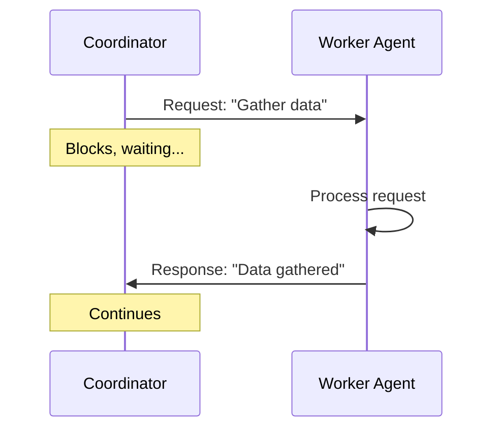
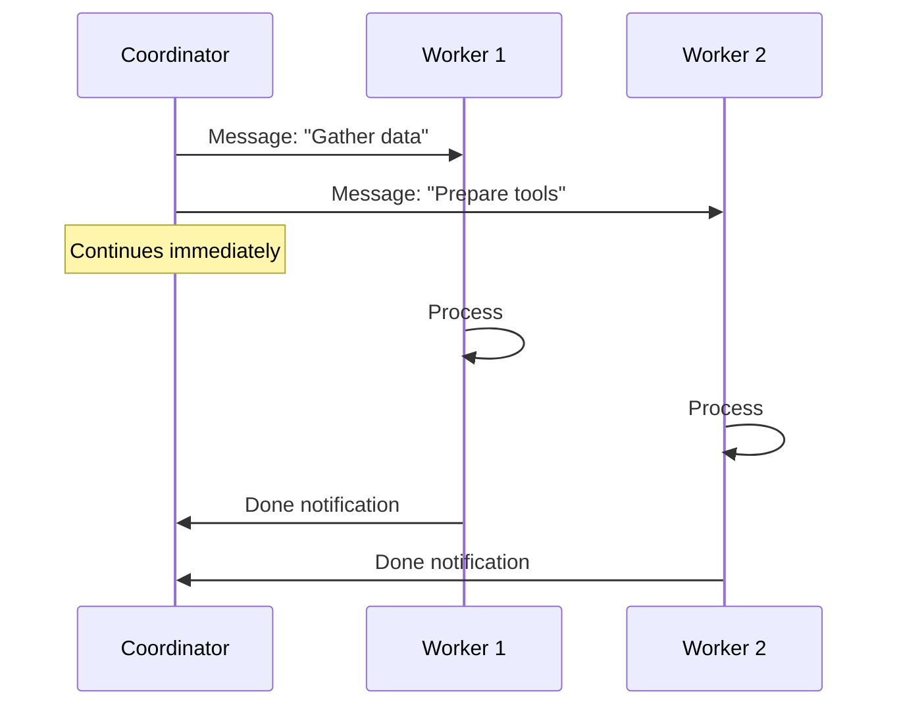
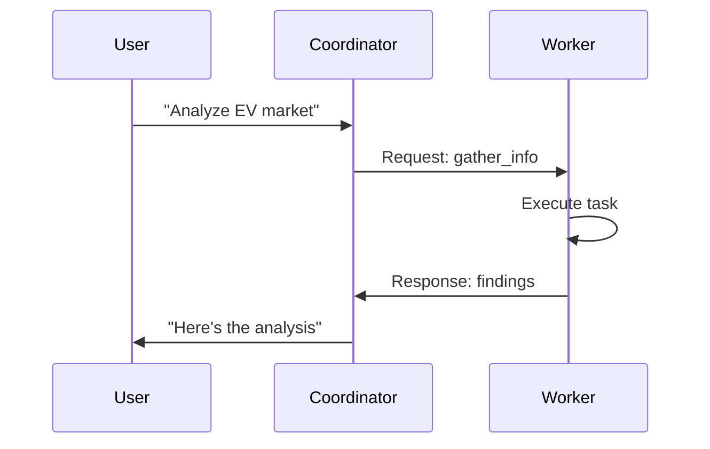
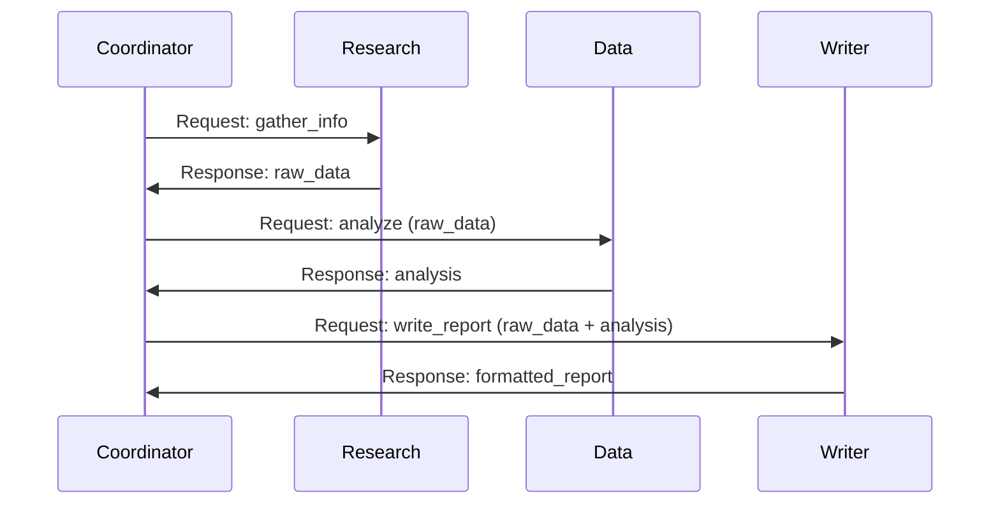
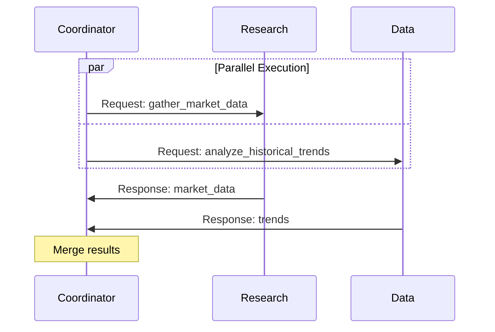
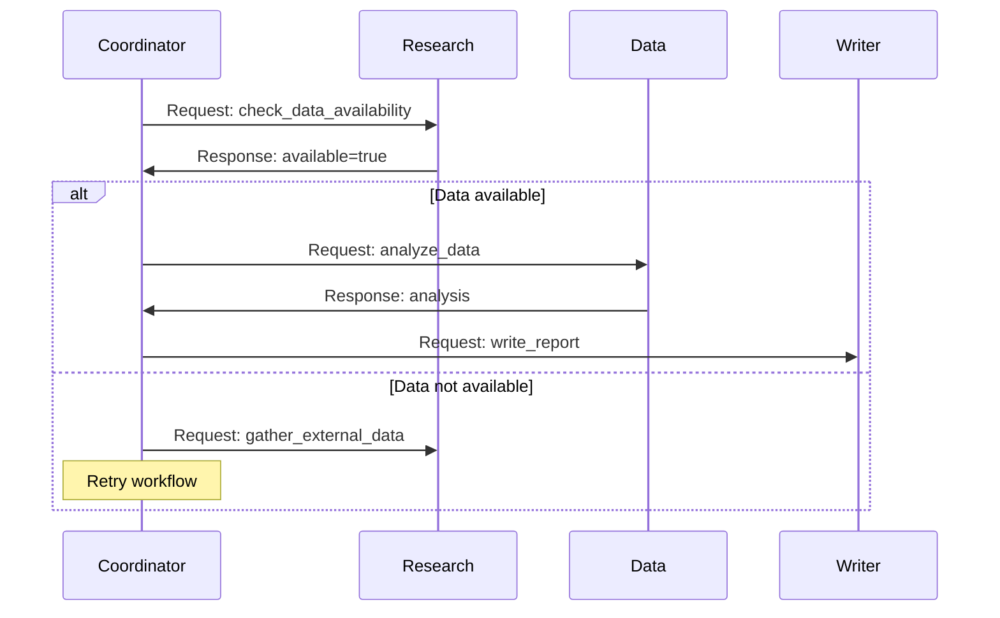
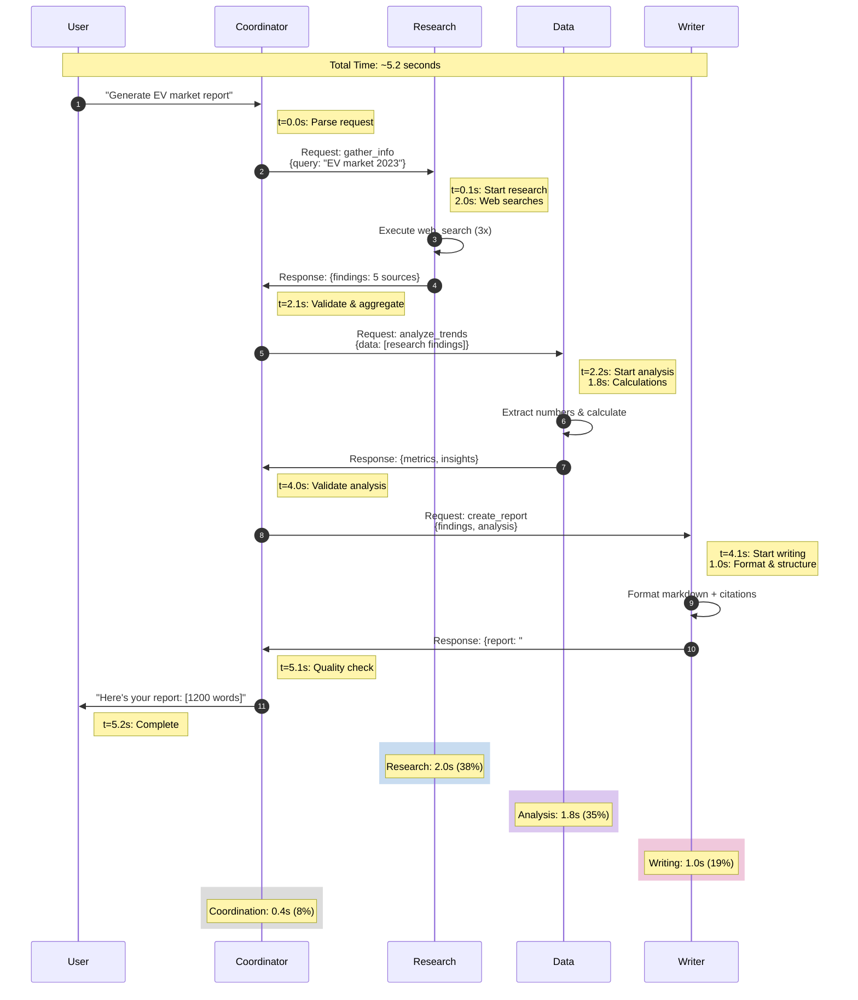
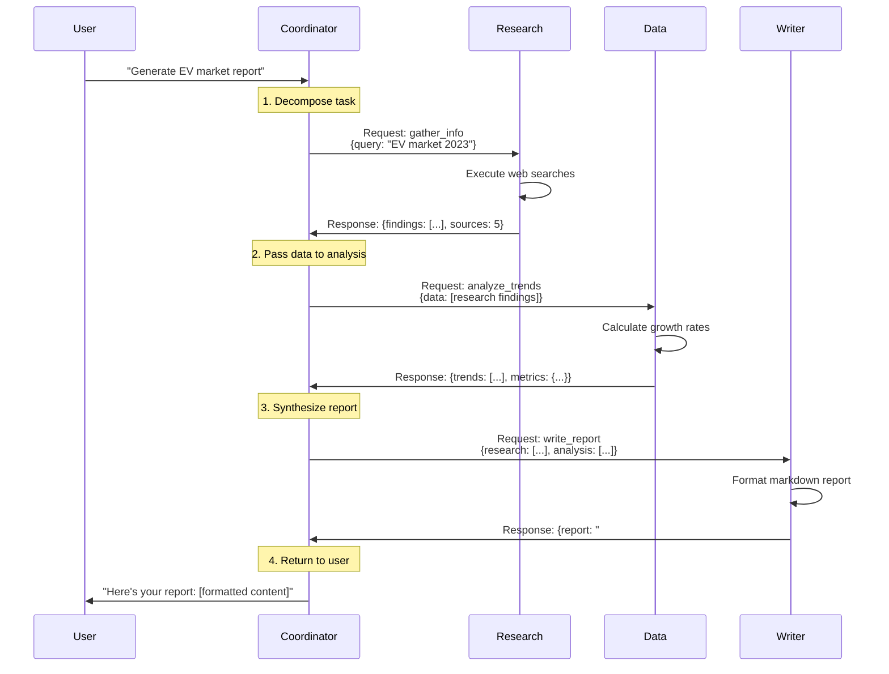

# Agent Communication

**Page 3 of 9** | [← Previous: Agent Specialization](./agent-specialization.md) | [Next: State Management →](./state-management.md) | [↑ Reading Guide](../READING_GUIDE.md)

Agents need to talk to each other. Unlike function calls (which are synchronous and blocking), agent communication is more like sending messages—asynchronous, structured, and trackable. This page covers how to design communication protocols for multi-agent systems.

## Message Passing Fundamentals

### Why Not Just Function Calls?

You might wonder: "Why not just have the coordinator call `research_agent.gather_info(query)`?"

**Problem with Direct Function Calls:**
```python
# Synchronous - Coordinator blocks until research completes
result = research_agent.gather_info("electric vehicles")  # Waits...
# Can't do anything else while waiting
```

**Benefits of Message Passing:**
```python
# Asynchronous - Coordinator sends message and continues
coordinator.send_message(research_agent, "gather_info", {"query": "electric vehicles"})
# Can send to other agents simultaneously
coordinator.send_message(data_agent, "prepare_analysis", {"metric": "sales"})
# Wait for responses later
```

**Key Advantages:**
1. **Asynchronous:** Send multiple requests without blocking
2. **Trackable:** Every message can be logged and traced
3. **Flexible:** Can queue, retry, or redirect messages
4. **Testable:** Can mock message handlers easily
5. **Distributed:** Could scale to agents on different machines (future)

### Synchronous vs. Asynchronous Communication

**Synchronous (Request-Response):**


- ✅ Simple to implement and reason about
- ✅ Guaranteed order of operations
- ❌ Coordinator idle while waiting
- ❌ Can't parallelize work

**Asynchronous (Fire and Forget):**


- ✅ Parallel execution
- ✅ Coordinator not blocked
- ❌ Complex coordination logic
- ❌ Need to handle timeout and failures

**For Tutorial 2:** We use **synchronous request-response** for simplicity. Async patterns are covered in Tutorial 4.

## JSON-Based Message Protocol

Our message protocol uses JSON for structure and clarity.

### Message Structure

Every message has these fields:

```python
{
    "message_id": "msg_001",           # Unique identifier for tracking
    "message_type": "request",         # request | response | error
    "timestamp": "2023-11-22T10:30:00",
    "from_agent": "coordinator",       # Sender
    "to_agent": "research_agent",      # Recipient
    "action": "gather_info",           # What to do
    "payload": {                       # Action-specific data
        "query": "electric vehicles",
        "max_sources": 5
    },
    "context": {                       # Optional shared context
        "task_id": "report_001",
        "user_request": "Market analysis"
    }
}
```

### Message Types

#### 1. Request Message

Coordinator asking a worker to perform an action.

```json
{
    "message_id": "req_001",
    "message_type": "request",
    "timestamp": "2023-11-22T10:30:00",
    "from_agent": "coordinator",
    "to_agent": "research_agent",
    "action": "gather_info",
    "payload": {
        "query": "EV market trends 2023",
        "max_sources": 5,
        "focus_areas": ["sales", "market_share", "pricing"]
    },
    "context": {
        "task_id": "rpt_789",
        "deadline": "2023-11-22T11:00:00"
    }
}
```

#### 2. Response Message

Worker returning results to coordinator.

```json
{
    "message_id": "resp_001",
    "message_type": "response",
    "timestamp": "2023-11-22T10:32:15",
    "from_agent": "research_agent",
    "to_agent": "coordinator",
    "in_reply_to": "req_001",          # Links to original request
    "status": "success",                # success | partial | failed
    "payload": {
        "findings": [
            {
                "fact": "Global EV sales: 10.5M units in 2022",
                "source": "https://iea.org/reports/...",
                "date": "2023-05-15"
            },
            {
                "fact": "Tesla market share: 65% (US)",
                "source": "https://coxautomotive.com/...",
                "date": "2023-01-12"
            }
        ],
        "sources_count": 5,
        "execution_time": "2.3s"
    }
}
```

#### 3. Error Message

Worker reporting a failure.

```json
{
    "message_id": "err_001",
    "message_type": "error",
    "timestamp": "2023-11-22T10:31:00",
    "from_agent": "research_agent",
    "to_agent": "coordinator",
    "in_reply_to": "req_001",
    "error_code": "SEARCH_FAILED",
    "error_message": "Web search API rate limit exceeded",
    "payload": {
        "retry_after": "60s",
        "partial_results": ["Source 1", "Source 2"],
        "succeeded_actions": 2,
        "failed_actions": 3
    }
}
```

## Request-Response Patterns

### Pattern 1: Simple Delegation

Coordinator → Worker → Coordinator



**Use for:** Simple tasks with one worker

### Pattern 2: Sequential Workflow

Data flows through multiple workers in sequence.



**Use for:** Pipeline tasks where each step needs previous results

### Pattern 3: Parallel Execution

Multiple workers execute simultaneously.



**Use for:** Independent subtasks that don't depend on each other

### Pattern 4: Conditional Execution

Next worker depends on results of previous worker.



**Use for:** Workflows with decision points

## Error Handling in Messaging

### The Three Types of Errors

1. **Communication Errors:** Message failed to send/receive
2. **Execution Errors:** Worker couldn't complete task
3. **Validation Errors:** Message format invalid

### Handling Strategy

```python
# Coordinator sending request
try:
    response = coordinator.send_request(
        to_agent=research_agent,
        action="gather_info",
        payload={"query": "EV trends"},
        timeout=30.0  # seconds
    )
    
    if response.status == "success":
        # Process results
        handle_success(response.payload)
    
    elif response.status == "partial":
        # Some results, but not all
        handle_partial(response.payload)
        # Decide: Use partial results or retry?
    
    elif response.status == "failed":
        # Task failed completely
        handle_failure(response.error_message)
        # Decide: Retry, use fallback, or report error to user?

except TimeoutError:
    # Worker didn't respond in time
    log_timeout(research_agent, "gather_info")
    # Retry or fail gracefully

except MessageFormatError:
    # Response was malformed
    log_invalid_message(response)
    # This is a bug - fix the worker

except Exception as e:
    # Unexpected error
    log_unexpected_error(e)
    # Coordinator should handle gracefully
```

### Error Response Example

```json
{
    "message_type": "error",
    "error_code": "PARTIAL_FAILURE",
    "error_message": "Retrieved 2 of 5 requested sources",
    "payload": {
        "partial_results": ["source1", "source2"],
        "failed_sources": ["source3", "source4", "source5"],
        "failure_reasons": {
            "source3": "404 Not Found",
            "source4": "Timeout after 10s",
            "source5": "Access Denied"
        },
        "retry_recommended": true
    }
}
```

## Communication Flow Example

### Visual: Message Flow with Timing

This diagram shows a complete workflow with realistic timing:



**Timing Breakdown:**
- Research: 2.0s (38%) - Multiple web searches
- Data Analysis: 1.8s (35%) - Calculations and trend detection
- Writing: 1.0s (19%) - Formatting and structure
- Coordination: 0.4s (8%) - Delegation and validation
- **Total: 5.2 seconds**

**Optimization Opportunities:**
- Parallel research + data gathering: Save 1.5s
- Cache frequent queries: Save 0.5s
- Use smaller model for coordination: Save $0.02

Let's trace a complete multi-agent interaction:



**Total Messages:** 6 (3 requests + 3 responses)
**Total Time:** ~5 seconds (sequential execution)

---

## 🎯 Knowledge Check

**Question 1:** Why use JSON messages instead of direct Python function calls between agents?

<details>
<summary>Show Answer</summary>

**Key Reasons:**

1. **Traceability:** Every message can be logged, making debugging easier
2. **Asynchronicity:** Can send multiple messages without blocking (future-proof)
3. **Serialization:** JSON works across languages and network boundaries
4. **Testing:** Easy to mock and replay messages
5. **Flexibility:** Can intercept, transform, or reroute messages

**Example:** If a worker crashes, you can replay the message to retry. With function calls, you'd need to rebuild the entire state.

**Trade-off:** More overhead than direct calls, but better architecture for distributed systems.
</details>

**Question 2:** What happens if a worker takes 5 minutes to respond?

<details>
<summary>Show Answer</summary>

**Depends on the timeout setting:**

**With Timeout (Recommended):**
```python
try:
    response = send_request(worker, action, timeout=30.0)
except TimeoutError:
    # Coordinator can:
    # 1. Retry with different parameters
    # 2. Try a different worker
    # 3. Return partial results
    # 4. Report error to user
```

**Without Timeout (Bad):**
```python
response = send_request(worker, action)  # Blocks forever
# Coordinator hangs, user sees no feedback
```

**Best Practice:** 
- Set reasonable timeouts (10-60s depending on task)
- Log timeouts for debugging
- Implement retry logic with exponential backoff
- Provide user feedback for long-running tasks

**Advanced:** In Tutorial 4, we'll cover async patterns where coordinator doesn't block at all.
</details>

**Question 3:** Design a message for this scenario: Coordinator asks Data Agent to analyze trends, but only 3 of 10 data sources were available.

<details>
<summary>Show Answer</summary>

```json
{
    "message_id": "resp_042",
    "message_type": "response",
    "timestamp": "2023-11-22T10:35:00",
    "from_agent": "data_agent",
    "to_agent": "coordinator",
    "in_reply_to": "req_042",
    "status": "partial",
    "payload": {
        "analysis": {
            "growth_rate": 52.3,
            "market_size": 10.1,
            "confidence": "medium"
        },
        "sources_used": 3,
        "sources_requested": 10,
        "missing_sources": [
            "Q3_sales_data.csv",
            "competitor_analysis.json",
            "...5 more..."
        ],
        "impact_on_confidence": "Results based on 30% of expected data. Trends are directionally correct but magnitudes may be off by ±15%."
    },
    "warnings": [
        "Incomplete data set",
        "Some regional markets not represented"
    ],
    "recommendations": {
        "retry": true,
        "wait_time": "Check if missing sources become available in 1 hour",
        "alternative": "Use external API for missing data"
    }
}
```

**Key Elements:**
- `status: "partial"` - Signals incomplete but usable results
- Clear count: 3 of 10 sources
- Impact assessment: How does this affect reliability?
- Actionable recommendations: What should coordinator do next?

**Coordinator Decision Tree:**
- If confidence is "high" → Use partial results
- If confidence is "medium" → Ask user if partial is acceptable
- If confidence is "low" → Retry or report error
</details>

---

**Ready?** If you understand agent communication protocols, you're ready for [State Management](./state-management.md) to learn how agents share data.

**Page 3 of 9** | [← Previous: Agent Specialization](./agent-specialization.md) | [Next: State Management →](./state-management.md) | [↑ Reading Guide](../READING_GUIDE.md)

