# Multi-Agent Architecture

**Page 1 of 9** | [Next: Agent Specialization →](./agent-specialization.md) | [↑ Reading Guide](../READING_GUIDE.md)

> **🎯 Why This Matters**
> 
> You've built single agents that work well for simple tasks. But what happens when:
> - The agent has 15+ tools and gets confused about which to use?
> - Research takes 10 seconds and your user is waiting?
> - You need different expertise levels (novice writer, expert analyst)?
> 
> Multi-agent systems solve these problems by:
> - **Specialization** → Higher quality (research agent knows research)
> - **Parallelization** → 3x faster (run independent tasks simultaneously)
> - **Scalability** → Add agents without overwhelming a single context
> 
> This is the difference between a solo developer and a coordinated team.
> By the end of this guide, you'll know **when** to use multi-agent and **how** to design it.

> **🏗️ Building on Tutorial 1**
> 
> In [Tutorial 1](../../../lesson-1-fundamentals/tutorial-1/INDEX.md), you built the `Agent` class with Ollama LLM integration and tool calling through the [7-step tool calling loop](../../../lesson-1-fundamentals/tutorial-1/concepts/tool-calling-architecture.md).
> 
> **Tutorial 2 extends Tutorial 1's `Agent` class through inheritance:**
> - `WorkerAgent` inherits from `Agent` → Gets LLM and tool calling automatically
> - One generalist agent → Multiple specialist agents (each a `WorkerAgent` subclass)
> - All tools available → Tool filtering by specialization (allowed_tools parameter)
> - Sequential tool calls → Parallel agent execution
> - Single context → Distributed state management via `SharedState`
> - One agent debugging → Multi-agent coordination debugging
> 
> **Key point:** Your Tutorial 1 `Agent` class becomes the foundation. Worker agents reuse it, not reimplement it.
> 
> **Review if needed:** [Tool Calling Architecture](../../../lesson-1-fundamentals/tutorial-1/concepts/tool-calling-architecture.md)

Building a single agent with tools is powerful. But some tasks are too complex for one agent to handle efficiently. Multi-agent systems split work across specialized agents that collaborate to solve complex problems.

## What is a Multi-Agent System?

A multi-agent system is a collection of autonomous agents that:
- **Communicate** with each other to share information
- **Coordinate** their actions to achieve a common goal
- **Specialize** in different capabilities or domains
- **Collaborate** to solve problems that would be difficult for a single agent

### Example: Research Report Generator

**Single Agent Approach:**
```
User: "Write a market analysis report on electric vehicles"
Agent: 
  1. Search for data (20+ tool calls)
  2. Analyze trends (complex reasoning)
  3. Write report (formatting)
  4. Cite sources (tracking)
  → Takes 5+ minutes, error-prone, shallow analysis
```

**Multi-Agent Approach:**
```
User: "Write a market analysis report on electric vehicles"
Coordinator:
  ├─> Research Agent: Find latest EV market data
  ├─> Data Agent: Analyze trends and statistics  
  └─> Writer Agent: Synthesize into formatted report
  → Takes 2 minutes, focused specialists, deeper analysis
```

## When to Use Multi-Agent vs. Single Agent

Not every task needs multiple agents. Use this decision framework:


### Use Multi-Agent When:

✅ **Task has clear subtasks** - "Research → Analyze → Report" can be cleanly divided
✅ **Subtasks need different tools** - Research needs web search, data analysis needs calculations
✅ **Parallel execution helps** - Multiple agents can work simultaneously
✅ **Specialization improves quality** - Focused prompts produce better results than one generalist
✅ **Complex workflows** - Multi-step processes with conditional logic

### Stick with Single Agent When:

❌ **Simple linear tasks** - "Read file and summarize" doesn't need coordination
❌ **High interactivity** - Tasks requiring constant user input
❌ **Tight coupling** - Each step depends heavily on previous step details
❌ **Development time matters** - Building multi-agent is more complex
❌ **Debugging is critical** - Single agent failures are easier to trace

## 🤔 Decision Tree: Single vs Multi-Agent

Use this decision tree to determine if your task needs multi-agent architecture:

```
START: Analyze Your Task
    |
    ├─> How many distinct capabilities needed?
    |   |
    |   ├─> 1-3 tools
    |   |   └─> Is agent context overloaded? (>1000 tokens system prompt)
    |   |       ├─> NO  → ✅ Single Agent (simplest)
    |   |       └─> YES → Consider Multi-Agent (specialization)
    |   |
    |   └─> 4+ tools
    |       └─> Can work be parallelized?
    |           ├─> YES → ✅ Multi-Agent (parallel pattern)
    |           |         Example: Gather data from 5 independent sources
    |           |
    |           └─> NO → Can split by domain expertise?
    |               ├─> YES → ✅ Multi-Agent (sequential pattern)
    |               |         Example: Research → Data → Writer
    |               |
    |               └─> NO → ✅ Single Agent (for now)
    |                         Re-evaluate as complexity grows
    |
    └─> Special Considerations:
        |
        ├─> Need real-time response (<1 sec)?
        |   └─> Multi-Agent with parallel execution
        |
        ├─> Multiple data sources (3+)?
        |   └─> Multi-Agent: Parallel gathering, sequential synthesis
        |
        ├─> Quality critical (medical, legal, financial)?
        |   └─> Multi-Agent: Specialists with coordinator review
        |
        └─> Learning/prototyping phase?
            └─> Single Agent first, migrate later
```

**Decision Examples:**

| Task | Tools | Parallelizable? | Decision | Reason |
|------|-------|----------------|----------|---------|
| Summarize document | 1-2 | N/A | ✅ Single Agent | Simple, linear task |
| Market research report | 8+ | Yes (data gathering) | ✅ Multi-Agent | Parallel + specialization |
| Chatbot | 3-5 | No | ✅ Single Agent | High interactivity |
| Code review system | 6+ | Yes (quality/security/tests) | ✅ Multi-Agent | Independent checks |
| Calculate metrics | 2-3 | No | ✅ Single Agent | Tight coupling |

**Rule of Thumb:** If you're uncertain, **start with single agent**. You can always refactor to multi-agent later (see [Refactoring Guide](../guides/refactoring-single-to-multi.md)).

## Coordination Patterns

There are three main patterns for organizing multi-agent systems:

### 1. Coordinator-Worker (Our Focus)

A central coordinator agent delegates tasks to specialized worker agents.


**Characteristics:**
- ✅ Simple to understand and implement
- ✅ Clear control flow and error handling
- ✅ Easy to add new workers
- ❌ Coordinator is a single point of failure
- ❌ Not optimal for peer collaboration

**Best for:** Tasks with clear delegation (research, analysis, reporting)

### 2. Peer-to-Peer

Agents communicate directly without a central coordinator.


**Characteristics:**
- ✅ No single point of failure
- ✅ Flexible collaboration patterns
- ✅ Agents can negotiate directly
- ❌ Complex coordination logic
- ❌ Harder to debug and test
- ❌ Risk of deadlocks or infinite loops

**Best for:** Negotiation tasks, consensus building, distributed systems

### 3. Hierarchical

Multi-level structure with supervisors and sub-coordinators.


**Characteristics:**
- ✅ Scales to large teams
- ✅ Clear chain of command
- ✅ Divide and conquer complex workflows
- ❌ Most complex to implement
- ❌ High coordination overhead
- ❌ Slower due to multiple delegation layers

**Best for:** Large-scale projects, enterprise workflows (Tutorial 3+)

## Benefits of Multi-Agent Systems

| Benefit | Description | Example |
|---------|-------------|---------|
| **Specialization** | Each agent focuses on what it does best | Research agent optimized for finding sources, not writing |
| **Parallelization** | Multiple agents work simultaneously | Data collection and analysis happen in parallel |
| **Modularity** | Easy to replace or upgrade individual agents | Swap research agent without touching writer agent |
| **Scalability** | Add more workers as load increases | Add more data agents during peak processing |
| **Separation of Concerns** | Clean boundaries between responsibilities | Writer never touches data sources directly |

## Cost Considerations

**Important:** Multi-agent systems typically incur higher LLM API costs than single-agent systems.

### Cost Structure

```
Single Agent Task:
- User query → Agent (1 LLM call) → Tools (N calls) → Response
- LLM Calls: 1-3 per task
- Cost: $0.01 - $0.05 per query (typical)

Multi-Agent Task:
- User query → Coordinator (1 call) → 
  - Research Agent (2-3 calls) →
  - Data Agent (2-3 calls) →
  - Writer Agent (2-3 calls) →
  Response
- LLM Calls: 7-10+ per task
- Cost: $0.05 - $0.20 per query (typical)

Cost Multiplier: 3-5x higher for multi-agent
```

### When Cost Matters More Than Quality

**Stick with single agent if:**
- High volume, low budget (100K+ queries/day)
- Simple tasks where quality gain is minimal
- Prototyping or development phase
- User-facing tasks where speed matters

**Use multi-agent despite cost if:**
- Quality improvements justify expense
- Complex analysis requiring specialization
- Lower volume but critical accuracy needs
- Parallel execution saves wall-clock time

### Cost Optimization Strategies

1. **Caching:** Store agent results for repeated queries
2. **Smaller Models:** Use GPT-3.5 for coordination, GPT-4 for analysis
3. **Batch Processing:** Group similar queries
4. **Lazy Evaluation:** Only call agents when needed
5. **Result Reuse:** Share research between data and writer agents

### Example Cost Analysis

**Task:** Generate market research report

| Approach | LLM Calls | Avg Tokens | Cost (GPT-4) | Time |
|----------|-----------|------------|--------------|------|
| Single Agent | 3 | 6,000 | $0.18 | 45s |
| Multi-Agent Sequential | 9 | 15,000 | $0.45 | 60s |
| Multi-Agent Parallel | 9 | 15,000 | $0.45 | 30s |

**ROI Analysis:**
- Cost increase: 2.5x
- Quality improvement: 40% (measured by human eval)
- Time improvement: 33% faster (parallel)
- **Decision:** Use multi-agent for production reports where quality matters

### Cost/Quality Trade-off Visualization

```mermaid
graph LR
    subgraph "Single Agent"
        SA[Single Agent<br/>Cost: $<br/>Quality: ⭐⭐⭐<br/>Time: 45s]
    end
    
    subgraph "Multi-Agent Sequential"
        MS[Multi-Agent Seq<br/>Cost: $$$<br/>Quality: ⭐⭐⭐⭐⭐<br/>Time: 60s]
    end
    
    subgraph "Multi-Agent Parallel"
        MP[Multi-Agent Par<br/>Cost: $$$<br/>Quality: ⭐⭐⭐⭐⭐<br/>Time: 30s]
    end
    
    SA -->|+$0.27<br/>+40% quality| MS
    MS -->|Same cost<br/>-50% time| MP
    
    style SA fill:#D32F2F,color:#FFFFFF
    style MS fill:#F57C00,color:#FFFFFF
    style MP fill:#388E3C,color:#FFFFFF
```



**Read this diagram:**
- Single Agent: Cheapest but lower quality
- Multi-Agent Sequential: Better quality, higher cost, slower
- Multi-Agent Parallel: Best of both (quality + speed), but highest cost

## Challenges of Multi-Agent Systems

| Challenge | Why It's Hard | Mitigation Strategy |
|-----------|---------------|---------------------|
| **Coordination Overhead** | Agents need to communicate, wait, retry | Use efficient message protocol, async patterns |
| **Increased Complexity** | More moving parts, more failure modes | Start simple, add agents incrementally |
| **Debugging Difficulty** | Failures span multiple agents | Comprehensive logging, trace IDs |
| **State Management** | Shared state creates race conditions | Minimize shared state, use locks |
| **Testing Complexity** | Need to test interactions, not just units | O.V.E. methodology for agent interactions |

---

## 🎯 Knowledge Check

Test your understanding of multi-agent architecture:

**Question 1:** You're building a code review assistant. Should you use multi-agent?

<details>
<summary>Show Answer</summary>

**Probably not** - This is a good single agent task.

**Reasoning:**
- Task is relatively linear: Read code → Analyze → Suggest improvements
- All steps need the same context (the code being reviewed)
- A single agent with proper tools (read_file, analyze_code) can handle this
- No clear benefit from splitting into specialists

**When it MIGHT need multi-agent:**
- If you're reviewing 100s of files simultaneously (parallelization)
- If you need separate security, performance, and style experts
- If you're integrating multiple analysis tools (linters, type checkers, etc.)

**Key insight:** Default to single agent; split only when benefits are clear.
</details>

**Question 2:** In a coordinator-worker pattern, can workers communicate directly with each other?

<details>
<summary>Show Answer</summary>

**Technically yes, but usually no.**

**Pure Coordinator-Worker:**
- All communication flows through the coordinator
- Workers don't even know other workers exist
- Coordinator aggregates and distributes information

**Why this is better:**
- Simpler debugging (all messages logged in one place)
- Coordinator can validate and transform messages
- Easier to add/remove workers without updating others
- Clear control flow

**When direct communication makes sense:**
- Performance-critical handoffs (avoid coordinator bottleneck)
- Large data transfers (don't duplicate through coordinator)
- Hybrid patterns (coordinator-worker with peer negotiation)

**For Tutorial 2:** We use pure coordinator-worker (no direct worker communication).
</details>

**Question 3:** You have a research task taking 2 minutes. Adding multi-agent will...

<details>
<summary>Show Answer</summary>

**Probably make it slower** - at first.

**Why:**
- Coordination overhead: 200-500ms per agent delegation
- Message serialization: 50-100ms per message
- Context switching: Each agent starts "cold"
- Aggregation time: Coordinator must synthesize results

**When multi-agent helps:**
- ✅ Parallelization: If 3 agents work simultaneously, 2 min → 1 min
- ✅ Quality: Specialized agents produce better results (worth the time)
- ✅ Reusability: Agents can be reused for other tasks

**When it doesn't:**
- ❌ Sequential dependencies: Next step needs previous results
- ❌ Small tasks: Overhead dominates actual work
- ❌ Simple operations: Single agent is fast enough

**Key insight:** Multi-agent is about **quality and scalability**, not always speed.
</details>

**Hands-on Challenge:** Design a multi-agent system for "Plan a 3-day trip to Tokyo". Which agents would you create? What would the coordinator do?

<details>
<summary>Show Example Design</summary>

**Coordinator:**
- Receives user preferences (budget, interests, dates)
- Delegates to specialized agents
- Resolves conflicts (e.g., restaurant timing vs. activity hours)
- Synthesizes final itinerary

**Agent Team:**
1. **Research Agent**: Find attractions, restaurants, hotels
   - Tools: web_search, get_reviews, check_availability
2. **Budget Agent**: Calculate costs, optimize spending
   - Tools: calculate, convert_currency, compare_prices
3. **Schedule Agent**: Create timeline, check transit times
   - Tools: get_directions, calculate_duration, check_opening_hours
4. **Writer Agent**: Format itinerary into readable document
   - Tools: format_markdown, create_map_links

**Workflow:**
1. Coordinator → Research: "Find top attractions + restaurants"
2. Coordinator → Budget: "Estimate costs for these options"
3. Coordinator → Schedule: "Create 3-day timeline"
4. Coordinator → Writer: "Format as travel itinerary"
5. Coordinator → User: Return final plan

**Why multi-agent?** Each subtask needs different expertise, can run partially in parallel, and produces better results with specialized prompts.
</details>

---

## 📋 Quick Reference Card

### When to Use Multi-Agent

**Use Multi-Agent When:**
- ✅ Task naturally splits into domains (research/data/writing)
- ✅ Need parallel execution for speed (independent subtasks)
- ✅ Single agent context overloaded (10+ tools, long prompts)
- ✅ Want to optimize quality per domain (specialists > generalists)
- ✅ Complex workflows with conditional logic

**Stick with Single Agent When:**
- ❌ Simple linear task with 1-3 tools
- ❌ Learning phase (master single agent first)
- ❌ Development speed critical (multi-agent adds complexity)
- ❌ All subtasks tightly coupled
- ❌ High user interactivity required

### Key Metrics
- **Coordination overhead:** 8-15% of total time
- **Ideal team size:** 3-5 specialized agents
- **Speedup from parallelization:** 2-4x typical
- **Quality improvement:** 20-30% with specialists vs generalist

### Three Main Patterns
1. **Coordinator-Worker** (Tutorial 2 focus)
   - Single coordinator, multiple workers
   - Best for most use cases

2. **Hierarchical** (Tutorial 3+)
   - Multi-level coordinators
   - For 10+ agents

3. **Peer-to-Peer** (Advanced)
   - No coordinator
   - For consensus/negotiation

### Quick Start Checklist
1. ✅ Read [Agent Specialization](./agent-specialization.md)
2. ✅ Design 3-agent team (input → process → output)
3. ✅ Implement [message protocol](./agent-communication.md)
4. ✅ Add [shared state](./state-management.md)
5. ✅ Test with [O.V.E. extended](../guides/testing-multi-agent.md)

### Decision Tree Summary
- **1-3 tools** → Single agent (usually)
- **4+ tools + parallelizable** → Multi-agent (parallel pattern)
- **4+ tools + sequential** → Multi-agent (pipeline pattern)
- **Uncertain?** → Start single, refactor later ([guide](../guides/refactoring-single-to-multi.md))

---

**Ready?** If you understand when and why to use multi-agent systems, you're ready for [Agent Specialization](./agent-specialization.md) to learn how to design focused agents.

**Page 1 of 9** | [Next: Agent Specialization →](./agent-specialization.md) | [↑ Reading Guide](../READING_GUIDE.md)

