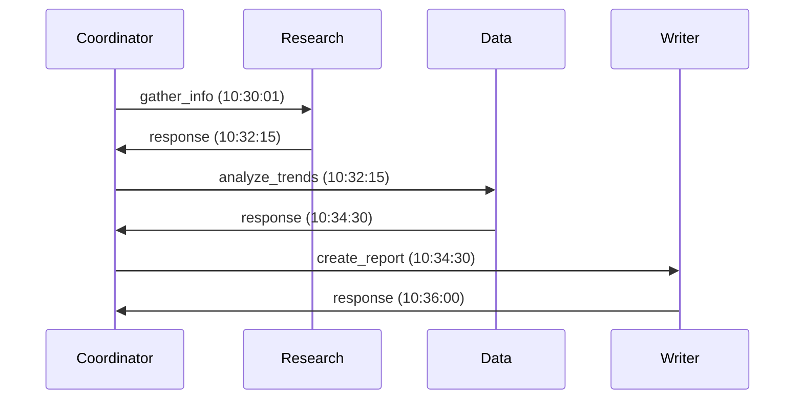
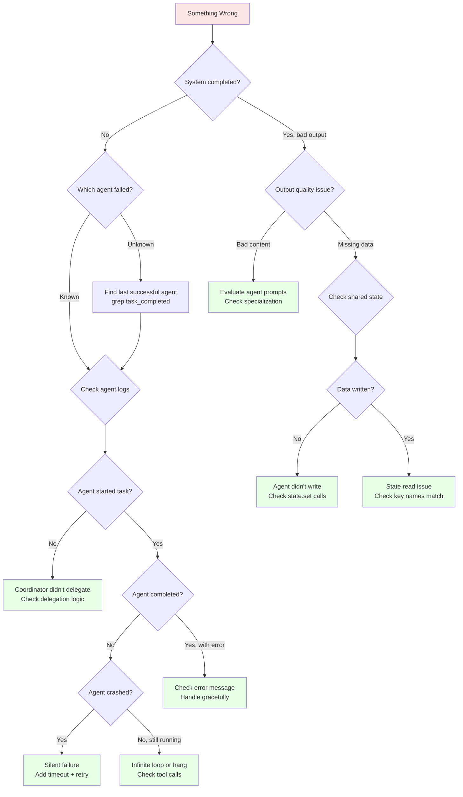

# Debugging Multi-Agent Systems

**Page 6 of 9** | [← Previous: Designing Agent Teams](./designing-agent-teams.md) | [Next: Testing Multi-Agent Systems →](./testing-multi-agent.md) | [↑ Reading Guide](../READING_GUIDE.md)

Debugging a single agent is straightforward: read the logs, trace the execution. But what happens when three agents are passing messages, updating shared state, and one produces garbage? Multi-agent debugging requires new strategies.

## The Multi-Agent Debugging Challenge

### What Makes Multi-Agent Debugging Hard?

**Single Agent:**
```
User → Agent → LLM → Tool → LLM → Response
           ↑_____(linear trace)_____↑
```
- Linear execution path
- Single conversation history
- Clear cause and effect

**Multi-Agent:**
```
User → Coordinator → Research Agent → LLM → Tool
         ↓              ↓
      Data Agent ←  Shared State
         ↓              ↓
      Writer Agent ← Messages
         ↓
      Response (but which agent caused the bug?)
```
- Multiple execution paths
- Interleaved operations
- Distributed state
- Unclear causation

## Logging Strategies for Multi-Agent Systems

### Strategy 1: Structured Logging with Trace IDs

Every operation gets a unique trace ID that flows through the entire system.

```python
import logging
import uuid
from datetime import datetime

class MultiAgentLogger:
    def __init__(self, agent_name: str):
        self.agent_name = agent_name
        self.logger = logging.getLogger(f"agent.{agent_name}")
    
    def log_message(self, trace_id: str, event: str, data: dict = None):
        """Log with consistent structure."""
        log_entry = {
            "timestamp": datetime.utcnow().isoformat(),
            "trace_id": trace_id,
            "agent": self.agent_name,
            "event": event,
            "data": data or {}
        }
        self.logger.info(json.dumps(log_entry))

# Usage in coordinator
trace_id = str(uuid.uuid4())  # Generate once per user request
logger = MultiAgentLogger("coordinator")

logger.log_message(trace_id, "task_received", {
    "user_query": "Analyze EV market"
})

logger.log_message(trace_id, "delegating_to_agent", {
    "target_agent": "research",
    "action": "gather_info"
})

# Research agent uses SAME trace_id
research_logger = MultiAgentLogger("research")
research_logger.log_message(trace_id, "task_started", {
    "action": "gather_info",
    "query": "EV market"
})
```

**Output:**
```json
{"timestamp": "2023-11-22T10:30:00", "trace_id": "abc-123", "agent": "coordinator", "event": "task_received", "data": {"user_query": "Analyze EV market"}}
{"timestamp": "2023-11-22T10:30:01", "trace_id": "abc-123", "agent": "coordinator", "event": "delegating_to_agent", "data": {"target_agent": "research", "action": "gather_info"}}
{"timestamp": "2023-11-22T10:30:02", "trace_id": "abc-123", "agent": "research", "event": "task_started", "data": {"action": "gather_info", "query": "EV market"}}
```

**Benefits:**
- ✅ Grep by trace_id to see entire workflow
- ✅ Can reconstruct execution order by timestamp
- ✅ Clear which agent produced which log

### Strategy 2: Message Flow Logging

Log every message send and receive.

```python
class Coordinator:
    def send_message(self, to_agent: str, action: str, payload: dict):
        message_id = str(uuid.uuid4())
        
        # Log BEFORE sending
        self.logger.log_message(self.trace_id, "message_sent", {
            "message_id": message_id,
            "to": to_agent,
            "action": action,
            "payload": payload
        })
        
        # Send message
        response = self._send(to_agent, action, payload)
        
        # Log AFTER receiving
        self.logger.log_message(self.trace_id, "message_received", {
            "message_id": message_id,
            "from": to_agent,
            "status": response.status,
            "execution_time": response.execution_time
        })
        
        return response
```

**Tracing Messages:**
```bash
# Find all messages in trace abc-123
grep '"trace_id": "abc-123"' agent.log | grep message

# See message flow for specific agent
grep '"agent": "research"' agent.log | jq -r '[.timestamp, .event, .data.action] | @tsv'
```

### Strategy 3: State Change Logging

Log every read/write to shared state.

```python
class SharedState:
    def set(self, key: str, value: Any):
        self.logger.log_message(self.current_trace_id, "state_write", {
            "key": key,
            "value_type": type(value).__name__,
            "value_size": len(str(value)),
            "caller": self._get_caller()  # Which agent wrote this?
        })
        self._write(key, value)
    
    def get(self, key: str):
        value = self._read(key)
        self.logger.log_message(self.current_trace_id, "state_read", {
            "key": key,
            "found": value is not None,
            "caller": self._get_caller()
        })
        return value
```

## Tracing Messages Between Agents

### Visualization Technique: Message Flow Diagram

From logs, reconstruct the message flow:

```bash
# Extract message flow from logs
grep '"event": "message_sent"' agent.log | jq -r '[.timestamp, .agent, .data.to, .data.action] | @csv'
```

**Output:**
```
2023-11-22T10:30:01,coordinator,research,gather_info
2023-11-22T10:32:15,coordinator,data,analyze_trends
2023-11-22T10:34:30,coordinator,writer,create_report
```

**Convert to Mermaid:**


### Debugging Tool: Trace Viewer

```python
# scripts/view_trace.py
import sys
import json

def view_trace(trace_id: str, log_file: str = "agent.log"):
    """Display timeline of a specific trace."""
    events = []
    
    with open(log_file) as f:
        for line in f:
            try:
                entry = json.loads(line)
                if entry.get("trace_id") == trace_id:
                    events.append(entry)
            except json.JSONDecodeError:
                continue
    
    events.sort(key=lambda e: e["timestamp"])
    
    print(f"Trace: {trace_id}")
    print(f"Events: {len(events)}")
    print()
    
    for event in events:
        timestamp = event["timestamp"].split("T")[1][:8]  # HH:MM:SS
        agent = event["agent"].ljust(12)
        evt = event["event"].ljust(20)
        print(f"[{timestamp}] {agent} {evt} {json.dumps(event['data'])}")

# Usage
# python scripts/view_trace.py abc-123
```

**Output:**
```
Trace: abc-123
Events: 12

[10:30:00] coordinator    task_received        {"user_query": "Analyze EV market"}
[10:30:01] coordinator    delegating_to_agent  {"target_agent": "research"}
[10:30:02] research       task_started         {"action": "gather_info"}
[10:30:15] research       tool_call            {"tool": "web_search", "query": "EV market 2023"}
[10:31:45] research       task_completed       {"findings_count": 5}
[10:31:46] coordinator    message_received     {"from": "research", "status": "success"}
...
```

## Common Failure Modes

### 1. The Silent Failure

**Symptom:** Coordinator waits forever, no error message.

**Cause:** Worker agent crashed without sending response.

**Debug:**
```bash
# Check for task_started without task_completed
grep "research" agent.log | grep -E "(task_started|task_completed)"

# Output shows:
# task_started at 10:30:02
# (no task_completed) ← Agent crashed!
```

**Fix:** Add try-catch in worker to always send response.

```python
class WorkerAgent:
    def handle_request(self, request):
        try:
            result = self.execute(request)
            return Response(status="success", payload=result)
        except Exception as e:
            # Always send response, even on error
            return Response(status="error", error=str(e))
```

### 2. The Corrupt State

**Symptom:** Agent uses wrong/missing data from shared state.

**Cause:** State written by one agent, read by another, but format doesn't match expectations.

**Debug:**
```bash
# Who wrote to state?
grep "state_write" agent.log | grep "research_findings"

# Output:
# [10:31:45] research  state_write  {"key": "research_findings", "value_type": "list"}

# Who read from state?
grep "state_read" agent.log | grep "research_findings"

# Output:
# [10:32:00] data  state_read  {"key": "research_findings", "found": true}
```

**Check the actual state:**
```bash
cat .agent_state/shared_state.json | jq '.research_findings'

# Output:
# ["Finding 1", "Finding 2"]  ← Data agent expected dict, got list!
```

**Fix:** Define state schema and validate on read/write.

### 3. The Infinite Loop

**Symptom:** Same message sent repeatedly, system hangs.

**Cause:** Agent fails, coordinator retries, agent fails again, etc.

**Debug:**
```bash
# Count message sends by action
grep "message_sent" agent.log | jq -r .data.action | sort | uniq -c

# Output:
# 1 analyze_trends
# 1 create_report
# 47 gather_info  ← Retried 47 times!
```

**Fix:** Limit retries and use exponential backoff.

```python
def send_with_retry(agent, action, payload, max_retries=3):
    for attempt in range(max_retries):
        try:
            return agent.execute(action, payload)
        except Exception as e:
            if attempt == max_retries - 1:
                raise  # Final attempt, give up
            wait_time = 2 ** attempt  # Exponential backoff
            time.sleep(wait_time)
```

### 4. The Race Condition

**Symptom:** Intermittent failures, inconsistent state.

**Cause:** Two agents writing to shared state simultaneously.

**Debug:**
```bash
# Find overlapping state writes
grep "state_write" agent.log | grep "results" | cut -d'"' -f8,12

# Output:
# 10:35:00.123 research
# 10:35:00.127 data  ← Only 4ms apart!
```

**Fix:** Use file locking (already in SharedState) or namespaced keys.

### 5. The Message Mismatch

**Symptom:** Agent receives message it doesn't understand.

**Cause:** Coordinator sends action that agent doesn't implement.

**Debug:**
```bash
# Find unhandled actions
grep "ERROR.*unknown action" agent.log

# Output:
# [10:40:00] research  ERROR  Unknown action: analyze_data (should be gather_info)
```

**Fix:** Validate action names at send time.

```python
class Coordinator:
    VALID_ACTIONS = {
        "research": ["gather_info", "search_files"],
        "data": ["analyze_trends", "calculate_metrics"],
        "writer": ["create_report", "format_document"]
    }
    
    def send_message(self, agent: str, action: str, payload: dict):
        if action not in self.VALID_ACTIONS.get(agent, []):
            raise ValueError(f"Agent '{agent}' doesn't support action '{action}'")
        # ... send message
```

### 6. The Slow Agent

**Symptom:** System is very slow, times out frequently.

**Cause:** One agent is bottleneck.

**Debug:**
```bash
# Calculate execution time per agent
grep "task_completed" agent.log | jq -r '[.agent, .data.execution_time] | @tsv' | \
    awk '{sum[$1]+=$2; count[$1]+=1} END {for(a in sum) print a, sum[a]/count[a]}'

# Output:
# coordinator  0.5s
# research     2.1s
# data         45.3s  ← BOTTLENECK!
# writer       1.2s
```

**Fix:** Optimize slow agent or split into sub-agents.

---

## Debugging Decision Tree

When debugging multi-agent issues, use this systematic flowchart:



**How to use this diagram:**
1. Start at "Something Wrong"
2. Answer each question based on logs and state
3. Follow arrows to diagnosis
4. Apply the fix suggested in green boxes

## 🛠️ Debugging Checklist

When something goes wrong, follow this systematic approach:

### Step 1: Identify the Failure Point

- [ ] Find the trace ID for the failing request
- [ ] Extract all logs for that trace
- [ ] Identify which agent produced the unexpected behavior

**Commands:**
```bash
# Get trace ID from user's request
grep "task_received" agent.log | tail -1 | jq -r .trace_id

# Extract all events for that trace
python scripts/view_trace.py <trace_id>
```

### Step 2: Check Message Flow

- [ ] Verify all expected messages were sent
- [ ] Check for messages that were sent but not received
- [ ] Look for duplicate or unexpected messages

**Commands:**
```bash
# Count messages per agent
grep <trace_id> agent.log | jq -r .agent | sort | uniq -c

# Find missing responses
grep <trace_id> agent.log | grep -E "(message_sent|message_received)" | less
```

### Step 3: Inspect State Changes

- [ ] Check what was written to shared state
- [ ] Verify state reads returned expected data
- [ ] Look for state corruption or missing keys

**Commands:**
```bash
# State changes during trace
grep <trace_id> agent.log | grep state_write

# Current state
cat .agent_state/shared_state.json | jq '.'
```

### Step 4: Analyze Agent Execution

- [ ] Check if agent started execution
- [ ] Look for tool calls and their results
- [ ] Verify agent completed or errored properly

**Commands:**
```bash
# Agent's execution steps
grep <trace_id> agent.log | grep research | jq -r '[.timestamp, .event, .data] | @json'
```

### Step 5: Review Error Messages

- [ ] Check for explicit error messages
- [ ] Look for Python exceptions or stack traces
- [ ] Identify root cause

**Commands:**
```bash
# Find errors in trace
grep <trace_id> agent.log | grep -i error

# Check coordinator errors
grep <trace_id> agent.log | grep coordinator | grep -i "error\|exception\|failed"
```

---

## 🎯 Debugging Exercise

**Scenario:** User reports "My report is missing data analysis."

**Given Logs:**
```
{"timestamp": "10:00:00", "trace_id": "xyz", "agent": "coordinator", "event": "task_received"}
{"timestamp": "10:00:01", "trace_id": "xyz", "agent": "coordinator", "event": "message_sent", "data": {"to": "research"}}
{"timestamp": "10:02:00", "trace_id": "xyz", "agent": "research", "event": "task_completed", "data": {"findings_count": 5}}
{"timestamp": "10:02:01", "trace_id": "xyz", "agent": "coordinator", "event": "message_sent", "data": {"to": "data"}}
{"timestamp": "10:02:05", "trace_id": "xyz", "agent": "data", "event": "ERROR", "data": {"message": "Key 'research_findings' not found in state"}}
{"timestamp": "10:02:06", "trace_id": "xyz", "agent": "coordinator", "event": "message_sent", "data": {"to": "writer"}}
{"timestamp": "10:03:00", "trace_id": "xyz", "agent": "writer", "event": "task_completed"}
```

**Your Task:** What's the bug? How would you fix it?

<details>
<summary>Show Answer</summary>

**The Bug:**
1. Research agent completes successfully (10:02:00)
2. Data agent fails with "Key 'research_findings' not found" (10:02:05)
3. Coordinator proceeds to writer anyway (10:02:06)

**Root Cause:** Research agent didn't write findings to shared state.

**Evidence:**
- No "state_write" log from research agent
- Data agent can't find expected key
- Writer creates report without analysis (garbage in, garbage out)

**Fix:**
```python
class ResearchAgent:
    def gather_info(self, query):
        findings = self._search(query)
        
        # FIX: Write to shared state!
        self.shared_state.set("research_findings", findings)
        
        return Response(status="success", findings_count=len(findings))
```

**Prevention:**
- Add validation in coordinator: Check state before delegating to next agent
- Data agent should error more loudly (return error response, not just log)
- Integration test: Verify research → data flow works end-to-end
</details>

---

**Ready?** If you can debug multi-agent systems, you're ready for [Testing Multi-Agent Systems](./testing-multi-agent.md) to learn how to prevent bugs before they happen.

**Page 6 of 9** | [← Previous: Designing Agent Teams](./designing-agent-teams.md) | [Next: Testing Multi-Agent Systems →](./testing-multi-agent.md) | [↑ Reading Guide](../READING_GUIDE.md)

