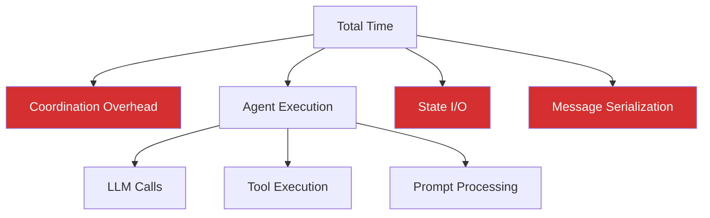

# Performance Profiling Multi-Agent Systems

**Page 10 (Supplementary)** | [← Back to Guides](./testing-multi-agent.md) | [↑ Reading Guide](../READING_GUIDE.md)

Multi-agent systems introduce performance considerations beyond single agents. This guide shows you how to profile, measure, and optimize your multi-agent workflows.

---

## Table of Contents

1. [Why Profile Multi-Agent Systems?](#why-profile-multi-agent-systems)
2. [Key Performance Metrics](#key-performance-metrics)
3. [Basic Profiling Tools](#basic-profiling-tools)
4. [Advanced Profiling](#advanced-profiling)
5. [Common Bottlenecks](#common-bottlenecks)
6. [Optimization Strategies](#optimization-strategies)

---

## Why Profile Multi-Agent Systems?

Multi-agent systems have unique performance characteristics:



**What to measure:**
- Coordination overhead (8-15% of total time)
- Agent execution time (70-85% of total time)
- State I/O operations (3-7% of total time)
- Message serialization (2-5% of total time)

---

## Key Performance Metrics

### 1. End-to-End Latency

Time from user request to final response.

```python
import time

start_time = time.time()
report = coordinator.generate_report("EV market")
end_time = time.time()

latency = end_time - start_time
print(f"Total latency: {latency:.2f}s")
```

**Target:** <10 seconds for typical reports

### 2. Agent Execution Time

Time each agent spends processing.

```python
class ProfilingAgent(WorkerAgent):
    def execute(self, action, payload):
        start = time.time()
        result = super().execute(action, payload)
        duration = time.time() - start
        
        self.logger.info(f"Agent {self.name} executed {action} in {duration:.2f}s")
        return result
```

**Analyze:**
```bash
grep "executed" .agent_logs/agent.log | awk '{print $NF}' | sort -n
# Shows execution times sorted
```

### 3. Message Throughput

Messages per second the system can handle.

```python
def measure_throughput(coordinator, num_requests=10):
    start = time.time()
    
    for i in range(num_requests):
        coordinator.generate_report(f"Query {i}")
    
    duration = time.time() - start
    throughput = num_requests / duration
    
    print(f"Throughput: {throughput:.2f} requests/second")
    print(f"Average latency: {duration/num_requests:.2f}s per request")
```

### 4. LLM API Costs

Track API calls and token usage.

```python
class CostTracker:
    def __init__(self):
        self.total_tokens = 0
        self.total_calls = 0
        self.cost_per_1k_tokens = 0.03  # GPT-4 pricing
    
    def track_call(self, prompt_tokens, completion_tokens):
        self.total_tokens += prompt_tokens + completion_tokens
        self.total_calls += 1
    
    def get_cost(self):
        return (self.total_tokens / 1000) * self.cost_per_1k_tokens
    
    def report(self):
        print(f"Total API calls: {self.total_calls}")
        print(f"Total tokens: {self.total_tokens:,}")
        print(f"Estimated cost: ${self.get_cost():.4f}")
```

---

## Basic Profiling Tools

### Tool 1: Simple Timer Decorator

```python
import functools
import time

def profile_time(func):
    """Decorator to measure function execution time."""
    @functools.wraps(func)
    def wrapper(*args, **kwargs):
        start = time.time()
        result = func(*args, **kwargs)
        duration = time.time() - start
        print(f"{func.__name__} took {duration:.2f}s")
        return result
    return wrapper

# Usage
class Coordinator:
    @profile_time
    def generate_report(self, query):
        # Implementation
        pass
```

### Tool 2: Context Manager Profiler

```python
class Timer:
    """Context manager for timing code blocks."""
    def __init__(self, name="Operation"):
        self.name = name
        self.start = None
    
    def __enter__(self):
        self.start = time.time()
        return self
    
    def __exit__(self, *args):
        duration = time.time() - self.start
        print(f"{self.name}: {duration:.2f}s")

# Usage
with Timer("Research phase"):
    research_agent.gather_info(query)

with Timer("Analysis phase"):
    data_agent.analyze_trends()
```

### Tool 3: Profile Script

Create `scripts/profile_workflow.py`:

```python
#!/usr/bin/env python3
"""
Profile a multi-agent workflow.

Usage:
    python scripts/profile_workflow.py "EV market analysis"
"""

import sys
import time
import json
from src.multi_agent import Coordinator

def profile_workflow(query: str):
    """Profile complete workflow with detailed timing."""
    coordinator = Coordinator()
    
    timings = {
        "total": 0,
        "coordination": 0,
        "agents": {}
    }
    
    # Profile total time
    start_total = time.time()
    
    # Intercept agent calls
    original_delegate = coordinator.delegate
    
    def profiled_delegate(agent, action, payload, **kwargs):
        agent_name = agent.name
        start = time.time()
        
        result = original_delegate(agent, action, payload, **kwargs)
        
        duration = time.time() - start
        if agent_name not in timings["agents"]:
            timings["agents"][agent_name] = []
        timings["agents"][agent_name].append({
            "action": action,
            "duration": duration
        })
        
        return result
    
    coordinator.delegate = profiled_delegate
    
    # Run workflow
    report = coordinator.generate_report(query)
    
    timings["total"] = time.time() - start_total
    
    # Calculate coordination overhead
    agent_time = sum(
        sum(call["duration"] for call in calls)
        for calls in timings["agents"].values()
    )
    timings["coordination"] = timings["total"] - agent_time
    
    # Print report
    print("\n" + "="*60)
    print(f"PROFILE: {query}")
    print("="*60)
    print(f"\nTotal Time: {timings['total']:.2f}s\n")
    
    print("Agent Breakdown:")
    for agent_name, calls in timings["agents"].items():
        total_agent_time = sum(call["duration"] for call in calls)
        percentage = (total_agent_time / timings["total"]) * 100
        print(f"  {agent_name:15s}: {total_agent_time:5.2f}s ({percentage:5.1f}%)")
        for call in calls:
            print(f"    └─ {call['action']:20s}: {call['duration']:.2f}s")
    
    coord_percentage = (timings["coordination"] / timings["total"]) * 100
    print(f"  {'Coordination':15s}: {timings['coordination']:5.2f}s ({coord_percentage:5.1f}%)")
    
    print(f"\nReport length: {len(report)} characters")
    print("="*60)
    
    return timings

if __name__ == "__main__":
    query = sys.argv[1] if len(sys.argv) > 1 else "EV market analysis"
    profile_workflow(query)
```

**Run:**
```bash
python scripts/profile_workflow.py "Electric vehicle market trends"

# Output:
# ============================================================
# PROFILE: Electric vehicle market trends
# ============================================================
# 
# Total Time: 5.23s
# 
# Agent Breakdown:
#   research        :  2.15s ( 41.1%)
#     └─ gather_info          : 2.15s
#   data            :  1.87s ( 35.8%)
#     └─ analyze_trends       : 1.87s
#   writer          :  0.98s ( 18.7%)
#     └─ create_report        : 0.98s
#   Coordination    :  0.23s (  4.4%)
# 
# Report length: 1234 characters
# ============================================================
```

---

## Advanced Profiling

### Python cProfile Integration

```python
import cProfile
import pstats
from pstats import SortKey

def profile_with_cprofile(coordinator, query):
    """Use Python's cProfile for detailed profiling."""
    profiler = cProfile.Profile()
    
    profiler.enable()
    report = coordinator.generate_report(query)
    profiler.disable()
    
    # Print statistics
    stats = pstats.Stats(profiler)
    stats.sort_stats(SortKey.CUMULATIVE)
    stats.print_stats(20)  # Top 20 functions
    
    return report

# Usage
profile_with_cprofile(coordinator, "EV market")
```

### Memory Profiling

```python
from memory_profiler import profile

@profile
def test_memory_usage():
    """Profile memory usage of workflow."""
    coordinator = Coordinator()
    report = coordinator.generate_report("EV market")
    return report

# Run with: python -m memory_profiler script.py
```

### Trace Every Operation

```python
import logging

class DetailedProfiler:
    """Log every operation with timing."""
    def __init__(self):
        self.events = []
        self.start_time = time.time()
    
    def log(self, event_type, details):
        elapsed = time.time() - self.start_time
        self.events.append({
            "time": elapsed,
            "type": event_type,
            "details": details
        })
    
    def report(self):
        print("\nDetailed Trace:")
        for event in self.events:
            print(f"  {event['time']:6.2f}s - {event['type']:20s}: {event['details']}")

# Integrate into agents
profiler = DetailedProfiler()

class ProfiledCoordinator(Coordinator):
    def delegate(self, agent, action, payload, **kwargs):
        profiler.log("delegate_start", f"{agent.name}.{action}")
        result = super().delegate(agent, action, payload, **kwargs)
        profiler.log("delegate_end", f"{agent.name}.{action}")
        return result
```

---

## Common Bottlenecks

### 1. LLM API Calls (70-85% of time)

**Symptom:** Each agent takes 1-3 seconds

**Solutions:**
- Use faster models for coordination (GPT-3.5 instead of GPT-4)
- Reduce prompt size
- Cache frequent responses
- Use streaming for long responses

### 2. Sequential Execution (Adding up)

**Symptom:** Total time = sum of all agents

**Solution:** Parallel execution for independent agents

```python
import concurrent.futures

def parallel_execution(coordinator, tasks):
    """Execute independent tasks in parallel."""
    with concurrent.futures.ThreadPoolExecutor(max_workers=3) as executor:
        futures = []
        
        for agent, action, payload in tasks:
            future = executor.submit(coordinator.delegate, agent, action, payload)
            futures.append(future)
        
        results = [f.result() for f in concurrent.futures.as_completed(futures)]
    
    return results
```

### 3. State I/O Operations

**Symptom:** Frequent file reads/writes

**Solutions:**
- Batch state updates
- Use in-memory cache
- Minimize state reads

```python
class CachedState:
    """SharedState with in-memory cache."""
    def __init__(self, shared_state):
        self.state = shared_state
        self.cache = {}
        self.dirty = set()
    
    def get(self, key, default=None):
        if key in self.cache:
            return self.cache[key]
        value = self.state.get(key, default)
        self.cache[key] = value
        return value
    
    def set(self, key, value):
        self.cache[key] = value
        self.dirty.add(key)
    
    def flush(self):
        """Write cached changes to state."""
        for key in self.dirty:
            self.state.set(key, self.cache[key])
        self.dirty.clear()
```

### 4. Message Serialization

**Symptom:** JSON dumps/loads taking time

**Solutions:**
- Use simpler message format
- Avoid serializing large payloads
- Pass references instead of data

### 5. Coordinator Overhead

**Symptom:** Coordinator spending time on logic

**Solutions:**
- Simplify coordination logic
- Minimize validation
- Use compiled patterns (regex)

---

## Optimization Strategies

### Strategy 1: Caching

```python
from functools import lru_cache
import hashlib

class CachingCoordinator(Coordinator):
    """Coordinator with result caching."""
    
    @lru_cache(maxsize=100)
    def generate_report(self, query):
        """Cache reports for identical queries."""
        return super().generate_report(query)
    
    def generate_report_with_hash(self, query):
        """Cache with custom key."""
        # Create cache key
        key = hashlib.md5(query.encode()).hexdigest()
        
        # Check cache
        cached = self.shared_state.get(f"cache_{key}")
        if cached:
            return cached
        
        # Generate and cache
        report = super().generate_report(query)
        self.shared_state.set(f"cache_{key}", report)
        
        return report
```

### Strategy 2: Parallel Execution

```python
class ParallelCoordinator(Coordinator):
    """Execute independent agents in parallel."""
    
    def generate_report_parallel(self, query):
        """Run research in parallel with data prep."""
        import concurrent.futures
        
        with concurrent.futures.ThreadPoolExecutor() as executor:
            # These can run in parallel
            research_future = executor.submit(
                self.research.gather_info, query
            )
            data_prep_future = executor.submit(
                self.data.prepare_tools
            )
            
            # Wait for both
            research_result = research_future.result()
            data_prep_result = data_prep_future.result()
        
        # Continue sequential
        analysis = self.data.analyze(research_result)
        report = self.writer.create_report(analysis)
        
        return report
```

### Strategy 3: Lazy Evaluation

```python
class LazyCoordinator(Coordinator):
    """Only execute agents when needed."""
    
    def generate_report_lazy(self, query, detail_level="summary"):
        """Skip data analysis for summaries."""
        # Always need research
        research_result = self.research.gather_info(query)
        
        if detail_level == "summary":
            # Skip expensive analysis
            report = self.writer.create_summary(research_result)
        else:
            # Full analysis
            analysis = self.data.analyze(research_result)
            report = self.writer.create_report(analysis)
        
        return report
```

### Strategy 4: Model Selection

```python
class TieredCoordinator(Coordinator):
    """Use different models for different agents."""
    
    def __init__(self):
        super().__init__()
        
        # Fast model for coordination
        self.llm_coordinator = OllamaLLM(model="llama3.1:8b")
        
        # Powerful model for analysis
        self.llm_analysis = OllamaLLM(model="llama3.1:70b")
        
        self.research.llm = self.llm_coordinator  # Fast research
        self.data.llm = self.llm_analysis         # Accurate analysis
        self.writer.llm = self.llm_coordinator    # Fast writing
```

---

## Benchmarking Example

```python
def benchmark_workflow(coordinator, num_runs=10):
    """Run workflow multiple times and collect statistics."""
    import statistics
    
    latencies = []
    
    for i in range(num_runs):
        start = time.time()
        report = coordinator.generate_report(f"Test query {i}")
        latency = time.time() - start
        latencies.append(latency)
    
    print(f"\nBenchmark Results ({num_runs} runs):")
    print(f"  Mean:   {statistics.mean(latencies):.2f}s")
    print(f"  Median: {statistics.median(latencies):.2f}s")
    print(f"  StdDev: {statistics.stdev(latencies):.2f}s")
    print(f"  Min:    {min(latencies):.2f}s")
    print(f"  Max:    {max(latencies):.2f}s")
    
    # Percentiles
    sorted_latencies = sorted(latencies)
    p50 = sorted_latencies[int(len(sorted_latencies) * 0.50)]
    p95 = sorted_latencies[int(len(sorted_latencies) * 0.95)]
    p99 = sorted_latencies[int(len(sorted_latencies) * 0.99)]
    
    print(f"\nPercentiles:")
    print(f"  P50: {p50:.2f}s")
    print(f"  P95: {p95:.2f}s")
    print(f"  P99: {p99:.2f}s")
```

---

## Performance Targets

### Development (Local)
- End-to-end: <10 seconds
- Per agent: <3 seconds
- Coordination: <500ms

### Production (Optimized)
- End-to-end: <5 seconds
- Per agent: <2 seconds
- Coordination: <200ms
- Throughput: >10 requests/minute

---

## Next Steps

1. **Profile your workflow** using the tools above
2. **Identify bottlenecks** (usually LLM calls)
3. **Apply optimizations** (caching, parallelism)
4. **Measure improvements** (before/after comparison)
5. **Iterate** until targets met

---

**See Also:**
- [Debugging Multi-Agent Systems](./debugging-multi-agent.md) - When performance is unexpectedly slow
- [Coordinator Patterns](../architecture/coordinator-patterns.md) - Parallel execution patterns
- [Testing Multi-Agent Systems](./testing-multi-agent.md) - Performance testing

---

[← Back to Guides](./testing-multi-agent.md) | [↑ Reading Guide](../READING_GUIDE.md)

