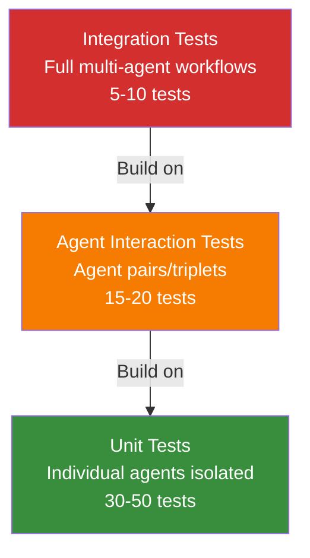

# Testing Multi-Agent Systems

**Page 7 of 9** | [← Previous: Debugging Multi-Agent Systems](./debugging-multi-agent.md) | [Next: Coordinator Patterns →](../architecture/coordinator-patterns.md) | [↑ Reading Guide](../READING_GUIDE.md)

> **📚 Building on Tutorial 1**
> 
> In Tutorial 1, you learned the [O.V.E. methodology](../../../lesson-1-fundamentals/tutorial-1/concepts/testing-agents.md) for testing single agents: Observe the execution, Validate deterministic behaviors, Evaluate quality.
> 
> **Tutorial 2 extends O.V.E. to multi-agent:**
> - Test individual agents (unit tests)
> - Test agent pairs (interaction tests)
> - Test full workflows (integration tests)
> - Test coordination logic (new challenge)
> - Test message protocols (new challenge)
> 
> **The testing pyramid:** Unit → Interaction → Integration

In Tutorial 1, you learned the Observe-Validate-Evaluate (O.V.E.) methodology for testing single agents. Multi-agent systems add new testing challenges: coordination logic, message passing, and agent interactions. This guide extends O.V.E. for multi-agent scenarios.

## Review: The O.V.E. Methodology

From Tutorial 1:

- **Observe:** Run the agent, capture all inputs/outputs
- **Validate:** Check deterministic behaviors (tool calls, message formats)
- **Evaluate:** Check probabilistic outputs (did the answer make sense?)

**For Multi-Agent:**
- **Observe:** Capture message flows, state changes, agent outputs
- **Validate:** Check coordination logic, message protocols, state consistency
- **Evaluate:** Check overall system quality (not just individual agents)

## Testing Pyramid for Multi-Agent Systems



### Level 1: Unit Tests (Individual Agents)

Test each agent in isolation, mocking dependencies.

```python
def test_research_agent_gather_info():
    """Test research agent independently."""
    # Setup
    agent = ResearchAgent(shared_state=MockSharedState())
    
    # Execute
    result = agent.gather_info(query="EV market trends")
    
    # Validate
    assert result.status == "success"
    assert len(result.findings) >= 3
    assert all(f.source_url for f in result.findings)
    
    # Evaluate (optional)
    assert "electric vehicle" in result.findings[0].text.lower()
```

### Level 2: Interaction Tests (Agent Pairs)

Test how two agents work together.

```python
def test_research_to_data_flow():
    """Test that data agent can consume research output."""
    # Setup
    shared_state = SharedState()
    research = ResearchAgent(shared_state)
    data = DataAgent(shared_state)
    
    # Research gathers data
    research_result = research.gather_info(query="EV sales 2023")
    
    # Validate research wrote to state
    findings = shared_state.get("research_findings")
    assert findings is not None
    assert len(findings) > 0
    
    # Data agent analyzes
    data_result = data.analyze_trends()
    
    # Validate data read correctly
    assert data_result.status == "success"
    assert "growth_rate" in data_result.analysis
```

### Level 3: Integration Tests (Full Workflows)

Test complete end-to-end scenarios.

```python
def test_full_report_workflow():
    """Test complete research → data → writer pipeline."""
    # Setup
    coordinator = Coordinator()
    
    # Execute full workflow
    report = coordinator.generate_report(query="EV market analysis")
    
    # Validate coordination
    assert coordinator.message_count == 6  # 3 requests + 3 responses
    assert len(coordinator.completed_agents) == 3
    
    # Validate output
    assert report is not None
    assert len(report.content) > 500  # Substantial report
    assert report.sections["research"] is not None
    assert report.sections["analysis"] is not None
    
    # Evaluate quality
    assert "growth" in report.content.lower()
    assert "market" in report.content.lower()
```

## Testing Coordination Logic

### Test Pattern 1: Sequential Delegation

Verify coordinator executes agents in correct order.

```python
def test_coordinator_sequential_execution():
    """Coordinator should execute research, then data, then writer."""
    # Setup with tracking
    coordinator = Coordinator()
    execution_order = []
    
    # Mock agents that record execution
    class TrackingAgent:
        def __init__(self, name):
            self.name = name
        
        def execute(self, *args):
            execution_order.append(self.name)
            return Response(status="success")
    
    coordinator.research = TrackingAgent("research")
    coordinator.data = TrackingAgent("data")
    coordinator.writer = TrackingAgent("writer")
    
    # Execute
    coordinator.generate_report("test query")
    
    # Validate order
    assert execution_order == ["research", "data", "writer"]
```

### Test Pattern 2: Parallel Execution

Verify agents that can run in parallel do so.

```python
def test_coordinator_parallel_execution():
    """Independent agents should execute in parallel."""
    import time
    
    # Setup agents with delays
    class SlowAgent:
        def __init__(self, name, delay):
            self.name = name
            self.delay = delay
        
        def execute(self, *args):
            time.sleep(self.delay)
            return Response(status="success")
    
    coordinator = Coordinator()
    coordinator.agent_a = SlowAgent("a", 1.0)
    coordinator.agent_b = SlowAgent("b", 1.0)
    
    # Execute
    start = time.time()
    coordinator.execute_parallel(["agent_a", "agent_b"])
    duration = time.time() - start
    
    # Validate parallelism
    # Sequential would take 2+ seconds, parallel ~1 second
    assert duration < 1.5, "Agents executed sequentially, not in parallel"
```

### Test Pattern 3: Error Recovery

Verify coordinator handles agent failures gracefully.

```python
def test_coordinator_handles_agent_failure():
    """Coordinator should retry or fail gracefully on agent error."""
    # Setup
    coordinator = Coordinator()
    
    # Mock failing agent
    class FailingAgent:
        def __init__(self):
            self.attempts = 0
        
        def execute(self, *args):
            self.attempts += 1
            if self.attempts < 2:
                raise TimeoutError("Agent timed out")
            return Response(status="success")
    
    coordinator.research = FailingAgent()
    
    # Execute
    result = coordinator.generate_report("test query")
    
    # Validate retry logic
    assert coordinator.research.attempts == 2  # Retried once
    assert result.status == "success"  # Eventually succeeded
```

## Testing Agent Specialization

### Test Pattern 4: Tool Usage Boundaries

Verify agents only use tools assigned to them.

```python
def test_research_agent_tool_boundaries():
    """Research agent should only use research tools, not data tools."""
    # Setup
    research = ResearchAgent()
    
    # Execute with monitoring
    with ToolMonitor() as monitor:
        research.gather_info("EV trends")
    
    # Validate tool usage
    allowed_tools = {"web_search", "read_file", "list_files"}
    used_tools = set(monitor.called_tools)
    
    assert used_tools.issubset(allowed_tools), \
        f"Agent used forbidden tools: {used_tools - allowed_tools}"
```

### Test Pattern 5: Role Adherence

Verify agents stay within their specialization.

```python
def test_research_agent_does_not_analyze():
    """Research agent should gather data, not analyze it."""
    # Setup
    research = ResearchAgent()
    
    # Execute
    result = research.gather_info("EV market growth")
    
    # Validate: Check output for analysis keywords
    # Research should have raw facts, NOT interpretation
    output_text = str(result.findings)
    
    # These should appear (facts)
    assert "sales" in output_text or "units" in output_text
    
    # These should NOT appear (analysis)
    forbidden_phrases = [
        "indicates that",
        "suggests that",
        "analysis shows",
        "growth rate of",  # That's data agent's job!
        "trend indicates"
    ]
    for phrase in forbidden_phrases:
        assert phrase not in output_text.lower(), \
            f"Research agent is analyzing (found '{phrase}')"
```

## Testing Message Protocol

### Test Pattern 6: Message Format Validation

Verify all messages follow the protocol.

```python
def test_message_format_compliance():
    """All messages should have required fields."""
    # Setup
    coordinator = Coordinator()
    
    # Execute with message capture
    with MessageCapture() as capture:
        coordinator.generate_report("test query")
    
    # Validate every message
    required_fields = ["message_id", "timestamp", "from_agent", 
                       "to_agent", "message_type"]
    
    for msg in capture.messages:
        for field in required_fields:
            assert field in msg, f"Message missing field '{field}': {msg}"
        
        # Validate message types
        assert msg["message_type"] in ["request", "response", "error"]
```

### Test Pattern 7: Request-Response Matching

Verify every request gets a response.

```python
def test_all_requests_get_responses():
    """Each request should have matching response."""
    # Setup and execute
    coordinator = Coordinator()
    
    with MessageCapture() as capture:
        coordinator.generate_report("test")
    
    # Collect requests and responses
    requests = {msg["message_id"]: msg 
                for msg in capture.messages 
                if msg["message_type"] == "request"}
    
    responses = {msg["in_reply_to"]: msg 
                 for msg in capture.messages 
                 if msg["message_type"] == "response"}
    
    # Validate: Every request has response
    for req_id in requests:
        assert req_id in responses, \
            f"Request {req_id} has no response"
```

## Integration Testing Patterns

### Test Pattern 8: End-to-End Workflows

Test complete user scenarios.

```python
def test_e2e_market_research_report():
    """
    GIVEN a user wants market research
    WHEN they request an EV market report
    THEN they receive a complete, formatted report
    """
    # Observe
    coordinator = Coordinator()
    
    with ObservationContext() as obs:
        result = coordinator.generate_report("EV market trends 2023")
    
    # Validate (deterministic checks)
    assert result.status == "success"
    assert result.report is not None
    
    # Check all agents executed
    assert "research" in obs.executed_agents
    assert "data" in obs.executed_agents
    assert "writer" in obs.executed_agents
    
    # Check message flow
    assert obs.message_count >= 6  # 3 req + 3 resp minimum
    
    # Check state consistency
    state = obs.final_state
    assert state.get("research_findings") is not None
    assert state.get("data_analysis") is not None
    assert state.get("final_report") is not None
    
    # Evaluate (probabilistic checks)
    report = result.report
    
    # Content quality
    assert len(report) > 1000, "Report too short"
    assert "electric vehicle" in report.lower()
    assert "market" in report.lower()
    
    # Structure quality
    assert "##" in report  # Has headings
    assert any(char.isdigit() for char in report)  # Has numbers
    
    # Source attribution
    assert "source:" in report.lower() or "http" in report
```

### Test Pattern 9: State Consistency

Verify shared state remains consistent throughout workflow.

```python
def test_shared_state_consistency():
    """State should be consistent across agent transitions."""
    # Setup
    coordinator = Coordinator()
    shared_state = coordinator.shared_state
    
    # Execute with state snapshots
    snapshots = []
    
    def snapshot_state(agent_name):
        snapshots.append({
            "agent": agent_name,
            "state": shared_state.get_all_keys(),
            "timestamp": time.time()
        })
    
    coordinator.on_agent_complete = snapshot_state
    coordinator.generate_report("test query")
    
    # Validate state only grows (never loses data)
    for i in range(1, len(snapshots)):
        prev_keys = set(snapshots[i-1]["state"].keys())
        curr_keys = set(snapshots[i]["state"].keys())
        
        # Current should have all previous keys (or more)
        assert prev_keys.issubset(curr_keys), \
            f"State lost keys between {snapshots[i-1]['agent']} and {snapshots[i]['agent']}"
```

## Mocking Strategies

### Strategy 1: Mock Individual Agents

Replace agents with controlled mocks for testing coordination.

```python
class MockResearchAgent:
    """Predictable research agent for testing."""
    def gather_info(self, query: str):
        return Response(
            status="success",
            findings=[
                {"fact": "EV sales: 10M", "source": "mock"},
                {"fact": "Growth: 50%", "source": "mock"}
            ]
        )

def test_coordinator_with_mock_agents():
    coordinator = Coordinator()
    coordinator.research = MockResearchAgent()
    coordinator.data = MockDataAgent()
    coordinator.writer = MockWriterAgent()
    
    result = coordinator.generate_report("test")
    # Test coordination logic without depending on real agent behavior
```

### Strategy 2: Mock LLM Calls

Control LLM responses for reproducible tests.

```python
class MockLLM:
    """Deterministic LLM responses."""
    def chat(self, messages):
        last_message = messages[-1]["content"]
        
        if "gather information" in last_message:
            return {"role": "assistant", "content": "I will search for EV data"}
        elif "analyze" in last_message:
            return {"role": "assistant", "content": "Growth rate: 50%"}
        
        return {"role": "assistant", "content": "Done"}

def test_agent_with_mock_llm():
    agent = ResearchAgent(llm=MockLLM())
    # Agent behavior is now deterministic
```

---

## 🎯 Testing Checklist

Before considering your multi-agent system tested:

**Unit Level:**
- [ ] Each agent has tests for its core functionality
- [ ] Edge cases handled (empty input, failures)
- [ ] Tool usage is correct and within boundaries
- [ ] Agent outputs follow expected format

**Interaction Level:**
- [ ] Agent pairs work together (research→data, data→writer)
- [ ] State passing works correctly
- [ ] Message protocol is followed
- [ ] Errors in one agent don't crash others

**Integration Level:**
- [ ] Full workflows complete successfully
- [ ] Coordinator logic is correct (order, parallelism, retries)
- [ ] State remains consistent throughout
- [ ] Edge cases handled at system level (all agents fail, timeout, etc.)

**Quality Level:**
- [ ] Output quality meets standards (O.V.E. evaluation)
- [ ] Performance is acceptable (execution time)
- [ ] Resource usage is reasonable (memory, API calls)
- [ ] Logging and observability work

---

## 🎯 Practical Exercise

**Scenario:** Write tests for a research→data→writer pipeline where the data agent might fail.

```python
# Your task: Fill in the test
def test_pipeline_handles_data_agent_failure():
    """
    GIVEN research completes successfully
    WHEN data agent fails to analyze
    THEN coordinator should either retry or return error gracefully
    """
    # Setup
    coordinator = Coordinator()
    
    # TODO: Mock research agent (succeeds)
    # TODO: Mock data agent (fails)
    # TODO: Execute workflow
    # TODO: Validate error handling
    
    pass
```

<details>
<summary>Show Solution</summary>

```python
def test_pipeline_handles_data_agent_failure():
    """Coordinator handles data agent failure gracefully."""
    # Setup
    coordinator = Coordinator()
    
    # Mock successful research
    class MockResearch:
        def gather_info(self, query):
            return Response(status="success", findings=["fact1", "fact2"])
    
    # Mock failing data agent
    class FailingDataAgent:
        def __init__(self):
            self.attempts = 0
        
        def analyze_trends(self):
            self.attempts += 1
            return Response(status="error", error="Analysis failed")
    
    coordinator.research = MockResearch()
    coordinator.data = FailingDataAgent()
    
    # Execute
    result = coordinator.generate_report("test query")
    
    # Validate error handling
    # Option 1: Coordinator retried
    if result.status == "success":
        assert coordinator.data.attempts > 1, "Should have retried"
    
    # Option 2: Coordinator returned error gracefully
    elif result.status == "error":
        assert "analysis" in result.error.lower()
        assert coordinator.data.attempts >= 1
    
    # Either way: Shouldn't crash
    assert result is not None
```
</details>

---

**Ready?** If you can test multi-agent systems, you're ready for [Coordinator Patterns](../architecture/coordinator-patterns.md) to learn advanced coordination techniques.

**Page 7 of 9** | [← Previous: Debugging Multi-Agent Systems](./debugging-multi-agent.md) | [Next: Coordinator Patterns →](../architecture/coordinator-patterns.md) | [↑ Reading Guide](../READING_GUIDE.md)

