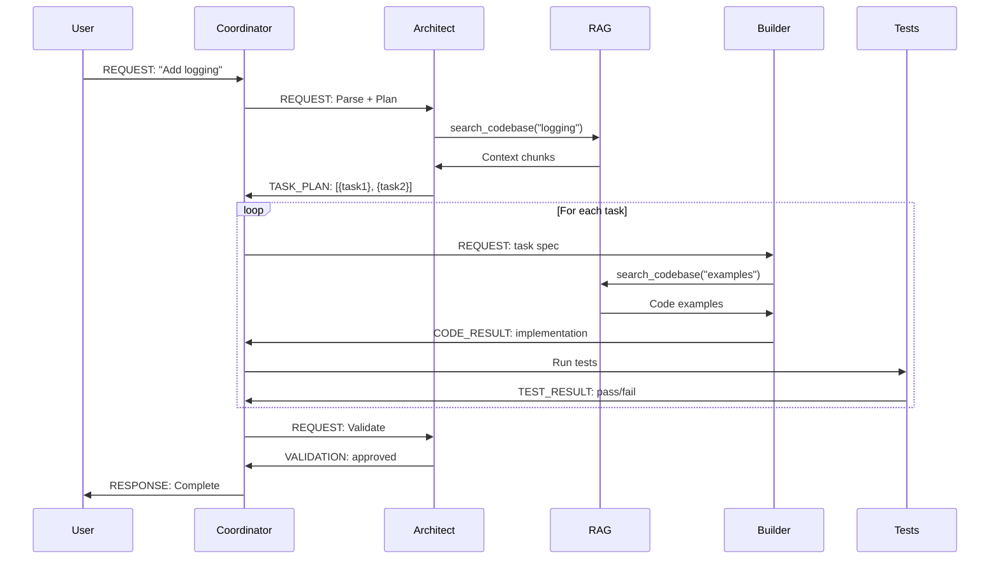
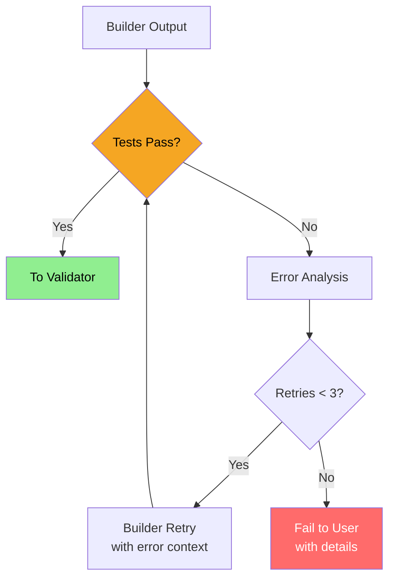
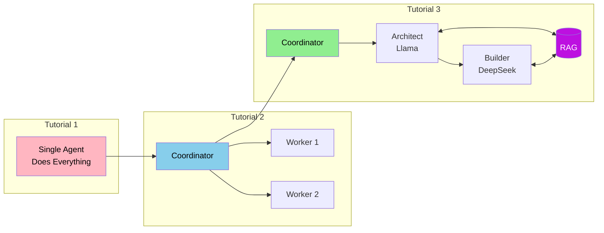

# Architect-Builder Pattern

[← RAG Pipeline Architecture](./rag-pipeline.md) | [↑ Index](../INDEX.md)

This document details the Architect-Builder pattern for multi-model orchestration, where Llama 3.1 plans and DeepSeek-Coder implements.

---

## Pattern Overview

### Analogy: Building a House 🏠

Building software with AI is like constructing a house:

**Without specialization:**
> One contractor does everything - designs the blueprint, calculates structural requirements, lays the foundation, builds walls, installs plumbing... 
> 
> *Result: Slow, inconsistent quality, expertise spread thin*

**With specialization:**
> - **Architect** creates the blueprint, ensures building codes are met, validates the final result
> - **Builder** executes the blueprint efficiently and correctly
> 
> *Result: Each specialist excels, faster completion, higher quality*

**In AI terms:**
- **Architect (Llama 3.1):** Understands requirements, queries knowledge base, creates detailed plans, validates implementations
- **Builder (DeepSeek-Coder):** Implements code according to specifications, follows patterns, generates tests

---

## Architecture Diagram

```mermaid
flowchart TD
    subgraph "User Layer"
        U[User Request:<br/>"Add error handling to tools"]
    end
    
    subgraph "Coordinator"
        C[Multi-Model Coordinator]
    end
    
    subgraph "Architect Agent (Llama 3.1)"
        A1[1. Parse Request]
        A2[2. Query RAG<br/>Find patterns]
        A3[3. Create Plan<br/>Task breakdown]
        A4[7. Validate<br/>Check implementation]
    end
    
    subgraph "Knowledge Layer"
        RAG[(RAG Engine)]
    end
    
    subgraph "Builder Agent (DeepSeek-Coder)"
        B1[4. Receive Task]
        B2[5. Query RAG<br/>Get examples]
        B3[6. Generate Code]
    end
    
    subgraph "Testing"
        T[O.V.E. Harness]
    end
    
    U --> C
    C --> A1
    A1 --> A2
    A2 <--> RAG
    A2 --> A3
    A3 --> B1
    B1 --> B2
    B2 <--> RAG
    B2 --> B3
    B3 --> T
    T --> A4
    A4 -->|Pass| C
    A4 -->|Fail| B1
    C --> U
    
    style A1 fill:#4A90E2,color:#FFFFFF
    style A2 fill:#4A90E2,color:#FFFFFF
    style A3 fill:#4A90E2,color:#FFFFFF
    style A4 fill:#4A90E2,color:#FFFFFF
    style B1 fill:#7ED321,color:#000000
    style B2 fill:#7ED321,color:#000000
    style B3 fill:#7ED321,color:#000000
    style RAG fill:#BD10E0,color:#FFFFFF
    style T fill:#F5A623,color:#000000
```

---

## Component Responsibilities

### Architect Agent (Llama 3.1)

The Architect focuses on **understanding**, **planning**, and **validating**.

**Responsibilities:**

| Phase | Action | Output |
|-------|--------|--------|
| **Understand** | Parse user request, identify intent | Structured requirement |
| **Research** | Query RAG for existing patterns | Context + examples |
| **Plan** | Break down into implementable tasks | Task list with specs |
| **Validate** | Check implementation against requirements | Pass/Fail + feedback |

**System Prompt:**

```python
ARCHITECT_SYSTEM_PROMPT = """You are an Architect agent responsible for planning code changes.

Your capabilities:
- Understand user requirements and break them into tasks
- Query the knowledge base for existing patterns and examples
- Create detailed implementation specifications
- Validate that implementations meet requirements

Your workflow:
1. UNDERSTAND: Parse the user request to identify what needs to be done
2. RESEARCH: Use search_codebase() to find relevant patterns and examples
3. PLAN: Create a detailed task list with specifications for each task
4. VALIDATE: After Builder implements, verify the code meets requirements

Output format for plans:
{
    "tasks": [
        {
            "id": 1,
            "description": "What to implement",
            "file": "path/to/file.py",
            "specification": "Detailed spec with examples",
            "acceptance_criteria": ["Criterion 1", "Criterion 2"]
        }
    ]
}

You do NOT write code. You plan and validate. The Builder writes code.
"""
```

### Builder Agent (DeepSeek-Coder)

The Builder focuses on **implementing** according to specifications.

**Responsibilities:**

| Phase | Action | Output |
|-------|--------|--------|
| **Receive** | Accept task from Architect | Task acknowledgment |
| **Research** | Query RAG for code examples | Similar code patterns |
| **Implement** | Generate code following spec | Code implementation |
| **Test** | Generate basic tests | Test code |

**System Prompt:**

```python
BUILDER_SYSTEM_PROMPT = """You are a Builder agent responsible for implementing code.

Your capabilities:
- Implement code according to detailed specifications
- Follow existing patterns from the codebase
- Generate clean, well-documented code
- Write basic tests for implementations

Your workflow:
1. RECEIVE: Accept task specification from Architect
2. RESEARCH: Use search_codebase() to find similar code patterns
3. IMPLEMENT: Write code that follows the specification exactly
4. TEST: Generate tests that verify the implementation

Code standards:
- Type hints on all functions
- Google-style docstrings
- Follow existing patterns from codebase
- Logging with lazy % formatting

Output format:
{
    "task_id": 1,
    "status": "complete",
    "code": "def function_name()...",
    "tests": "def test_function_name()...",
    "notes": "Any implementation notes"
}

You do NOT plan or validate. You implement according to the Architect's plan.
"""
```

---

## Message Protocol Extensions

Tutorial 3 extends the message protocol from Tutorial 2 with new message types:

### New Message Types

```python
from enum import Enum

class MessageType(Enum):
    # Tutorial 2 types
    REQUEST = "request"
    RESPONSE = "response"
    ERROR = "error"
    
    # Tutorial 3 additions
    TASK_PLAN = "task_plan"      # Architect's breakdown
    CODE_RESULT = "code_result"  # Builder's implementation
    TEST_RESULT = "test_result"  # Test execution result
    VALIDATION = "validation"    # Architect's validation
```

### Message Flow



### Example Messages

**TASK_PLAN Message:**

```python
Message(
    message_type=MessageType.TASK_PLAN,
    from_agent="architect",
    to_agent="coordinator",
    payload={
        "request_id": "req_123",
        "tasks": [
            {
                "id": 1,
                "description": "Add structlog initialization",
                "file": "src/agent/simple_agent.py",
                "specification": "Import structlog, create logger in __init__",
                "acceptance_criteria": [
                    "Logger initialized with agent name",
                    "Uses lazy % formatting",
                ],
                "context": [
                    "Found similar in coordinator.py line 45",
                ],
            },
            {
                "id": 2,
                "description": "Add logging to tool execution",
                "file": "src/agent/simple_agent.py",
                "specification": "Log before and after each tool call",
                "acceptance_criteria": [
                    "Log tool name and arguments",
                    "Log result or error",
                ],
            },
        ],
    },
)
```

**CODE_RESULT Message:**

```python
Message(
    message_type=MessageType.CODE_RESULT,
    from_agent="builder",
    to_agent="coordinator",
    payload={
        "task_id": 1,
        "status": "complete",
        "code": '''
import structlog

class Agent:
    def __init__(self, name: str):
        self.name = name
        self.logger = structlog.get_logger(name)
        self.logger.info("Agent initialized", agent_name=name)
''',
        "tests": '''
def test_agent_has_logger():
    agent = Agent("test")
    assert agent.logger is not None
''',
        "notes": "Followed pattern from coordinator.py",
    },
)
```

---

## RAG Integration Points

Both Architect and Builder query RAG, but for different purposes:

### Architect RAG Queries

| Purpose | Example Query | Expected Results |
|---------|---------------|------------------|
| Find patterns | "How is logging implemented in this project?" | Existing logging code |
| Understand architecture | "What is the structure of the Agent class?" | Class definition + docs |
| Check conventions | "What coding standards does this project use?" | .cursorrules content |

### Builder RAG Queries

| Purpose | Example Query | Expected Results |
|---------|---------------|------------------|
| Get examples | "Show me structlog initialization examples" | Code snippets |
| Match style | "How are type hints used in this codebase?" | Function signatures |
| Copy patterns | "Error handling pattern for tool execution" | Try/except blocks |

### RAG Query Code

```python
class ArchitectAgent:
    def research(self, task: str) -> dict:
        """Query RAG for planning context."""
        queries = [
            f"How is {task} implemented in this codebase?",
            f"What patterns exist for {task}?",
            f"Architecture and structure for {task}",
        ]
        
        context = {}
        for q in queries:
            results = self.rag_engine.query(q, top_k=3)
            context[q] = results
        
        return context

class BuilderAgent:
    def get_examples(self, specification: str) -> list:
        """Query RAG for implementation examples."""
        results = self.rag_engine.query(
            f"Code example: {specification}",
            top_k=5,
            filter={"file_type": "python"},  # Only code files
        )
        return results
```

---

## Error Handling

### Build Failures

When Builder produces code that doesn't compile or has errors:



**Error handling code:**

```python
async def execute_task(self, task: dict, max_retries: int = 3):
    """Execute task with retries on failure."""
    
    for attempt in range(max_retries):
        # Get implementation from Builder
        result = await self.builder.implement(task)
        
        # Run tests
        test_result = await self.test_harness.run(result["code"])
        
        if test_result.passed:
            return result
        
        # Add error context for retry
        task["previous_error"] = test_result.error
        task["attempt"] = attempt + 1
        
        self.logger.warning(
            "Build failed, retrying",
            attempt=attempt + 1,
            error=test_result.error[:200],
        )
    
    # All retries exhausted
    raise BuildError(f"Failed after {max_retries} attempts: {test_result.error}")
```

### Validation Failures

When code works but doesn't meet requirements:

```python
async def validate_implementation(self, task: dict, code: str) -> dict:
    """Architect validates Builder's implementation."""
    
    validation = await self.architect.validate(task, code)
    
    if validation["approved"]:
        return {"status": "approved", "code": code}
    
    # Create improvement request
    return {
        "status": "revision_needed",
        "feedback": validation["feedback"],
        "specific_issues": validation["issues"],
    }
```

---

## Comparison with Tutorial 2

| Aspect | Tutorial 2 Coordinator-Worker | Tutorial 3 Architect-Builder |
|--------|------------------------------|------------------------------|
| **Models** | Single (Llama) | Multiple (Llama + DeepSeek) |
| **Specialization** | Via prompts | Via model selection |
| **Planning** | Implicit in coordinator | Explicit Architect role |
| **Validation** | Basic error checking | Architect validates against spec |
| **Knowledge** | Conversation context | RAG-augmented context |
| **Message Types** | REQUEST, RESPONSE, ERROR | + TASK_PLAN, CODE_RESULT, VALIDATION |

### Evolution of Patterns



---

## Implementation Skeleton

```python
"""Architect-Builder pattern implementation skeleton."""

from dataclasses import dataclass
from typing import Optional
from llama_index.llms.ollama import Ollama

@dataclass
class Task:
    id: int
    description: str
    file: str
    specification: str
    acceptance_criteria: list[str]
    context: Optional[list[str]] = None

@dataclass
class Implementation:
    task_id: int
    status: str
    code: str
    tests: str
    notes: str

class ArchitectAgent:
    """Plans and validates code changes."""
    
    def __init__(self, rag_engine):
        self.llm = Ollama(model="llama3.1:8b")
        self.rag_engine = rag_engine
    
    def plan(self, request: str) -> list[Task]:
        """Create task plan from user request."""
        # 1. Query RAG for context
        context = self.rag_engine.query(request)
        
        # 2. Generate plan
        prompt = f"""
        Request: {request}
        Context: {context}
        
        Create a task plan...
        """
        response = self.llm.complete(prompt)
        
        # 3. Parse into Task objects
        return self._parse_plan(response)
    
    def validate(self, task: Task, code: str) -> dict:
        """Validate implementation against task requirements."""
        prompt = f"""
        Task: {task.description}
        Acceptance Criteria: {task.acceptance_criteria}
        Implementation: {code}
        
        Does this implementation meet all criteria?
        """
        return self._parse_validation(self.llm.complete(prompt))

class BuilderAgent:
    """Implements code according to specifications."""
    
    def __init__(self, rag_engine):
        self.llm = Ollama(model="deepseek-coder:6.7b")
        self.rag_engine = rag_engine
    
    def implement(self, task: Task) -> Implementation:
        """Implement a task according to specification."""
        # 1. Get code examples
        examples = self.rag_engine.query(
            f"code example: {task.specification}",
            filter={"file_type": "python"},
        )
        
        # 2. Generate implementation
        prompt = f"""
        Task: {task.description}
        Specification: {task.specification}
        Examples from codebase: {examples}
        
        Implement this task following the patterns shown.
        """
        code = self.llm.complete(prompt)
        
        # 3. Generate tests
        tests = self._generate_tests(task, code)
        
        return Implementation(
            task_id=task.id,
            status="complete",
            code=code,
            tests=tests,
            notes="",
        )

class ArchitectBuilderCoordinator:
    """Orchestrates Architect and Builder agents."""
    
    def __init__(self, rag_engine):
        self.architect = ArchitectAgent(rag_engine)
        self.builder = BuilderAgent(rag_engine)
        self.test_harness = OVETestHarness()
    
    async def process_request(self, request: str) -> str:
        """Process a user request through Architect-Builder workflow."""
        
        # 1. Architect plans
        tasks = self.architect.plan(request)
        
        results = []
        for task in tasks:
            # 2. Builder implements
            implementation = self.builder.implement(task)
            
            # 3. Test
            test_result = self.test_harness.run(implementation)
            
            if not test_result.passed:
                # Retry with error context
                task.context = [f"Previous error: {test_result.error}"]
                implementation = self.builder.implement(task)
            
            # 4. Architect validates
            validation = self.architect.validate(task, implementation.code)
            
            if validation["approved"]:
                results.append(implementation)
            else:
                # Handle validation failure...
                pass
        
        return self._format_results(results)
```

---

## Next Steps

Ready to implement the Architect-Builder pattern? Head to the lab:

**Continue to:** [Lab 3 README](../../lab-3/README.md)

---

[← RAG Pipeline Architecture](./rag-pipeline.md) | [↑ Index](../INDEX.md)

