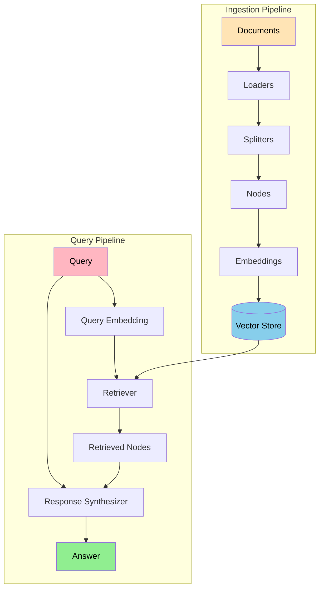
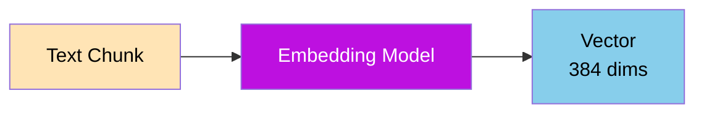
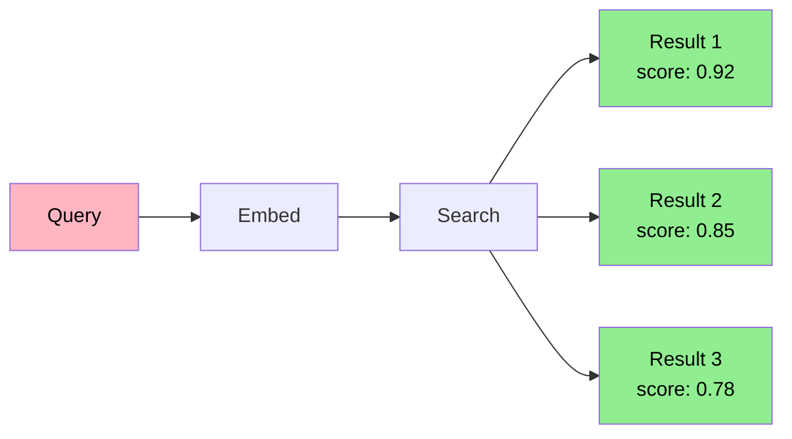
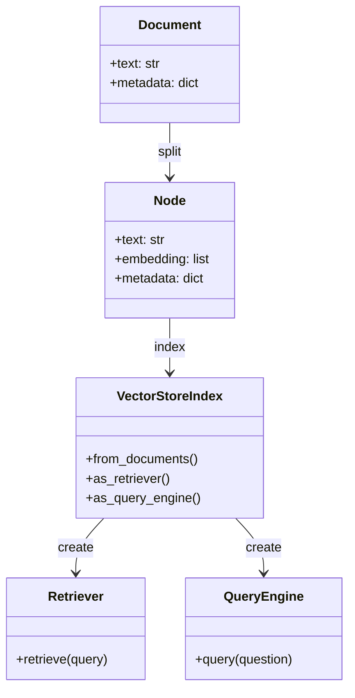
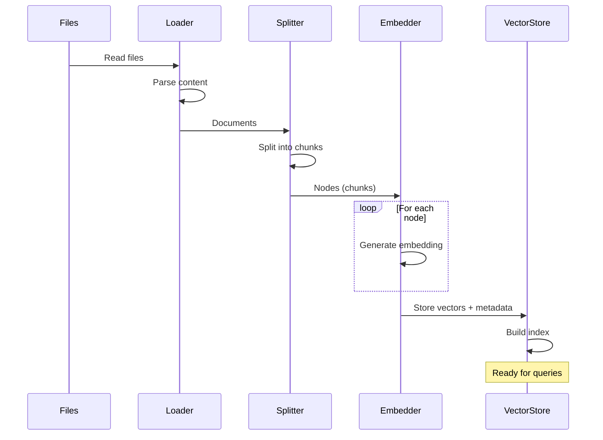
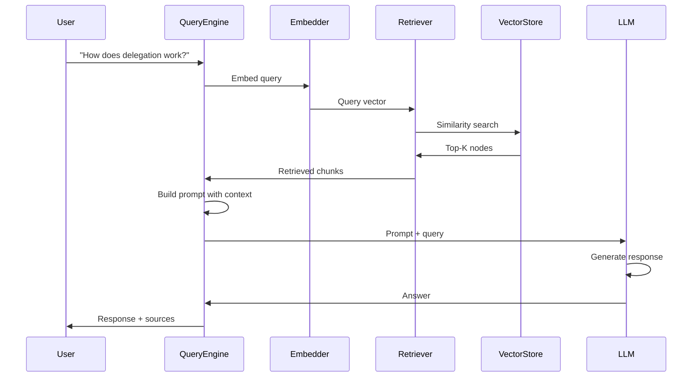
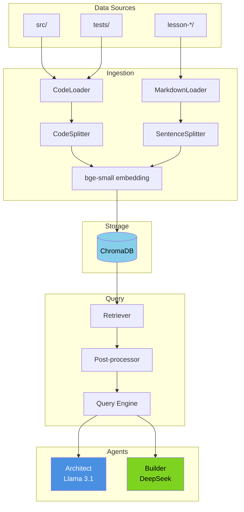

# RAG Pipeline Architecture

[Next: Architect-Builder Pattern →](./architect-builder-pattern.md) | [↑ Index](../INDEX.md)

This document provides a detailed breakdown of the RAG pipeline architecture and how LlamaIndex components map to our concepts.

---

## High-Level Overview



---

## Components

### Document Loaders

**Purpose:** Convert various file formats into Document objects.

| Loader | Formats | Use Case |
|--------|---------|----------|
| `SimpleDirectoryReader` | Any | General purpose |
| `PDFReader` | PDF | Documentation |
| `MarkdownReader` | Markdown | Docs, README |
| `PythonReader` | Python | Source code |

**Tutorial 3 Loaders:**

```python
from llama_index.core import SimpleDirectoryReader

# Load code and documentation
documents = SimpleDirectoryReader(
    input_dir="./src",
    recursive=True,
    required_exts=[".py", ".md"],
    exclude=["__pycache__", ".git", "*.pyc"],
).load_data()

# Each document has:
# - doc.text: The content
# - doc.metadata: {file_path, file_name, file_type, ...}
```

### Text Splitters

**Purpose:** Break documents into chunks suitable for embedding.

| Splitter | Strategy | Best For |
|----------|----------|----------|
| `SentenceSplitter` | By sentence boundary | Prose text |
| `TokenTextSplitter` | By token count | General purpose |
| `SemanticSplitter` | By meaning similarity | Mixed content |
| `CodeSplitter` | By code structure | Source code |

**Tutorial 3 Chunking:**

```python
from llama_index.core.node_parser import (
    SentenceSplitter,
    CodeSplitter,
)

# For documentation
doc_splitter = SentenceSplitter(
    chunk_size=512,
    chunk_overlap=50,
)

# For code (respects function boundaries)
code_splitter = CodeSplitter(
    language="python",
    chunk_lines=40,
    chunk_lines_overlap=5,
    max_chars=1500,
)
```

### Embedding Models

**Purpose:** Convert text chunks into numerical vectors.



**Tutorial 3 Embedding Configuration:**

```python
from llama_index.embeddings.huggingface import HuggingFaceEmbedding

# Local embedding model (free, fast, good quality)
embed_model = HuggingFaceEmbedding(
    model_name="BAAI/bge-small-en-v1.5",
    cache_folder="./models",
)

# Output: 384-dimensional vectors
# Similarity: Cosine similarity
```

### Vector Stores

**Purpose:** Store and search embeddings efficiently.

| Store | Persistence | Best For |
|-------|-------------|----------|
| `SimpleVectorStore` | In-memory | Development |
| `ChromaVectorStore` | Disk | Small-medium datasets |
| `PineconeVectorStore` | Cloud | Production scale |
| `WeaviateVectorStore` | Cloud/Self-hosted | Enterprise |

**Tutorial 3 Vector Store:**

```python
import chromadb
from llama_index.vector_stores.chroma import ChromaVectorStore

# Persistent ChromaDB
client = chromadb.PersistentClient(path="./chroma_db")
collection = client.get_or_create_collection(
    name="tutorial_codebase",
    metadata={"hnsw:space": "cosine"},
)

vector_store = ChromaVectorStore(chroma_collection=collection)
```

### Retrievers

**Purpose:** Find relevant chunks for a query.



**Retriever Types:**

```python
# Basic vector retriever
retriever = index.as_retriever(
    similarity_top_k=5,
)

# With metadata filtering
retriever = index.as_retriever(
    similarity_top_k=5,
    filters=MetadataFilters(
        filters=[
            MetadataFilter(key="file_type", value="python"),
        ]
    ),
)
```

### Query Engines

**Purpose:** Combine retrieval and generation into end-to-end pipeline.

```python
# Basic query engine
query_engine = index.as_query_engine(
    similarity_top_k=5,
    response_mode="compact",  # Combine chunks before sending to LLM
)

# With custom prompt
from llama_index.core import PromptTemplate

qa_prompt = PromptTemplate(
    """Context from codebase:
{context_str}

Based on the context above, answer: {query_str}

If the answer isn't in the context, say "Not found in codebase."
"""
)

query_engine = index.as_query_engine(
    text_qa_template=qa_prompt,
)
```

---

## LlamaIndex Abstraction Mapping

How our concepts map to LlamaIndex classes:

| Our Concept | LlamaIndex Class | Purpose |
|-------------|------------------|---------|
| Document | `Document` | Container for text + metadata |
| Chunk | `Node` / `TextNode` | Indexed unit with embedding |
| Index | `VectorStoreIndex` | Collection of embedded nodes |
| Retriever | `VectorIndexRetriever` | Similarity search |
| Query Engine | `RetrieverQueryEngine` | End-to-end RAG |
| Embedding | `BaseEmbedding` subclass | Text to vector |
| LLM | `LLM` subclass | Response generation |



---

## Data Flow Diagrams

### Ingestion Flow



### Query Flow



---

## Extension Points

### Custom Loaders

Create loaders for special file types:

```python
from llama_index.core.readers.base import BaseReader
from llama_index.core import Document

class CustomCodeLoader(BaseReader):
    """Custom loader that extracts docstrings and function signatures."""
    
    def load_data(self, file_path: str) -> list[Document]:
        with open(file_path) as f:
            content = f.read()
        
        # Custom parsing logic
        functions = self._extract_functions(content)
        
        documents = []
        for func in functions:
            documents.append(Document(
                text=func["docstring"] + "\n" + func["signature"],
                metadata={
                    "file_path": file_path,
                    "function_name": func["name"],
                    "type": "function",
                }
            ))
        
        return documents
    
    def _extract_functions(self, content: str) -> list[dict]:
        # Parse Python AST to extract functions
        ...
```

### Custom Retrievers

Create retrievers with special logic:

```python
from llama_index.core.retrievers import BaseRetriever

class HybridRetriever(BaseRetriever):
    """Combines vector search with keyword matching."""
    
    def __init__(self, vector_retriever, keyword_index):
        self.vector_retriever = vector_retriever
        self.keyword_index = keyword_index
    
    def _retrieve(self, query_bundle) -> list:
        # Vector search
        vector_results = self.vector_retriever.retrieve(query_bundle)
        
        # Keyword search
        keywords = self._extract_keywords(query_bundle.query_str)
        keyword_results = self.keyword_index.search(keywords)
        
        # Merge and deduplicate
        return self._merge_results(vector_results, keyword_results)
```

### Post-Processing

Add steps after retrieval:

```python
from llama_index.core.postprocessor import (
    SimilarityPostprocessor,
    KeywordNodePostprocessor,
)

# Filter by minimum score
similarity_filter = SimilarityPostprocessor(similarity_cutoff=0.7)

# Re-rank by keyword presence
keyword_filter = KeywordNodePostprocessor(
    required_keywords=["delegate", "coordinator"],
)

query_engine = index.as_query_engine(
    node_postprocessors=[similarity_filter, keyword_filter],
)
```

---

## Tutorial 3 Architecture



---

## Configuration Summary

```python
"""Complete RAG pipeline configuration for Tutorial 3."""

from llama_index.core import Settings, VectorStoreIndex, StorageContext
from llama_index.core.node_parser import SentenceSplitter, CodeSplitter
from llama_index.llms.ollama import Ollama
from llama_index.embeddings.huggingface import HuggingFaceEmbedding
from llama_index.vector_stores.chroma import ChromaVectorStore
import chromadb

# === LLM Configuration ===
Settings.llm = Ollama(
    model="llama3.1:8b",
    request_timeout=120.0,
    temperature=0.1,
)

# === Embedding Configuration ===
Settings.embed_model = HuggingFaceEmbedding(
    model_name="BAAI/bge-small-en-v1.5",
)

# === Chunking Configuration ===
Settings.chunk_size = 512
Settings.chunk_overlap = 50

# === Vector Store Configuration ===
chroma_client = chromadb.PersistentClient(path="./chroma_db")
chroma_collection = chroma_client.get_or_create_collection("tutorial_codebase")
vector_store = ChromaVectorStore(chroma_collection=chroma_collection)

# === Index Creation ===
storage_context = StorageContext.from_defaults(vector_store=vector_store)
# index = VectorStoreIndex.from_documents(documents, storage_context=storage_context)

# === Query Configuration ===
# query_engine = index.as_query_engine(
#     similarity_top_k=5,
#     response_mode="compact",
# )
```

---

**Next:** [Architect-Builder Pattern →](./architect-builder-pattern.md)

[Next: Architect-Builder Pattern →](./architect-builder-pattern.md) | [↑ Index](../INDEX.md)

