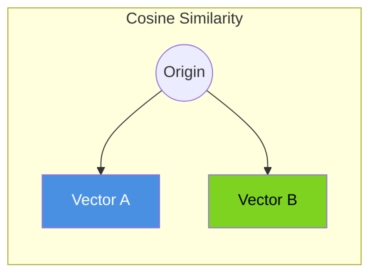
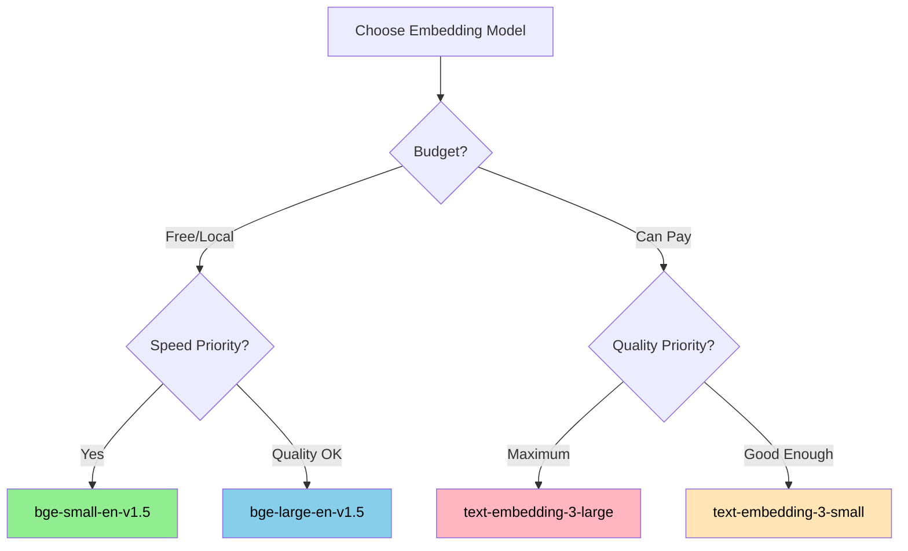

# Embeddings & Vector Stores

**Page 2 of 4** | [← RAG Architecture](./rag-architecture.md) | [Next: Multi-Model Orchestration →](./multi-model-orchestration.md) | [↑ Reading Guide](../READING_GUIDE.md)

> **🎯 Why This Matters**
> 
> RAG's magic happens in the retrieval step: finding relevant documents from potentially millions of options in milliseconds. This is only possible because of **embeddings** - numerical representations that capture meaning.
> 
> Understanding embeddings helps you:
> - **Debug retrieval issues** → "Why isn't this chunk being found?"
> - **Choose the right model** → Match embedding model to your content type
> - **Optimize performance** → Trade-off quality vs. speed vs. cost
> - **Understand limitations** → Know when similarity search will fail
> 
> By the end of this guide, you'll understand **how text becomes vectors** and **how similarity search works**.

> **🏗️ Building on Tutorial 2**
> 
> In Tutorial 2, agents communicated via structured messages. Each message had fields like `from_agent`, `to_agent`, and `payload`.
> 
> **Embeddings are similar but for meaning:**
> - Messages have **structured fields** → Embeddings have **dimensions** (768, 1024, etc.)
> - Messages encode **intent** → Embeddings encode **semantic meaning**
> - Message routing uses **agent names** → Retrieval uses **vector similarity**
> 
> Think of embeddings as "semantic addresses" - similar meanings live at nearby addresses.

---

## What are Embeddings?

An **embedding** is a numerical representation of text as a vector (a list of numbers).

### The GPS Coordinates Analogy 🗺️

Imagine text as locations on a map:

- **"happy"** → coordinates (45.2, -122.7)
- **"joyful"** → coordinates (45.3, -122.8) *(nearby!)*
- **"motorcycle"** → coordinates (12.1, 98.4) *(far away)*

Just like GPS coordinates tell you where places are in physical space, **embeddings tell you where concepts are in meaning space**.

```
"Meaning Space" (simplified to 2D)

    joy •  • happiness
           • delight
           
                          • sadness
                          • grief
                          
    
              • motorcycle
              • bicycle
              • car
```

In reality, embeddings have hundreds or thousands of dimensions (not just 2), allowing them to capture nuanced relationships.

### What an Embedding Looks Like

```python
from sentence_transformers import SentenceTransformer

model = SentenceTransformer('BAAI/bge-small-en-v1.5')

text = "The coordinator delegates tasks to worker agents"
embedding = model.encode(text)

print(f"Dimensions: {len(embedding)}")  # 384
print(f"First 10 values: {embedding[:10]}")
# [-0.023, 0.041, -0.089, 0.012, 0.067, -0.034, 0.091, -0.056, 0.028, -0.073]
```

Each number in the embedding captures some aspect of the text's meaning. No single number is interpretable, but together they create a unique "fingerprint" of the text.

---

## How Vector Similarity Works

Once text is converted to vectors, we can measure how similar two pieces of text are by comparing their vectors.

### Cosine Similarity

The most common similarity measure is **cosine similarity** - the angle between two vectors:



**Values:**
- **1.0** = Identical direction (most similar)
- **0.0** = Perpendicular (unrelated)
- **-1.0** = Opposite direction (most dissimilar)

**Why cosine over Euclidean distance?**
- Cosine focuses on **direction** (meaning) not **magnitude** (length)
- "Happy" and "very happy" point the same direction but have different magnitudes
- Normalized comparison works better for varying text lengths

### Similarity in Practice

```python
from numpy import dot
from numpy.linalg import norm

def cosine_similarity(a, b):
    return dot(a, b) / (norm(a) * norm(b))

# Embed some sentences
sentences = [
    "The coordinator delegates tasks to workers",      # 0
    "The manager assigns work to team members",        # 1
    "Python is a programming language",                # 2
    "The orchestrator distributes jobs to agents",     # 3
]

embeddings = model.encode(sentences)

# Compare sentence 0 with others
for i in range(1, 4):
    sim = cosine_similarity(embeddings[0], embeddings[i])
    print(f"Similarity 0-{i}: {sim:.3f}")

# Output:
# Similarity 0-1: 0.847  (very similar - same concept, different words)
# Similarity 0-2: 0.231  (unrelated)
# Similarity 0-3: 0.891  (very similar - agent coordination)
```

The embedding model learned that "coordinator", "manager", and "orchestrator" are related concepts, even though the words are different!

---

## Vector Store Fundamentals

A **vector store** is a database optimized for storing and searching embeddings.

### Basic Operations

| Operation | Description | SQL Equivalent |
|-----------|-------------|----------------|
| **Insert** | Add vector + metadata | INSERT |
| **Search** | Find k-nearest neighbors | SELECT ... ORDER BY similarity |
| **Filter** | Restrict search by metadata | WHERE clause |
| **Delete** | Remove vectors | DELETE |

### In-Memory vs. Persistent Storage

| Type | Pros | Cons | Best For |
|------|------|------|----------|
| **In-Memory** | Fast, simple | Lost on restart | Development, small datasets |
| **Persistent** | Survives restart | Slower, more setup | Production, large datasets |

**Tutorial 3 approach:** Start in-memory for development, add persistence for production.

### Index Types

Vector stores use special indexes for fast similarity search:

| Index | Speed | Accuracy | Memory | Best For |
|-------|-------|----------|--------|----------|
| **Flat (Brute Force)** | Slow | 100% | Low | <10K vectors |
| **IVF** | Fast | ~95% | Medium | 10K-1M vectors |
| **HNSW** | Very Fast | ~98% | High | Any size, quality matters |

**Tutorial 3 uses:** HNSW via ChromaDB (good default for most cases).

---

## Embedding Models Comparison

Choosing the right embedding model matters for retrieval quality.

### Popular Options

| Model | Dimensions | Quality | Speed | Cost |
|-------|------------|---------|-------|------|
| **OpenAI text-embedding-3-small** | 1536 | Excellent | Fast | $0.02/1M tokens |
| **OpenAI text-embedding-3-large** | 3072 | Best | Medium | $0.13/1M tokens |
| **bge-small-en-v1.5** | 384 | Good | Very Fast | Free |
| **bge-large-en-v1.5** | 1024 | Better | Medium | Free |
| **GTE-large** | 1024 | Better | Medium | Free |
| **nomic-embed-text** | 768 | Good | Fast | Free |

### Our Choice: `bge-small-en-v1.5`

For Tutorial 3, we use `bge-small-en-v1.5` because:

✅ **Free** - No API costs
✅ **Local** - Runs on your machine, no data leaves
✅ **Fast** - 384 dimensions is quick to compute and search
✅ **Good quality** - Competitive with larger models on benchmarks
✅ **Proven** - Widely used in production RAG systems

**Trade-off:** Slightly lower quality than OpenAI embeddings, but for codebase search it's more than sufficient.

### Model Selection Guide



---

## ChromaDB Basics

**ChromaDB** is an open-source vector database that's perfect for learning RAG.

### Why ChromaDB for Tutorial 3?

✅ **Simple setup** - `pip install chromadb` and you're done
✅ **No server** - Runs embedded in your Python process
✅ **Persistence** - Optionally save to disk
✅ **Metadata filtering** - Filter by file type, date, etc.
✅ **LlamaIndex integration** - Works seamlessly

### Core Concepts

**Collection:** A named group of vectors (like a database table)
```python
collection = chroma_client.create_collection("tutorial_codebase")
```

**Document:** The original text you're storing
```python
# Stored alongside the embedding for retrieval
```

**Embedding:** The vector representation
```python
# Computed automatically or provided manually
```

**Metadata:** Additional information about each document
```python
metadata = {
    "file_path": "src/agent/simple_agent.py",
    "file_type": "python",
    "chunk_index": 3
}
```

### Basic Usage

```python
import chromadb

# Create client (in-memory)
client = chromadb.Client()

# Or persistent
client = chromadb.PersistentClient(path="./chroma_db")

# Create collection
collection = client.create_collection(
    name="my_documents",
    metadata={"hnsw:space": "cosine"}  # Use cosine similarity
)

# Add documents (embeddings computed automatically)
collection.add(
    documents=["The coordinator manages workers", "RAG improves answers"],
    metadatas=[{"source": "tutorial"}, {"source": "tutorial"}],
    ids=["doc1", "doc2"]
)

# Query
results = collection.query(
    query_texts=["How do agents coordinate?"],
    n_results=2
)

print(results['documents'])
# [['The coordinator manages workers', 'RAG improves answers']]
```

---

## Visualizing Embedding Space

Understanding embedding space helps debug retrieval issues.

### 2D Projection of Code Embeddings

```
                    "function definitions"
                           |
    "class Agent"    •     |     •  "def __init__"
                      \    |    /
                       \   |   /
                        \  |  /
    "coordinator" •------[CODE]------• "worker"
                        /  |  \
                       /   |   \
                      /    |    \
    "test cases" •        |        • "imports"
                          |
                    "documentation"
```

**Key insight:** Similar code clusters together:
- Function definitions near each other
- Tests cluster separately from implementation
- Documentation forms its own region

### When Similarity Fails

Embeddings aren't perfect. They struggle with:

| Situation | Problem | Mitigation |
|-----------|---------|------------|
| **Negation** | "is" vs "is not" may be similar | Include more context |
| **Numbers** | "100" vs "1000" may be close | Exact match for IDs |
| **Rare terms** | Uncommon words poorly embedded | Domain-specific model |
| **Code syntax** | Similar structure, different meaning | Code-aware embeddings |

---

## 🤔 Knowledge Check

**Question 1:** Why do we use cosine similarity instead of Euclidean distance for text embeddings?

<details>
<summary>Show Answer</summary>

**Cosine similarity measures direction, not magnitude.**

Two pieces of text expressing the same idea with different word counts will:
- Have **different magnitudes** (longer text = longer vector)
- Have **similar directions** (same meaning = same angle)

Euclidean distance would penalize the longer text unfairly. Cosine similarity only cares about meaning alignment.

</details>

**Question 2:** You have 50,000 code chunks. Which index type should you use?

<details>
<summary>Show Answer</summary>

**HNSW (Hierarchical Navigable Small World)**

At 50K vectors:
- Flat index is too slow (brute force)
- IVF works but HNSW is faster with better recall
- Memory overhead of HNSW is acceptable at this scale

ChromaDB uses HNSW by default, so no configuration needed.

</details>

**Question 3:** Your RAG system finds "authentication" when searching for "login". Why?

<details>
<summary>Show Answer</summary>

**The embedding model learned they're related concepts.**

During training, the model saw:
- "Login to your account" and "Authentication required" in similar contexts
- Documentation linking login flows to authentication mechanisms
- User discussions treating them as related

The embedding space places semantically related terms nearby, even if the words are different. This is the power of embeddings!

</details>

**Question 4:** When would you choose `bge-large-en-v1.5` over `bge-small-en-v1.5`?

<details>
<summary>Show Answer</summary>

**Choose bge-large when:**
- Quality is more important than speed
- You have nuanced content where small differences matter
- Your hardware can handle 1024 dimensions (vs 384)
- Search latency of ~50ms is acceptable (vs ~10ms)

**Stick with bge-small when:**
- Speed is priority (real-time queries)
- Dataset is straightforward (code search, docs)
- Limited memory/storage
- Development/prototyping phase

For Tutorial 3's codebase search, bge-small is sufficient.

</details>

---

## 📋 Quick Reference Card

### Embedding Basics

| Term | Definition |
|------|------------|
| **Embedding** | Vector representation of text (list of numbers) |
| **Dimensions** | Number of values in the vector (384, 768, 1024...) |
| **Cosine Similarity** | Measure of angle between vectors (0 to 1) |
| **k-NN** | k-Nearest Neighbors search algorithm |

### Model Quick Reference

| Need | Model | Dimensions |
|------|-------|------------|
| Free + Fast | bge-small-en-v1.5 | 384 |
| Free + Quality | bge-large-en-v1.5 | 1024 |
| Paid + Best | text-embedding-3-large | 3072 |

### ChromaDB Cheatsheet

```python
# Setup
import chromadb
client = chromadb.PersistentClient(path="./db")
collection = client.get_or_create_collection("name")

# Add
collection.add(documents=[...], ids=[...], metadatas=[...])

# Query
results = collection.query(query_texts=[...], n_results=5)

# Filter
results = collection.query(
    query_texts=[...],
    where={"file_type": "python"}
)
```

### Similarity Score Guidelines

| Score | Interpretation |
|-------|----------------|
| > 0.9 | Nearly identical |
| 0.8 - 0.9 | Very similar |
| 0.7 - 0.8 | Related |
| 0.5 - 0.7 | Somewhat related |
| < 0.5 | Likely unrelated |

---

## Next Steps

You now understand how text becomes searchable vectors. Next, let's explore how to use **multiple models** for different tasks in the Architect-Builder pattern.

**Next:** [Multi-Model Orchestration →](./multi-model-orchestration.md)

---

**Page 2 of 4** | [← RAG Architecture](./rag-architecture.md) | [Next: Multi-Model Orchestration →](./multi-model-orchestration.md) | [↑ Reading Guide](../READING_GUIDE.md)

