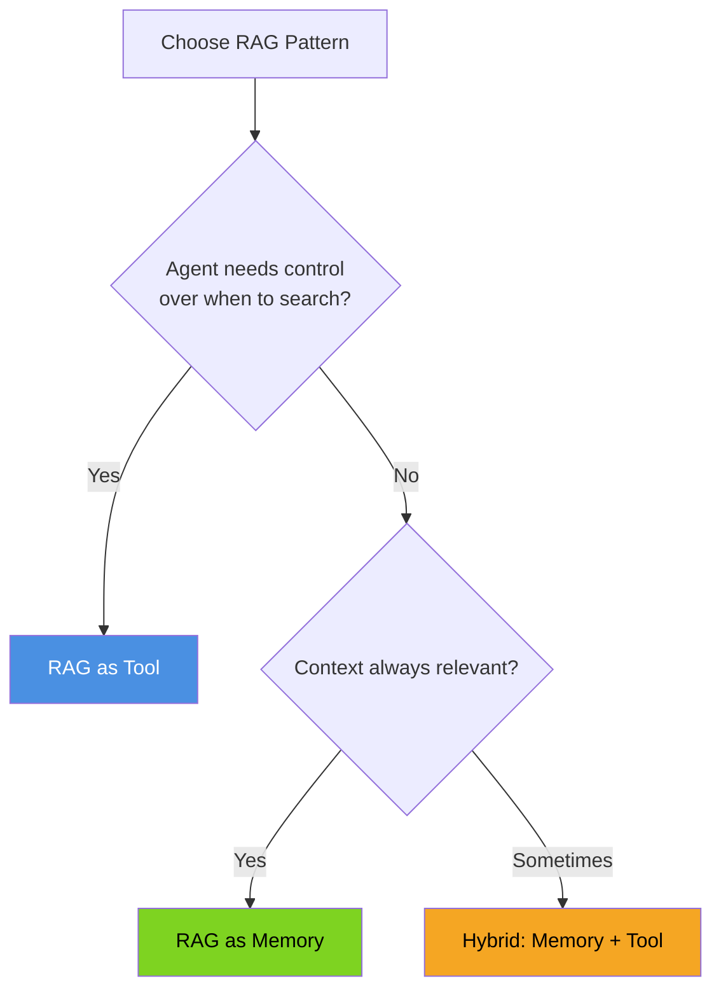
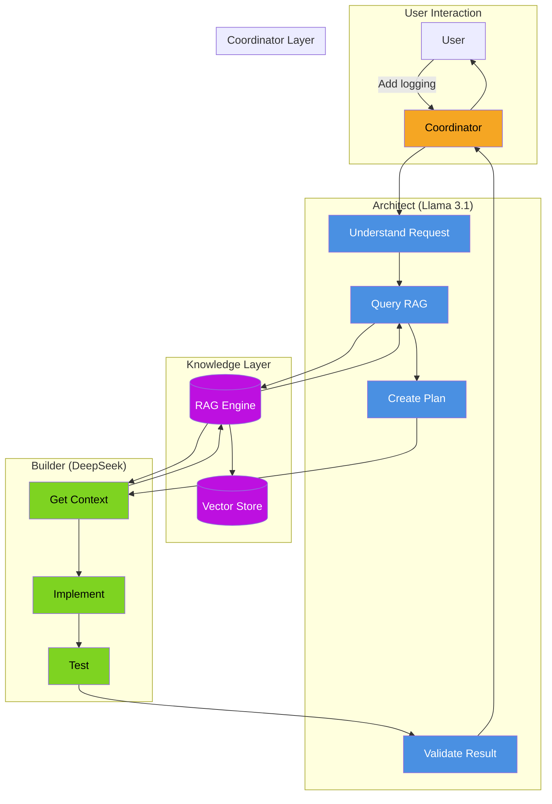
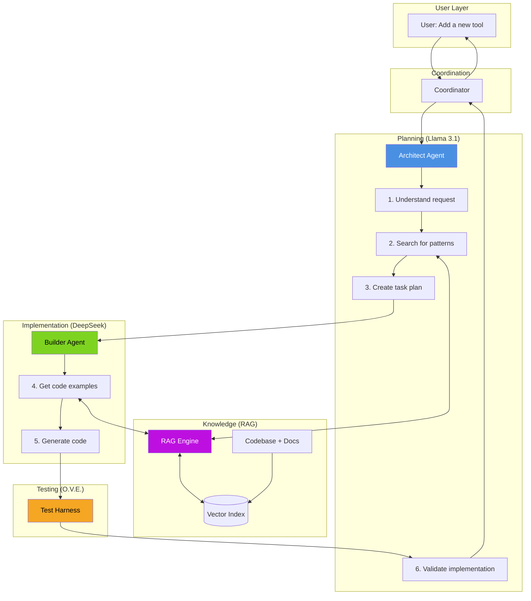

# Knowledge Integration with Agents

**Page 4 of 4** | [← Multi-Model Orchestration](./multi-model-orchestration.md) | [↑ Reading Guide](../READING_GUIDE.md)

> **🎯 Why This Matters**
> 
> You've learned about RAG pipelines and multi-model orchestration separately. Now it's time to **connect them** into a cohesive system.
> 
> Knowledge integration enables:
> - **Context-aware responses** → Agent knows about YOUR codebase
> - **Grounded answers** → "According to coordinator.py, line 45..."
> - **Self-awareness** → Agent can answer questions about its own implementation
> - **Continuous learning** → Add new documents without retraining
> 
> By the end of this guide, you'll understand **how RAG connects to agents** and **the patterns for knowledge-aware systems**.

> **🏗️ Building on Tutorials 1-2**
> 
> This is where everything comes together:
> - **Tutorial 1**: Agent with tools (7-step loop)
> - **Tutorial 2**: Coordinator delegates to workers
> - **Tutorial 3**: Workers query RAG for context before responding
> 
> **The integration:**
> ```
> User Question
>     ↓
> Coordinator (Llama) → "What do I need to know?"
>     ↓
> RAG Engine → Retrieve relevant chunks
>     ↓
> Architect (Llama) → Plan with context
>     ↓
> Builder (DeepSeek) → Implement with examples
>     ↓
> Response with citations
> ```

---

## RAG as a Tool vs. RAG as Memory

There are two fundamental patterns for integrating RAG with agents:

### Pattern 1: RAG as a Tool

The agent **explicitly calls** a search function when it needs information.

```python
@registry.register
def search_codebase(query: str) -> str:
    """
    Search the codebase for relevant code and documentation.
    
    Args:
        query: Natural language description of what to find
        
    Returns:
        Relevant code snippets and documentation
    """
    results = rag_engine.query(query, top_k=5)
    return format_results(results)
```

**How it works:**
1. Agent receives user question
2. Agent decides it needs more context
3. Agent calls `search_codebase("how does delegation work")`
4. RAG returns relevant chunks
5. Agent formulates response using retrieved context

**Pros:**
- Agent controls when to search
- No unnecessary retrieval
- Clear separation of concerns

**Cons:**
- Agent must recognize when to search
- May forget to search when needed

### Pattern 2: RAG as Memory

Context is **automatically injected** into every prompt.

```python
def process_query(user_query: str) -> str:
    # Always retrieve context first
    context = rag_engine.query(user_query, top_k=3)
    
    # Inject into prompt
    prompt = f"""You have access to the following context:
    
{context}

User question: {user_query}

Answer based on the context provided."""
    
    return llm.chat(prompt)
```

**How it works:**
1. User asks question
2. System automatically retrieves relevant context
3. Context is injected into prompt
4. LLM responds using the context

**Pros:**
- Agent always has relevant context
- No decision-making about when to search
- Simpler agent logic

**Cons:**
- May retrieve irrelevant context
- Wastes tokens on unnecessary retrieval
- Agent doesn't know where context came from

### Which Pattern to Use?



**Tutorial 3 approach:** We use **RAG as a Tool** because:
- Architect decides what context is needed for each task
- Builder receives targeted code examples
- More efficient use of tokens
- Better for learning (explicit retrieval calls)

---

## Integration Architecture

Here's how RAG fits into the multi-agent architecture:



### Data Flow

1. **User Request** → Coordinator receives "Add logging to the agent"
2. **Architect Queries RAG** → "How is logging currently implemented?"
3. **RAG Returns** → Chunks from `simple_agent.py` showing existing patterns
4. **Architect Plans** → Task list with context: "Use structlog like in coordinator.py"
5. **Builder Queries RAG** → "Show me structlog initialization examples"
6. **RAG Returns** → Code examples from the codebase
7. **Builder Implements** → Code following existing patterns
8. **Architect Validates** → Checks implementation matches plan

---

## Knowledge-Aware Agents

Agents become more capable when they understand their knowledge sources.

### System Prompt Augmentation

Add knowledge awareness to agent prompts:

```python
ARCHITECT_SYSTEM_PROMPT = """You are an Architect agent that plans code changes.

You have access to a knowledge base containing:
- The tutorial codebase (src/agent/, src/multi_agent/)
- Documentation (lesson-1/, lesson-2/, lesson-3/)
- Test files (tests/)

When planning:
1. First search for existing patterns using search_codebase()
2. Reference specific files and line numbers in your plan
3. Follow existing conventions discovered in the codebase

Available tools:
- search_codebase(query): Find relevant code and documentation
- list_files(directory): See what files exist
- read_file(path): Read a specific file
"""
```

### Tool-Based Retrieval

Give agents explicit search tools:

```python
class ArchitectAgent(WorkerAgent):
    def __init__(self, rag_engine: RAGEngine):
        self.rag_engine = rag_engine
        self.tools = [
            self.search_codebase,
            self.find_similar_code,
            self.get_file_summary,
        ]
    
    def search_codebase(self, query: str) -> str:
        """Search for relevant code and documentation."""
        results = self.rag_engine.query(query, top_k=5)
        return self._format_results(results)
    
    def find_similar_code(self, code_snippet: str) -> str:
        """Find code similar to the given snippet."""
        results = self.rag_engine.query(code_snippet, top_k=3)
        return self._format_results(results)
    
    def get_file_summary(self, file_path: str) -> str:
        """Get a summary of what a file contains."""
        results = self.rag_engine.query(
            f"summary of {file_path}",
            filter={"file_path": file_path}
        )
        return results[0] if results else "File not found in index"
```

### Hybrid Approaches

Combine automatic context with explicit search:

```python
class HybridArchitect(WorkerAgent):
    def process(self, message: Message) -> Message:
        # Automatic: Always inject relevant context for the current task
        auto_context = self.rag_engine.query(
            message.payload["task"],
            top_k=2
        )
        
        # Build prompt with automatic context
        prompt = f"""Context from codebase:
{auto_context}

Task: {message.payload["task"]}

You can also use search_codebase() for more specific searches."""
        
        # Agent can still explicitly search for more
        response = self.llm.chat(prompt, tools=self.tools)
        return response
```

---

## Context Management

Managing context effectively is crucial for RAG performance.

### Token Budget Allocation

With a 128K context window, budget carefully:

```
Total Budget: 128,000 tokens
├── System Prompt: 1,000 tokens (fixed)
├── Auto-retrieved Context: 4,000 tokens (5 chunks × 800)
├── Conversation History: 8,000 tokens (last ~10 messages)
├── Current Task/Query: 500 tokens
├── Tool Definitions: 1,500 tokens
└── Reserved for Response: 8,000 tokens
    ─────────────────────────
    Used: ~23,000 tokens
    Available: ~105,000 tokens for additional context
```

**Strategy:** Start with small budgets, expand if needed.

### Relevance Filtering

Not all retrieved chunks are equally relevant:

```python
def filter_context(results: list, threshold: float = 0.7) -> list:
    """Filter results by relevance score."""
    return [r for r in results if r.score >= threshold]

def deduplicate_context(results: list) -> list:
    """Remove duplicate or overlapping chunks."""
    seen_files = set()
    unique = []
    for r in results:
        file_key = (r.metadata["file_path"], r.metadata["chunk_index"])
        if file_key not in seen_files:
            seen_files.add(file_key)
            unique.append(r)
    return unique
```

### Citation Tracking

Help users verify information:

```python
def format_with_citations(response: str, sources: list) -> str:
    """Add source citations to response."""
    citations = "\n\nSources:\n"
    for i, source in enumerate(sources, 1):
        citations += f"[{i}] {source.metadata['file_path']}"
        citations += f" (lines {source.metadata['start_line']}-{source.metadata['end_line']})\n"
    
    return response + citations

# Example output:
# "The coordinator delegates tasks using the delegate() method [1],
# which creates a Message and sends it to the worker [2]."
#
# Sources:
# [1] src/multi_agent/coordinator.py (lines 78-95)
# [2] src/multi_agent/message_protocol.py (lines 23-45)
```

---

## The Complete Picture

Here's how everything connects in Tutorial 3:



### Workflow Summary

| Step | Agent | Action | RAG Used? |
|------|-------|--------|-----------|
| 1 | Architect | Understand user request | No |
| 2 | Architect | Search for existing patterns | Yes |
| 3 | Architect | Create detailed task plan | No |
| 4 | Builder | Get code examples | Yes |
| 5 | Builder | Generate implementation | No |
| 6 | Architect | Validate against requirements | No |

---

## 🤔 Knowledge Check

**Question 1:** The user asks "How does our agent handle tool errors?" Should you use RAG as Tool or RAG as Memory?

<details>
<summary>Show Answer</summary>

**RAG as Tool** is better here.

**Why:**
- This is a specific question about implementation details
- The Architect should explicitly search: `search_codebase("error handling in tool execution")`
- Memory pattern would guess what context is relevant
- Tool pattern lets Architect follow up with more searches if needed

**Search strategy:**
```python
# First search
results1 = search_codebase("tool error handling")

# If not enough, refine
results2 = search_codebase("try except in tool execution")

# Combine for complete picture
```

</details>

**Question 2:** Your RAG returns 10 chunks but only 3 are relevant. What's wrong and how do you fix it?

<details>
<summary>Show Answer</summary>

**Problem:** top_k is too high or similarity threshold is too low.

**Fixes:**

1. **Reduce top_k:**
   ```python
   results = rag_engine.query(query, top_k=5)  # Instead of 10
   ```

2. **Add similarity threshold:**
   ```python
   results = [r for r in results if r.score > 0.75]
   ```

3. **Improve chunking:** Chunks may be too large, mixing relevant and irrelevant content

4. **Better embeddings:** Consider a larger embedding model for your domain

5. **Query refinement:** Make queries more specific
   ```python
   # Instead of "error handling"
   # Use "how does delegate() handle worker failures"
   ```

</details>

**Question 3:** How would you implement citation tracking for the Architect-Builder workflow?

<details>
<summary>Show Answer</summary>

**Implementation:**

```python
class CitationTracker:
    def __init__(self):
        self.citations = []
    
    def add_citation(self, chunk, usage_context: str):
        self.citations.append({
            "id": len(self.citations) + 1,
            "file": chunk.metadata["file_path"],
            "lines": f"{chunk.metadata['start_line']}-{chunk.metadata['end_line']}",
            "used_for": usage_context,
            "relevance": chunk.score
        })
        return f"[{len(self.citations)}]"
    
    def format_citations(self) -> str:
        output = "\n\nSources:\n"
        for c in self.citations:
            output += f"[{c['id']}] {c['file']} (lines {c['lines']})"
            output += f" - {c['used_for']}\n"
        return output

# Usage in Architect:
tracker = CitationTracker()
context = rag_engine.query("delegation pattern")
for chunk in context:
    ref = tracker.add_citation(chunk, "understanding delegation")
    # Use ref in plan: "Follow the pattern in [1]"
```

</details>

**Question 4:** The Builder generates code that doesn't follow codebase conventions. How do you fix this?

<details>
<summary>Show Answer</summary>

**Problem:** Builder didn't receive enough examples of existing patterns.

**Solutions:**

1. **Architect provides better context:**
   ```python
   # In Architect's plan:
   plan = {
       "task": "Add logging",
       "conventions": "Use structlog, lazy % formatting per .cursorrules",
       "examples": search_codebase("logging examples"),  # Include examples!
       "similar_files": ["src/agent/simple_agent.py"]
   }
   ```

2. **Builder explicitly requests examples:**
   ```python
   # Builder's pre-implementation search
   examples = search_codebase(f"similar to {task_type} in this codebase")
   ```

3. **Add conventions to Builder's prompt:**
   ```python
   BUILDER_PROMPT = """Follow these codebase conventions:
   - Type hints on all functions
   - Google-style docstrings
   - Logging with lazy % formatting
   
   Examples from codebase:
   {examples}
   """
   ```

4. **Architect validates conventions:**
   ```python
   def validate(self, code: str) -> bool:
       checks = [
           "def " in code and ": " in code,  # Type hints
           '"""' in code,  # Docstrings
           "logger.info(%" in code or "logger.debug(%" in code,  # Lazy formatting
       ]
       return all(checks)
   ```

</details>

---

## 📋 Quick Reference Card

### Integration Patterns

| Pattern | When to Use | Complexity |
|---------|-------------|------------|
| **RAG as Tool** | Agent controls search | Medium |
| **RAG as Memory** | Always need context | Low |
| **Hybrid** | Best of both | High |

### Token Budget Template

```
System Prompt:     1,000 tokens
Auto Context:      4,000 tokens (5 × 800)
History:           8,000 tokens
Task/Query:          500 tokens
Tools:             1,500 tokens
Response Reserve:  8,000 tokens
─────────────────────────────
Total:            23,000 tokens
```

### Search Tool Template

```python
@registry.register
def search_codebase(query: str, top_k: int = 5) -> str:
    """
    Search the codebase for relevant code and docs.
    
    Args:
        query: What to search for
        top_k: Number of results (default 5)
    
    Returns:
        Formatted search results with citations
    """
    results = rag_engine.query(query, top_k=top_k)
    return format_with_citations(results)
```

### Context Quality Checklist

- [ ] Results above similarity threshold (>0.7)
- [ ] No duplicate chunks
- [ ] Citations tracked for all used context
- [ ] Total tokens within budget
- [ ] Fallback for no results

---

## What's Next?

You now understand how all the pieces fit together! Time to put it into practice.

**Continue to:**
- [Setting Up LlamaIndex](../guides/setting-up-llamaindex.md) - Installation guide
- [Lab 3 README](../../lab-3/README.md) - Start building!

---

**Page 4 of 4** | [← Multi-Model Orchestration](./multi-model-orchestration.md) | [↑ Reading Guide](../READING_GUIDE.md)

