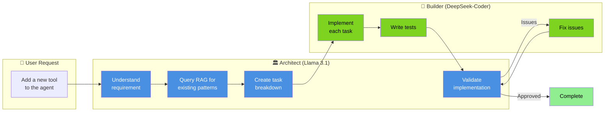
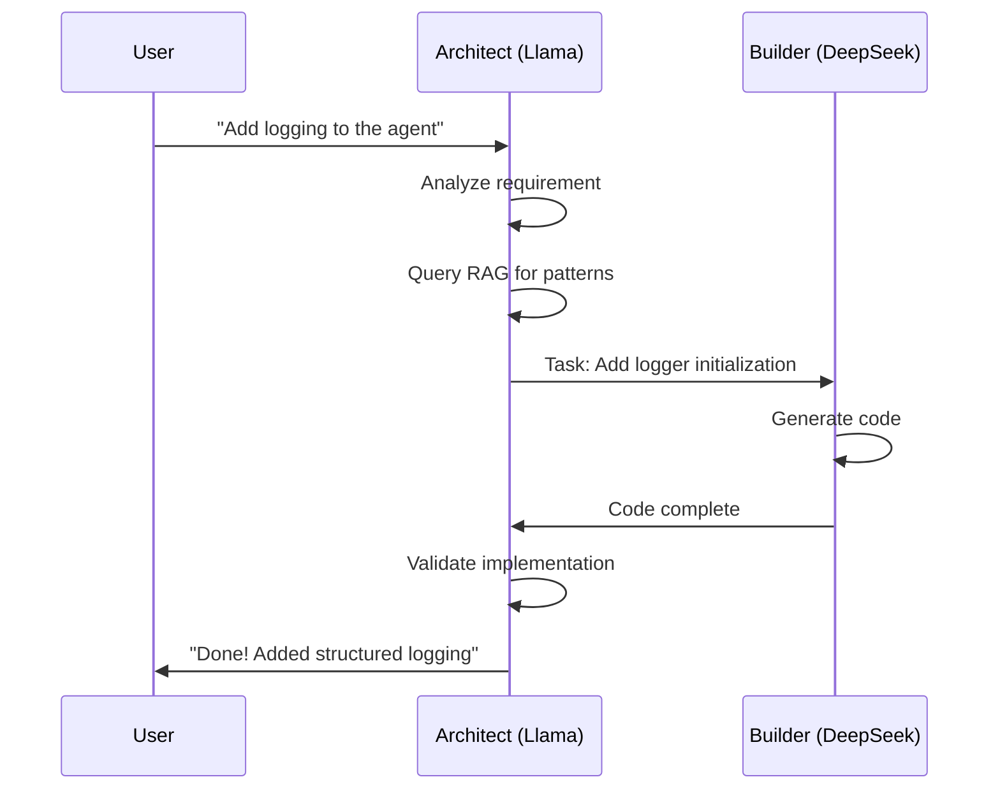
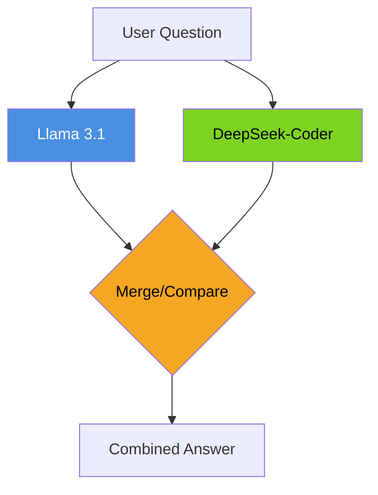
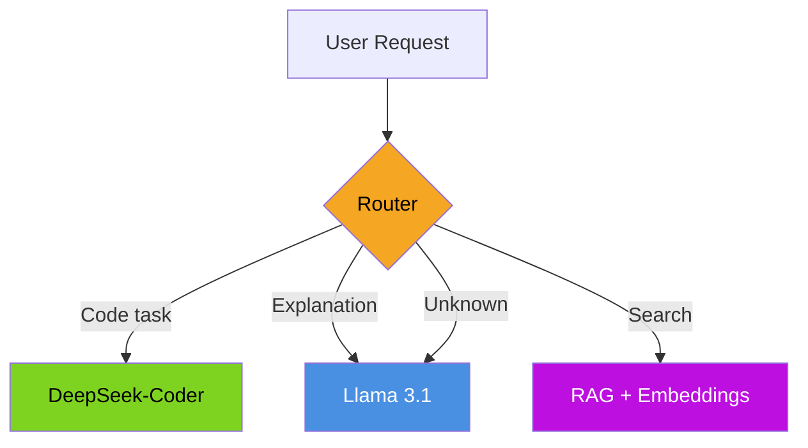

# Multi-Model Orchestration

**Page 3 of 4** | [← Embeddings & Vector Stores](./embeddings-vector-stores.md) | [Next: Knowledge Integration →](./knowledge-integration.md) | [↑ Reading Guide](../READING_GUIDE.md)

> **🎯 Why This Matters**
> 
> In Tutorials 1-2, you used a single model (Llama 3.1) for everything. But different tasks benefit from different models:
> - **General reasoning** → Llama excels
> - **Code generation** → DeepSeek-Coder is optimized for this
> - **Embeddings** → Specialized embedding models outperform general LLMs
> 
> Multi-model orchestration lets you:
> - **Play to each model's strengths** → Better results overall
> - **Optimize costs** → Use smaller models for simpler tasks
> - **Reduce latency** → Specialized models are often faster
> - **Build sophisticated workflows** → Architect plans, Builder codes
> 
> By the end of this guide, you'll understand **why** to use multiple models and **how** to coordinate them.

> **🏗️ Building on Tutorial 2**
> 
> In Tutorial 2, you built a coordinator that delegates to worker agents. Each worker had the same underlying model (Llama) but different prompts and tools.
> 
> **Tutorial 3 takes this further:**
> - Workers can now have **different underlying models**
> - The Architect (Llama) **reasons and plans**
> - The Builder (DeepSeek) **implements code**
> - This is specialization at the **model level**, not just prompt level
> 
> **Key insight:** Think of different models as "super-specialized workers" with fundamentally different capabilities.

---

## The Architect-Builder Analogy 🏗️

Building software with multiple models is like constructing a house:

### Traditional (Single Model)
> **One Person Does Everything:**
> - Designs the blueprint
> - Calculates load-bearing requirements
> - Lays the foundation
> - Builds the walls
> - Installs plumbing and electrical
> 
> *Result: Jack of all trades, master of none*

### Multi-Model (Architect-Builder)
> **Specialized Roles:**
> - **Architect** (Llama 3.1): Understands requirements, designs the solution, validates the result
> - **Builder** (DeepSeek-Coder): Implements the design efficiently and correctly
> 
> *Result: Each specialist excels at their role*



---

## Why Different Models for Different Tasks?

### 1. Specialization

Just like humans, models can specialize:

| Model | Optimized For | Why It's Better |
|-------|---------------|-----------------|
| **Llama 3.1** | General reasoning, planning | Trained on diverse data, good at understanding intent |
| **DeepSeek-Coder** | Code generation | Trained specifically on code, understands syntax and patterns |
| **bge-small** | Text embeddings | Architecture designed for similarity, not generation |

**Example:** Ask both models to implement a function:

```
Llama 3.1:
"To implement this, you'd want to consider error handling,
think about edge cases like empty input, and make sure to
follow the existing patterns in the codebase..."
(Great explanation, mediocre code)

DeepSeek-Coder:
def process_data(items: list[str]) -> dict[str, int]:
    """Process items and return frequency counts."""
    if not items:
        return {}
    return {item: items.count(item) for item in set(items)}
(Clean, correct, follows conventions)
```

### 2. Cost Optimization

Different models have different costs:

| Model | API Cost | Local RAM | Tokens/sec |
|-------|----------|-----------|------------|
| GPT-4 | $30/1M tokens | N/A | 50 |
| GPT-3.5 | $0.50/1M tokens | N/A | 100 |
| Llama 3.1 8B | Free (local) | 8GB | 30-50 |
| DeepSeek-Coder 6.7B | Free (local) | 6GB | 40-60 |

**Strategy:** Use capable-but-expensive models for complex reasoning, use efficient models for execution.

### 3. Capability Matching

Match the model to the task requirements:

| Task | Best Model | Why |
|------|------------|-----|
| "Explain this code" | Llama | Good at natural language explanation |
| "Implement this spec" | DeepSeek-Coder | Optimized for code generation |
| "Review for bugs" | Both | Llama catches logic issues, DeepSeek catches syntax |
| "Find similar code" | Embedding model | Designed for similarity, not generation |

---

## Model Selection Matrix

Use this matrix to decide which model handles each task type:

| Task Type | Primary Model | Fallback | Reasoning |
|-----------|---------------|----------|-----------|
| **Understand user intent** | Llama 3.1 | - | Best at natural language understanding |
| **Break down into tasks** | Llama 3.1 | - | Good at reasoning and planning |
| **Write new code** | DeepSeek-Coder | Llama | Specialized for code generation |
| **Fix syntax errors** | DeepSeek-Coder | - | Understands language syntax deeply |
| **Explain code** | Llama 3.1 | DeepSeek | Better at natural language output |
| **Review code quality** | Llama 3.1 | DeepSeek | Catches conceptual issues |
| **Write tests** | DeepSeek-Coder | - | Test code is still code |
| **Find relevant files** | RAG + Embedding | - | Similarity search, not generation |

---

## Orchestration Patterns

There are three main patterns for coordinating multiple models:

### Pattern 1: Sequential Handoff (Architect-Builder)

One model's output becomes another's input.



**Best for:** Coding tasks, document generation, any task with clear "plan → execute" phases.

### Pattern 2: Parallel Consultation

Ask multiple models the same question, compare or merge results.



**Best for:** Code review (catch different types of issues), fact-checking, critical decisions.

### Pattern 3: Router Pattern

A router model decides which specialist to use.



**Best for:** General-purpose assistants, chatbots handling varied requests.

---

## DeepSeek-Coder Overview

DeepSeek-Coder is the "Builder" in our Architect-Builder workflow.

### Strengths 💪

- **Code completion**: Excellent at continuing partial code
- **Following specifications**: Given a clear spec, produces clean implementation
- **Syntax awareness**: Rarely produces syntax errors
- **Multi-language**: Supports Python, TypeScript, and 30+ languages
- **Fast inference**: Optimized for speed

### Limitations ⚠️

- **General reasoning**: Less capable than Llama for complex reasoning
- **Ambiguous requirements**: Needs clear instructions
- **Explanations**: Code comments may be sparse
- **Context limits**: Smaller context window than latest models

### Ollama Setup

```bash
# Pull DeepSeek-Coder
ollama pull deepseek-coder:6.7b

# Test it works
ollama run deepseek-coder:6.7b "Write a Python function to reverse a string"

# Check both models are available
ollama list
# Should show:
# llama3.1:8b
# deepseek-coder:6.7b
```

### Model Comparison

| Aspect | Llama 3.1 8B | DeepSeek-Coder 6.7B |
|--------|--------------|---------------------|
| **Parameters** | 8B | 6.7B |
| **RAM Required** | ~8GB | ~6GB |
| **Best At** | Reasoning, planning | Code generation |
| **Context Window** | 128K | 16K |
| **Speed** | 30-50 tok/s | 40-60 tok/s |
| **Code Quality** | Good | Excellent |
| **Explanations** | Excellent | Good |

---

## Coordinator Role in Multi-Model

The coordinator from Tutorial 2 evolves to handle multiple models:

### Tutorial 2 Coordinator
```python
class Coordinator:
    def __init__(self):
        self.llm = Ollama(model="llama3.1:8b")  # One model
        self.research_agent = WorkerAgent(llm=self.llm, ...)
        self.data_agent = WorkerAgent(llm=self.llm, ...)
        self.writer_agent = WorkerAgent(llm=self.llm, ...)
```

### Tutorial 3 Coordinator (Multi-Model)
```python
class MultiModelCoordinator:
    def __init__(self):
        # Different models for different roles
        self.architect_llm = Ollama(model="llama3.1:8b")
        self.builder_llm = Ollama(model="deepseek-coder:6.7b")
        
        # Agents use appropriate models
        self.architect = ArchitectAgent(llm=self.architect_llm)
        self.builder = BuilderAgent(llm=self.builder_llm)
        
        # RAG for knowledge retrieval
        self.rag_engine = RAGEngine(...)
```

### Key Differences

| Aspect | Tutorial 2 | Tutorial 3 |
|--------|-----------|-----------|
| **Models** | 1 (Llama) | 2+ (Llama + DeepSeek) |
| **Specialization** | Via prompts | Via model selection |
| **Message Types** | REQUEST, RESPONSE | + TASK_PLAN, CODE_RESULT |
| **Knowledge** | Conversation only | + RAG retrieval |

---

## 🤔 Knowledge Check

**Question 1:** Your agent needs to: (1) understand a bug report, (2) find relevant code, (3) fix the bug. Which model handles each step?

<details>
<summary>Show Answer</summary>

1. **Understand bug report**: **Llama 3.1** - Best at natural language understanding
2. **Find relevant code**: **RAG + Embedding model** - Similarity search, not generation
3. **Fix the bug**: **DeepSeek-Coder** - Code generation is its specialty

**Workflow:**
```
Bug Report → Llama (understand) → RAG (find code) → DeepSeek (fix) → Llama (verify)
```

</details>

**Question 2:** When would you use Parallel Consultation instead of Sequential Handoff?

<details>
<summary>Show Answer</summary>

**Use Parallel Consultation when:**
- **Code review**: Llama catches logic issues, DeepSeek catches syntax issues
- **Critical decisions**: Get multiple perspectives before acting
- **Uncertainty**: Not sure which model is better for this specific task
- **Quality matters more than speed**: Willing to pay 2x compute for better results

**Use Sequential Handoff when:**
- Clear "plan → execute" workflow
- Speed is important
- Tasks have clear specialization (reasoning vs. coding)
- Compute budget is limited

</details>

**Question 3:** DeepSeek-Coder produces code but it has logical errors. What went wrong?

<details>
<summary>Show Answer</summary>

**DeepSeek excels at syntax, not logic.**

**Root cause:** The specification given to DeepSeek was ambiguous or incomplete.

**Solution:** Have Llama (Architect) create a detailed specification:
- Clear input/output examples
- Edge cases explicitly listed
- Expected behavior described precisely
- Existing patterns to follow

**Better workflow:**
```
Vague request → Llama (clarify + spec) → DeepSeek (implement) → Llama (verify logic)
```

</details>

**Question 4:** You're building a coding assistant. The user asks "How does this function work?" Which model responds?

<details>
<summary>Show Answer</summary>

**Llama 3.1** should respond.

**Why:**
- The task is **explanation**, not code generation
- Llama is better at natural language output
- Users expect readable, helpful explanations
- DeepSeek might give code-heavy response with sparse commentary

**Pattern:** Use a Router to detect task type:
```python
if is_explanation_request(query):
    return self.architect_llm.chat(query)
elif is_code_request(query):
    return self.builder_llm.chat(query)
```

</details>

---

## 📋 Quick Reference Card

### Architect-Builder Roles

| Role | Model | Responsibilities |
|------|-------|------------------|
| **Architect** | Llama 3.1 | Understand, plan, validate, explain |
| **Builder** | DeepSeek-Coder | Implement, fix, test |

### Orchestration Patterns

| Pattern | When to Use | Compute Cost |
|---------|-------------|--------------|
| **Sequential** | Plan → Execute workflow | 1x per step |
| **Parallel** | Need multiple perspectives | 2x+ |
| **Router** | Mixed task types | 1x (routing) + 1x (execution) |

### Model Capabilities Quick Check

| Task | Llama | DeepSeek | Both |
|------|-------|----------|------|
| Understand requirements | ✅ | ❌ | |
| Write code | ⚠️ | ✅ | |
| Explain code | ✅ | ⚠️ | |
| Review code | | | ✅ |
| Fix syntax errors | ⚠️ | ✅ | |
| Debug logic errors | ✅ | ⚠️ | |

### Message Protocol Extensions

```python
class MessageType(Enum):
    REQUEST = "request"       # Tutorial 2
    RESPONSE = "response"     # Tutorial 2
    ERROR = "error"           # Tutorial 2
    TASK_PLAN = "task_plan"   # New: Architect's breakdown
    CODE_RESULT = "code"      # New: Builder's output
    TEST_RESULT = "test"      # New: Test execution result
```

---

## Next Steps

You now understand how to orchestrate multiple models. Next, let's learn how to **integrate RAG with your agents** to give them knowledge about your codebase.

**Next:** [Knowledge Integration →](./knowledge-integration.md)

---

**Page 3 of 4** | [← Embeddings & Vector Stores](./embeddings-vector-stores.md) | [Next: Knowledge Integration →](./knowledge-integration.md) | [↑ Reading Guide](../READING_GUIDE.md)

