# RAG Architecture

**Page 1 of 4** | [Next: Embeddings & Vector Stores →](./embeddings-vector-stores.md) | [↑ Reading Guide](../READING_GUIDE.md)

> **🎯 Why This Matters**
> 
> Your agents from Tutorials 1-2 are smart, but they only know what's in their training data. When you ask about YOUR codebase, YOUR documents, or YOUR company's policies, they hallucinate or admit ignorance.
> 
> RAG solves this by giving agents access to **external knowledge**:
> - **Grounded responses** → Answers based on real documents, not guesses
> - **Up-to-date information** → No retraining needed when knowledge changes
> - **Source citations** → "According to file X, line Y..."
> - **Domain expertise** → Your agent becomes an expert on YOUR content
> 
> By the end of this guide, you'll understand **what RAG is**, **when to use it**, and **how the pipeline works**.

> **🏗️ Building on Tutorial 2**
> 
> In [Tutorial 2](../../../lesson-2-multi-agent/tutorial-2/INDEX.md), you built a coordinator-worker system where agents communicate via messages and share state.
> 
> **Tutorial 3 extends this with knowledge retrieval:**
> - Workers can now **query a knowledge base** before responding
> - The coordinator can **inject context** from RAG into worker prompts
> - Shared state includes **retrieved documents** alongside conversation history
> - A new "knowledge worker" specializes in retrieval tasks
> 
> **Key insight:** RAG is just another tool in your agent's toolbelt, but one that dramatically improves answer quality for domain-specific questions.

---

## What is Retrieval-Augmented Generation?

**Retrieval-Augmented Generation (RAG)** is a technique that enhances LLM responses by first retrieving relevant information from an external knowledge base.

### The Library Analogy 📚

Imagine two ways to answer "What's the refund policy for Product X?"

**Without RAG (Pure LLM):**
> "Based on my training, most companies have a 30-day refund policy..."
> 
> *(Guessing based on general knowledge)*

**With RAG (Librarian Approach):**
> 1. Search the policy database for "refund" + "Product X"
> 2. Find the actual policy document
> 3. Read the relevant section
> 4. Answer: "According to our policy document (last updated March 2024), Product X has a 90-day refund window with receipt..."
> 
> *(Grounded in actual source material)*

The LLM becomes a **librarian** who:
1. **Searches** the catalog for relevant materials
2. **Retrieves** the most relevant documents
3. **Reads** them to understand the context
4. **Answers** based on what they found

---

## When to Use RAG vs. Fine-Tuning vs. Prompt Engineering

Not every problem needs RAG. Here's a decision framework:

### Decision Matrix

| Approach | Best For | Update Cost | Setup Complexity |
|----------|----------|-------------|------------------|
| **Prompt Engineering** | Format changes, simple instructions | Free (change prompt) | Low |
| **RAG** | Dynamic knowledge, citations needed | Low (re-index documents) | Medium |
| **Fine-Tuning** | Behavior changes, style adaptation | High (retrain model) | High |

### Decision Flowchart


### Use RAG When:

✅ **Knowledge changes frequently** - Company policies, product catalogs, documentation
✅ **You need source citations** - "According to document X..."
✅ **Domain-specific but standard patterns** - Legal contracts, medical records, codebases
✅ **Limited compute budget** - No GPU cluster for fine-tuning
✅ **Privacy concerns** - Keep sensitive data in your vector store, not in model weights

### Use Fine-Tuning When:

✅ **Changing model behavior** - Different writing style, persona, reasoning approach
✅ **Stable knowledge** - Facts that won't change for years
✅ **High volume** - Amortize training cost over millions of queries
✅ **Speed critical** - Fine-tuned models are faster than RAG (no retrieval step)

### Use Prompt Engineering When:

✅ **Output format changes** - JSON, markdown, specific structure
✅ **Simple instructions** - "Be concise", "Use bullet points"
✅ **Quick iteration** - Testing different approaches
✅ **No additional knowledge needed** - Model already knows enough

---

## RAG Pipeline Overview

A RAG system has three main phases:

```mermaid
flowchart LR
    subgraph Ingestion["📥 Ingestion (Offline)"]
        D[Documents] --> C[Chunking]
        C --> E[Embedding]
        E --> V[(Vector Store)]
    end
    
    subgraph Retrieval["🔍 Retrieval (Online)"]
        Q[Query] --> QE[Query Embedding]
        QE --> S[Similarity Search]
        V --> S
        S --> R[Retrieved Chunks]
    end
    
    subgraph Generation["✨ Generation (Online)"]
        R --> P[Prompt + Context]
        Q --> P
        P --> L[LLM]
        L --> A[Answer]
    end
    
    style D fill:#FFE4B5,color:#000000
    style V fill:#87CEEB,color:#000000
    style L fill:#DDA0DD,color:#000000
    style A fill:#90EE90,color:#000000
```



### Phase 1: Ingestion (Offline)

**Goal:** Convert documents into searchable vectors.

```
Documents (PDF, code, markdown)
    ↓
Chunking (split into 256-1024 token pieces)
    ↓
Embedding (convert text to vectors)
    ↓
Vector Store (save for later retrieval)
```

**Key decisions:**
- **Chunk size:** Balance between precision and context
- **Chunk overlap:** Prevent cutting important content
- **Embedding model:** Trade-off between quality and speed

### Phase 2: Retrieval (Online)

**Goal:** Find the most relevant chunks for a query.

```
User Query: "How does the coordinator delegate tasks?"
    ↓
Query Embedding (same model as ingestion)
    ↓
Similarity Search (find nearest vectors)
    ↓
Retrieved Chunks (top-k most similar)
```

**Key decisions:**
- **top-k:** How many chunks to retrieve (typically 3-10)
- **Similarity threshold:** Minimum score to include
- **Reranking:** Optional second pass for better ordering

### Phase 3: Generation (Online)

**Goal:** Generate a response using retrieved context.

```
System Prompt: "You are a helpful assistant. Use the following context to answer."
    +
Context: [Retrieved chunks]
    +
User Query: "How does the coordinator delegate tasks?"
    ↓
LLM Processing
    ↓
Answer: "Based on the codebase, the coordinator delegates tasks by..."
```

**Key decisions:**
- **Context placement:** System prompt vs. user message
- **Citation format:** How to reference sources
- **Fallback:** What to do if no relevant chunks found

---

## RAG Quality Factors

RAG quality depends on each pipeline component:

### 1. Chunking Strategy

| Strategy | Pros | Cons | Best For |
|----------|------|------|----------|
| **Fixed-size** | Simple, predictable | May cut mid-sentence | Uniform content |
| **Sentence-based** | Natural boundaries | Varies wildly in size | Prose documents |
| **Semantic** | Coherent chunks | Complex, slower | Mixed content |
| **Code-aware** | Respects functions/classes | Language-specific | Source code |

**Our choice for Tutorial 3:** Semantic chunking with code-awareness (LlamaIndex handles this).

### 2. Embedding Model Choice

| Model | Size | Quality | Speed | Cost |
|-------|------|---------|-------|------|
| **OpenAI text-embedding-3-small** | Cloud | Excellent | Fast | $0.02/1M tokens |
| **bge-small-en-v1.5** | 33M | Good | Fast | Free |
| **bge-large-en-v1.5** | 335M | Better | Medium | Free |
| **GTE-large** | 335M | Better | Medium | Free |

**Our choice:** `bge-small-en-v1.5` - good quality, fast, free, runs locally.

### 3. Retrieval Parameters

- **top_k:** Number of chunks to retrieve
  - Too low (1-2): May miss relevant context
  - Too high (10+): Dilutes signal with noise
  - Sweet spot: 3-5 for most use cases

- **similarity_threshold:** Minimum score to include
  - Too strict: Misses relevant chunks
  - Too loose: Includes irrelevant chunks
  - Start at 0.7, tune based on results

### 4. Context Window Management

Your LLM has limited context (128K tokens for Llama 3.1). Budget it wisely:

```
Context Budget (128K tokens):
├── System prompt: ~500 tokens
├── Retrieved context: ~4000 tokens (5 chunks × 800 tokens)
├── Conversation history: ~2000 tokens
├── User query: ~100 tokens
└── Reserved for response: ~4000 tokens
    = ~10,600 tokens used, plenty of headroom
```

**Warning:** If you retrieve too many chunks, you'll either:
- Truncate important context
- Hit token limits and get errors
- Slow down inference significantly

---

## 🤔 Knowledge Check

Test your understanding of RAG architecture:

**Question 1:** Your company has a product catalog that updates weekly. Should you use RAG or fine-tuning?

<details>
<summary>Show Answer</summary>

**RAG** is the clear choice.

**Why:**
- Weekly updates would require weekly retraining with fine-tuning (expensive, slow)
- RAG just needs re-indexing (fast, cheap)
- Product queries benefit from citations ("According to the catalog...")
- No behavior change needed, just knowledge access

</details>

**Question 2:** What happens if your chunks are too small (50 tokens each)?

<details>
<summary>Show Answer</summary>

**Problems with tiny chunks:**
- **Fragmented context**: Important information split across many chunks
- **Lost coherence**: Individual chunks lack enough context to be useful
- **Retrieval noise**: Many chunks match partially, hard to rank
- **More retrievals needed**: Must fetch 10+ chunks to get complete picture

**Example:** A function explanation split into 5 tiny chunks loses the relationship between parameters and return values.

**Solution:** Use 256-1024 token chunks with 10-20% overlap.

</details>

**Question 3:** You're building a RAG system for legal contracts. What chunking strategy would you use?

<details>
<summary>Show Answer</summary>

**Semantic chunking with section awareness:**

1. **Respect document structure**: Don't split clauses mid-sentence
2. **Keep related sections together**: "Definitions" section stays unified
3. **Maintain hierarchy metadata**: Track which section each chunk belongs to
4. **Consider clause boundaries**: Legal language has natural break points

**Implementation:**
```python
# LlamaIndex with semantic splitter
from llama_index.core.node_parser import SemanticSplitterNodeParser

splitter = SemanticSplitterNodeParser(
    buffer_size=1,
    breakpoint_percentile_threshold=95,
    embed_model=embed_model
)
```

</details>

**Question 4:** Your RAG system retrieves relevant chunks but the LLM ignores them. What's wrong?

<details>
<summary>Show Answer</summary>

**Common causes:**

1. **Context placement**: Put context BEFORE the question, not after
2. **Prompt clarity**: Explicitly instruct "Use the provided context"
3. **Context overflow**: Too much context overwhelms the query
4. **Relevance mismatch**: Chunks are topically related but don't answer the question

**Debugging steps:**
```python
# 1. Check what context was injected
print(f"Context tokens: {len(context)} tokens")
print(f"First chunk: {chunks[0][:200]}...")

# 2. Verify prompt structure
prompt = f"""Use ONLY the following context to answer.
Context: {context}

Question: {query}
Answer:"""

# 3. Test with explicit instruction
prompt += "\nIf the context doesn't contain the answer, say 'Not found in context.'"
```

</details>

---

## 📋 Quick Reference Card

### When to Use RAG

| Use RAG | Don't Use RAG |
|---------|---------------|
| Dynamic knowledge | Static, well-known facts |
| Need citations | General chitchat |
| Domain-specific Q&A | Creative writing |
| Limited fine-tuning budget | Behavior/style changes |
| Privacy-sensitive data | Public information |

### RAG Pipeline at a Glance

```
INGESTION (once):  Documents → Chunks → Embeddings → Vector Store
RETRIEVAL (each query):  Query → Embedding → Search → Top-K Chunks
GENERATION (each query):  Context + Query → LLM → Answer
```

### Key Parameters

| Parameter | Typical Value | Tune If... |
|-----------|---------------|------------|
| Chunk size | 512 tokens | Answers incomplete → increase |
| Chunk overlap | 50 tokens | Context cut off → increase |
| top_k | 5 | Missing info → increase |
| Similarity threshold | 0.7 | Irrelevant results → increase |

### Quality Checklist

- [ ] Chunks are semantically coherent
- [ ] Embedding model matches content type
- [ ] top_k balances recall vs. precision
- [ ] Context fits in token budget
- [ ] LLM prompt instructs to use context

---

## Next Steps

You now understand **what** RAG is and **when** to use it. Next, let's dive into **how** embeddings and vector stores actually work.

**Next:** [Embeddings & Vector Stores →](./embeddings-vector-stores.md)

---

**Page 1 of 4** | [Next: Embeddings & Vector Stores →](./embeddings-vector-stores.md) | [↑ Reading Guide](../READING_GUIDE.md)

